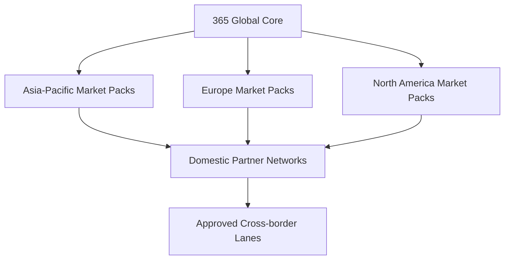

# 365 Parts Global Expansion Plan

**Repository:** `Hunting-Fishing/motorsales365`

**Program control:** [`365_PARTS_PROGRAM_INDEX.md`](./365_PARTS_PROGRAM_INDEX.md)

**Execution roadmap:** [`365_PARTS_EXECUTION_ROADMAP.md`](./365_PARTS_EXECUTION_ROADMAP.md)

**Related master plan:** [`365_PARTS_PARTNER_NETWORK_PLAN.md`](./365_PARTS_PARTNER_NETWORK_PLAN.md)

**Related export plan:** [`365_PARTS_GLOBAL_EXPORT_DISTRIBUTION_PLAN.md`](./365_PARTS_GLOBAL_EXPORT_DISTRIBUTION_PLAN.md)

**Regions:** Asia-Pacific, Europe, and North America

**First launch market:** Philippines

**Platform:** TanStack Start, Supabase, provider-adapter architecture, payment-provider abstraction

**Status:** Target global architecture, regional requirements, and country-launch framework

**Version:** 1.1

**Updated:** 2026-08-06

> This is a product, architecture, and operations plan. Market launch still requires current advice from qualified local legal, tax, customs, privacy, insurance, product-safety, and payment professionals plus signed provider agreements.

Country launch approval is controlled by the Program Index, Decision Register, Regulatory Change Register, and a versioned country pack. The initial Philippine pack is [`country-packs/PHILIPPINES.md`](./country-packs/PHILIPPINES.md).

## 1. Executive decision

365 should not launch one borderless marketplace. It should launch a **federation of domestic partner networks** that share a canonical product/vehicle knowledge layer and common software.

The recommended sequence is:

1. Prove the partner, inventory, order, settlement, return, and Shop Manager model in the Philippines.
2. Make the global core independent of Philippine addresses, pesos, VAT assumptions, GCash/Maya, local tax IDs, one timezone, and one catalog source.
3. Activate each new country through a versioned market pack, local legal/seller-of-record decision, domestic partner network, catalog coverage test, payment/payout provider, and local support operation.
4. Connect cross-border trade lanes only after domestic operations work and the exact origin/destination pair passes customs, tax, restricted-goods, delivery, returns, and warranty gates.

The commercial advantage is a connected local network in each market:

- nearby verified stock and pickup;
- domestic distributor reach;
- repair-shop procurement and installation;
- shared buying power;
- region-appropriate fitment;
- local returns and warranty support;
- optional cross-border access for unavailable items.

The most important global rule is:

> One canonical part may be recognized globally, but every offer, inventory balance, order, invoice, payment, shipment, return, warranty, and settlement belongs to a specific legal entity, location, market, and currency.

## 2. What the previous plan was missing

The master plan already covers the Philippine customer marketplace, partner network, multi-company tenancy, catalog, inventory, orders, payments, returns, security, operations, and rollout. International expansion adds the following requirements that cannot be treated as minor localization:

| Missing area | Why it matters |
|---|---|
| Market and legal-entity hierarchy | One organization may operate different legal entities, tax registrations, bank accounts, contracts, warehouses, and seller-of-record models by country. |
| Country launch packs | Asia, Europe, and North America are not three uniform legal or tax markets; requirements must be versioned per country and sometimes state/province. |
| Regional catalog standards | North America commonly uses ACES/PIES datasets; Europe is strongly TecDoc-oriented; Asian markets often require chassis/model/engine codes, domestic catalogs, EPCs, and local distributor mappings. |
| Domain separation | Automotive, motorcycle, heavy truck, equipment, and marine cannot share one passenger-car fitment model. |
| Multi-language product data | Names, attributes, warnings, legal terms, invoices, support, and search synonyms need localized, licensed translations and fallback rules. |
| Multi-currency accounting | Display currency, order currency, settlement currency, fee currency, FX quote, refunds, and ledger rounding must be explicit and immutable. |
| Regional tax and invoicing | VAT/GST/sales tax, marketplace-facilitator rules, withholding, tax exemptions, e-invoicing, invoice numbering, credit notes, and seller reporting vary. |
| Payment and payout availability | Existing Stripe subscription billing does not prove marketplace split payments or partner payouts are supported for every platform/seller country pair. |
| Product safety and environmental duties | Recalls, stop-sale, responsible-person/economic-operator data, warning language, battery/tire/oil recycling, emissions parts, and restricted products vary. |
| Cross-border landed cost | HS classification, origin, importer/exporter of record, Incoterm/delivery-duty model, customs value, duties/taxes, brokerage, dangerous goods, and returns are required. |
| Privacy and data residency | Consent, access/deletion, breach, cookie/marketing, cross-border transfer, retention, and regional hosting obligations differ. |
| Platform seller reporting | Some jurisdictions require platform operators to verify and report seller identity and transaction data. |
| Regional service operations | Local-language support, business hours, escalation, return addresses, warranty assessors, and regulator contacts are required before launch. |
| Global brand architecture | Philippine campaign artwork cannot serve as the neutral global verification mark or replace local legal disclosures. |

## 3. Operating topology

### 3.1 Global core

The global core owns:

- human identity and authentication;
- organizations, legal entities, locations, memberships, and permissions;
- canonical products, brands, part numbers, relationships, and provider mappings;
- canonical asset/vehicle identities with domain-specific extensions;
- seller items, offers, private inventory ledgers, availability projections, and reservations;
- parent/sub-orders, fulfilment, returns, warranty/core cases, and settlement ledgers;
- provider adapter contracts, provenance, audit, events, and observability;
- global partner and catalog quality controls.

### 3.2 Market pack

A market pack is an effective-dated configuration and approval record, not a collection of UI constants. It defines:

- country/territory and any state/province applicability;
- enabled languages, scripts, locale formats, units, timezone rules, and support hours;
- address schema, geocoding provider, postal validation, and delivery zones;
- currencies, rounding, price-display, FX, and settlement rules;
- seller onboarding/KYB fields, tax identifiers, payout requirements, and reporting;
- marketplace operating model and seller-of-record rules;
- tax calculation, exemptions, invoice/credit-note requirements, and retention;
- accepted payment, refund, COD, financing, and payout methods;
- consumer pre-contract disclosures, cancellation, return, warranty, and dispute paths;
- privacy notices, consent, cookie/marketing, data-subject rights, breach, and retention rules;
- product-safety, warnings, recall/stop-sale, environmental fees, and restricted categories;
- carrier, dangerous-goods, service-level, remote-area, pickup, and reverse-logistics capabilities;
- approved catalog/fitment providers and minimum coverage scores;
- local contracts, policies, insurance, regulator contacts, and launch approvals.

### 3.3 Vehicle-domain pack

Every domain pack defines:

- asset identity and search fields;
- fitment model and qualifiers;
- parts taxonomy and category attributes;
- provider adapters and external identifiers;
- safety-critical categories and seller qualifications;
- shipping classes and restricted items;
- return, warranty, core, condition, and installation rules;
- catalog coverage and fitment-accuracy tests;
- customer/partner screens and professional workflow requirements.

Required independent domains are:

1. automotive/light commercial;
2. motorcycle/scooter/tricycle/powersports;
3. heavy truck/bus;
4. construction/agricultural/industrial equipment;
5. marine/outboard/inboard/sterndrive/PWC;
6. category-specific products such as tires, wheels, batteries, fluids, tools, and shop supplies.

## 4. Required business and tenancy hierarchy

The existing Shop Manager correction described in the master plan remains the foundation. Global operation extends it as follows:

| Entity | Purpose |
|---|---|
| `auth.users` | Human login. Never a company, seller, or shop. |
| `organizations` | Business group or network member. May control several legal entities and brands. |
| `organization_memberships` | Human role at the organization level. |
| `legal_entities` | Registered company/sole proprietor responsible for contracts, tax, invoices, bank/payout, liability, and reporting in a jurisdiction. |
| `legal_entity_registrations` | Company, tax, VAT/GST/sales-tax, customs, EPR/environmental, importer, and other registrations with effective dates and evidence. |
| `businesses` | Public-facing brand or business listing. Not the accounting or inventory owner. |
| `shop_manager.shops` | Operational branch, store, warehouse, service shop, pickup point, or parts counter. |
| `shop_memberships` | Human access to one or more operational locations. |
| `market_nodes` | Approved country/territory operating configuration and responsible 365 legal entity. |
| `location_market_enrollments` | A shop's permission and capabilities within a market. |
| `network_partners` | Contracted 365 network participation at organization/legal-entity level. |
| `partner_capabilities` | Verified sell, stock, pickup, install, direct-ship, import/export, warranty, dangerous-goods, or other capability by location and market. |

Required relationships:

- an organization may own multiple legal entities;
- each legal entity may own multiple shops but each shop has one inventory/accounting owner at a point in time;
- a public brand can link to more than one legal entity/location, but checkout always names the actual seller;
- a user can work for several organizations/shops through memberships;
- a location cannot publish offers into a market without a valid enrollment, contract, required registrations, payout route, and approved capability;
- an order cannot change market, seller legal entity, or order currency after creation;
- historical records retain the original legal identity even after mergers, renaming, ownership transfer, or partner termination.

## 5. Global customer product requirements

### 5.1 Market selection and legal context

Market selection should use delivery destination and explicit customer confirmation, not IP address alone. IP/geolocation can suggest a market but must not silently determine tax, legal terms, or vehicle catalog.

Before showing purchasable offers, the platform needs:

- destination country and postal/administrative area;
- B2C or B2B buyer type;
- preferred language and currency display;
- domestic, cross-border, or both availability preference;
- selected vehicle/asset market or import origin where relevant.

The page footer, seller disclosure, policies, checkout, invoice, privacy notice, and support route must follow the active market pack.

### 5.2 Address and contact model

Do not make `barangay`, US `state`, Canadian `province`, or European `postal_code` universally required.

Store addresses as structured country-specific components plus a formatted snapshot:

- ISO country code;
- administrative levels 1–3 with provider codes where available;
- locality/sub-locality;
- postal code where used;
- street lines and building/unit;
- landmark and delivery instructions;
- validated geolocation and geocoding source;
- recipient name and country-coded phone;
- commercial/residential and remote-area flags;
- validation state and last verification date.

Every order freezes the formatted address, validation result, serviceability decision, and customer correction history. The customer can enter an address the validator does not recognize, but high-risk or carrier-incompatible orders require review.

### 5.3 Language, script, units, and accessibility

The system needs:

- user-interface translations;
- licensed catalog translations separated from user-entered seller descriptions;
- locale-aware search synonyms, abbreviations, spelling, and transliteration;
- original-language preservation for part numbers, labels, and evidence;
- legal/policy versions by language with acceptance evidence;
- localized date, number, decimal, currency, phone, and address formats;
- metric and imperial display while storing normalized measurement values;
- right-to-left readiness even if not in the first target countries;
- accessibility testing appropriate to each launch market;
- human translation review for safety warnings, legal terms, warranty, and return instructions.

Machine translation may assist discovery but must be labeled and must not be the sole source for safety-critical instructions or mandatory disclosures.

### 5.4 Multi-currency pricing

Each offer needs:

- source price and source currency;
- customer order currency;
- seller settlement currency;
- tax and fee currencies;
- FX provider, quote ID, rate, spread, timestamp, and expiry;
- rounding method and minor-unit precision;
- refund FX rule and customer disclosure;
- price validity and repricing rule;
- landed-cost components for cross-border offers.

Store monetary values as integer minor units plus ISO currency. Never recalculate a historical order from today's FX rate. A display conversion is informational until a payable quote is locked.

### 5.5 Customer garage and imported vehicles

The saved asset must separate:

- current registration/operating market;
- original sales/build market;
- steering side;
- identity method and confirmed fields;
- VIN/chassis/frame/PIN/serial where legally permitted;
- engine/transmission/axle/drive identifiers;
- production date or serial range;
- user evidence and verification state;
- gray-import or modified status;
- domain-specific identity payload.

A US-market model, European model, Japanese domestic model, and ASEAN-market model with the same public name are not interchangeable. Search must use build/sales market and configuration, not only customer location.

### 5.6 Search, product pages, and confidence

Search results must distinguish:

- fits the confirmed asset;
- fits with unresolved qualifiers;
- universal with specification checks;
- seller claims fitment but the network has not verified it;
- domestic stock;
- domestic special order;
- cross-border offer;
- used/remanufactured/condition-specific item;
- restricted from sale, shipping, or installation in the destination.

Product pages need market-specific safety/operator information, seller identity, taxes/fees, environmental/core charges, return/warranty rights, language, delivery promise, and import responsibility. Globally shared product content cannot overwrite a stricter local rule.

### 5.7 Customer support and redress

Every market launch requires:

- local-language support coverage and published hours;
- order, safety, privacy, payment, return, warranty, and regulator escalation paths;
- accessible complaint intake with case number and SLA;
- local return/inspection address or a disclosed alternative;
- emergency recall/stop-use communication;
- dispute/chargeback evidence preservation;
- durable copies of the order terms, seller, fitment, warranty, and invoice.

## 6. Partner and Shop Manager global requirements

### 6.1 Signup is not market activation

A new account can create or join a Shop Manager workspace, but it cannot sell through the network until the exact legal entity and location pass market-specific activation. Activation states should be:

`draft → identity pending → business verification → tax/payment pending → contract pending → catalog/inventory setup → training/test order → approved → active → restricted/suspended/terminated`

Approval applies to a legal entity, location, market, and capability combination. A partner approved for domestic brake-pad pickup in the Philippines is not automatically approved to export batteries to Germany or sell emissions components in California.

### 6.2 Partner workspace selector

The Shop Manager header must allow an authorized user to select:

1. organization;
2. legal entity;
3. shop/location;
4. operational role/context;
5. market view and language;

while RLS continues to authorize each record through memberships rather than trusting the selected context.

Dashboards should default to one legal entity and currency. Consolidated cross-entity analytics may convert for reporting, but they must never merge statutory ledgers or imply that stock owned by one entity belongs to another.

### 6.3 Partner settings by market

Partners need versioned controls for:

- selling territories and excluded destinations;
- domestic versus cross-border availability;
- retail, wholesale, fleet, and trade price books;
- tax registrations, exemptions accepted, and invoice identity;
- order cutoff, holidays, timezone, handling days, and capacity;
- pickup, ship-to-shop, local delivery, carrier, and installation capabilities;
- substitutions and fitment-approval policy;
- exact stock versus quantity-band publication;
- safety stock by channel;
- returns, cores, warranty, and labor-claim participation;
- hazardous/oversized/restricted categories;
- payout currency, bank/provider connection, reserve, and settlement schedule;
- customer support contacts and authorized return locations.

### 6.4 B2B and commercial accounts

Repair shops, fleets, dealers, insurers, governments, and resellers need:

- verified legal/tax identity;
- buyer locations and authorized staff;
- purchase-order numbers and approval limits;
- resale/tax-exemption certificates with jurisdiction/effective dates;
- credit applications, limits, aging, statements, holds, and collection status;
- negotiated price books and rebates;
- consolidated invoicing where lawful;
- requested delivery windows and unit-down priority;
- asset/fleet association and installed-part history;
- EDI/API ordering for mature accounts;
- audit logs for quotes, approvals, substitutions, receipts, and returns.

Credit is granted by a named legal entity, not by the global 365 brand unless 365 has deliberately become the creditor and completed the corresponding licensing, underwriting, collections, and risk work.

### 6.5 Offline and low-connectivity operation

Asia-Pacific launch cannot assume continuous broadband at every store. Shop Manager should support:

- mobile-first barcode receiving/counting;
- queued drafts for counts, picks, receipts, and photos;
- visible last-sync time and conflict handling;
- printable pick/receive sheets and fallback order codes;
- SMS/email/manual confirmation mode during integration outages;
- device enrollment, revocation, and local-cache protection;
- no offline final payment capture or irreversible inventory commit without a server-confirmed idempotent result.

## 7. Catalog and fitment strategy by region

### 7.1 One canonical layer, several licensed sources

365 should maintain its own stable canonical IDs and map every provider record through external-identifier tables. Provider data remains subject to its licence, territory, allowed use, update, deletion, attribution, and retention rules.

Required mapping records include:

- provider and dataset/version;
- region/country and vehicle domain;
- provider vehicle/article/brand/category/qualifier ID;
- internal canonical ID;
- mapping method, confidence, reviewer, and status;
- source licence, allowed surfaces, effective/expiry dates;
- first/last seen and provider deletion/tombstone;
- conflict and supersession history.

### 7.2 Asia-Pacific catalog strategy

Asia requires a portfolio, not a single “Asian TecDoc.” Use:

- manufacturer/importer/distributor product masters and local EPC/licensed feeds;
- VIN where standardized and supported;
- Japanese/Asian frame or chassis, model, engine, transmission, production-period, and market codes;
- local vehicle-registration or government data only where lawful/licensed;
- TecDoc where its market/brand coverage passes the 365 test;
- local motorcycle, truck, equipment, and marine providers as independent domain adapters;
- store/distributor cross-references quarantined until matched and verified;
- manual photo/data-plate/old-part sourcing for unresolved vehicles.

The acceptance test must use a country-specific sample of high-volume local vehicles, gray imports, motorcycles, commercial vehicles, and older fleets. A provider is not “Asia ready” because it recognizes internationally sold passenger cars.

### 7.3 Europe catalog strategy

TecDoc should be evaluated as the primary independent-aftermarket data standard, supplemented by:

- licensed VIN/registration lookups;
- country-specific identifiers and registration integrations;
- manufacturer/OE data and brand feeds;
- engine, production date, chassis/VIN range, PR/equipment codes, steering side, emissions, and body/brake qualifiers;
- separate UK/RHD and non-EU European market handling;
- commercial-vehicle, motorcycle, equipment, and marine domain providers where passenger-car TecDoc coverage is insufficient.

Do not assume a TecDoc ID or vehicle link can be republished globally. Contract territory, channel, caching, derived data, translations, images, VIN filtering, and deletion obligations must be recorded.

### 7.4 North America catalog strategy

Use ACES for vehicle application/fitment communication and PIES for product information, with licensed supporting databases such as VCdb, Qdb, PCdb, PAdb, and Brand Table where required. The internal model must preserve:

- VIN and decoded configuration;
- BaseVehicle/submodel/engine/drive/body/bed/wheelbase and qualifier detail;
- brand and manufacturer part number;
- product classification and attributes;
- interchange/supersession provenance;
- US, Canadian, and Mexican market differences;
- English, Canadian French, and Spanish content where licensed;
- medium/heavy truck data beyond light-vehicle assumptions.

ACES/PIES supporting datasets are licensed/subscription data, not a free database to copy into public tables. Provider versioning and territory rights must be enforced in ingestion and APIs.

### 7.5 Fitment quality gates

Every region/domain launch needs a controlled test set with:

- top vehicles/assets by active fleet and parts demand;
- older vehicles and common imports;
- engine/transmission/brake/axle/production splits;
- left- and right-hand-drive variants where applicable;
- genuine, aftermarket, reman, used, and universal categories;
- known negative fitments and misleading same-name models;
- human technician/parts-specialist validation;
- measured exact match, unresolved qualifier, false positive, false negative, no-result, and return rates.

Safety-critical categories must meet a higher threshold than accessories. A general catalog coverage percentage cannot conceal weak local fitment.

## 8. Global inventory, offers, and order routing

### 8.1 Inventory remains local and legally owned

Every inventory balance needs:

- owning legal entity;
- physical location and country;
- shop/warehouse and storage bin;
- seller item and canonical product mapping;
- condition, lot/batch/serial and expiry where applicable;
- on hand, reserved, allocated, quarantine, damaged, inbound, and available-to-promise;
- inventory valuation currency and method;
- customs status: domestic/free circulation, bonded, temporary import, or unknown;
- source/provenance and authorization evidence;
- dangerous-goods and shipping class;
- publish policy by market/channel;
- last source event and confidence/freshness.

Do not aggregate a global “12 in stock” value if five units are in Manila, four are in Toronto, and three are in Germany. Customer availability is computed for the active market and route; internal reporting may aggregate normalized quantities with ownership/location retained.

### 8.2 Offer eligibility

An offer is purchasable only when all of these pass:

1. seller legal entity is active for the market;
2. location has the required sell/ship/pickup/install capability;
3. product and brand are permitted for that territory/channel;
4. product-safety and responsible-party information is complete;
5. fitment or universal specification state is displayable;
6. price, currency, tax, invoice, and payout route are valid;
7. inventory/lead-time freshness meets policy;
8. destination is serviceable;
9. product is not recalled, stopped, restricted, counterfeit-suspect, or incompatible with the carrier;
10. return, warranty, and support route exists;
11. cross-border lane is approved if origin and destination countries differ.

The eligibility result needs machine-readable reason codes so Shop Manager, customer UI, support, and audit show the same explanation.

### 8.3 Routing hierarchy

Recommended routing preference:

1. verified domestic local pickup or installation;
2. verified domestic local delivery;
3. domestic partner/distributor parcel shipment;
4. domestic ship-to-shop;
5. approved cross-border offer with complete landed cost and support;
6. assisted wanted-parts request.

Customer choice, ETA, all-in cost, seller performance, stock confidence, fitment confidence, environmental impact, margin, and contractual routing rules may affect ranking. The routing engine must store its candidates, exclusions, score inputs, selected route, and override.

### 8.4 Preventing cross-market leakage

- Public availability views must filter by market before returning price or stock.
- Catalog licences can restrict which content is displayed, stored, exported, or cached by territory.
- Partner price books and distributor costs never cross legal entities without an authorized agreement.
- Offers cannot be copied to another market merely by currency conversion.
- Search-engine pages must not advertise unavailable regional prices or illegal shipment routes.
- Realtime channels, logs, analytics exports, support tools, and admin impersonation need the same market/tenant restrictions as database queries.

## 9. Marketplace operating models

365 must choose and document one model for every country and order channel. The UI, contracts, payment flow, tax, invoice, warranty, and liability must match it.

| Model | Customer contract/sale | 365 role | Appropriate use |
|---|---|---|---|
| Directory/referral | Customer contracts off-platform with the store | Advertising/lead/referral provider | Earliest market validation where integrated marketplace compliance or payouts are not ready. |
| Quote/sourcing network | Named partner quotes and accepts; payment may be off-platform or separately enabled | Sourcing and communication platform | Assisted pilot and uncommon parts. |
| Marketplace, partner seller of record | Customer buys from the named partner; 365 facilitates | Marketplace/platform, possibly payment collection agent | Primary independent-store model if local law/provider supports it. |
| 365 retailer/merchant of record | Customer buys from a 365 legal entity which procures from suppliers | Retailer/importer with direct tax, refund, warranty, and product liability | Selected categories/markets after stronger operations and capital. |
| Distributor direct contract | Customer or shop contracts with distributor; 365 earns software/referral/commission | Integration/ordering channel | Distributors that require their own invoice and payment relationship. |
| Franchise/agency | Depends on local agreement and apparent-authority rules | Brand owner/franchisor/agent | Later optional program, legally separate from the independent-partner network. |

Do not describe 365 as only a directory if it controls payment, key terms, ordering, delivery, or customer redress in a way that local law treats as marketplace involvement. Do not display “sold by 365” unless the named 365 entity is actually the seller.

## 10. Tax, invoicing, payments, and settlements

### 10.1 Tax engine requirements

Tax determination inputs need:

- market and jurisdiction chain;
- seller legal entity and registrations;
- buyer location, type, and verified tax/exemption IDs;
- ship-from, ship-to, pickup, and installation/service location;
- product tax category and environmental fees;
- B2C/B2B, domestic/cross-border, marketplace model, and importer;
- merchandise, shipping, service, discount, core, rebate, and platform-fee treatment;
- threshold/nexus/registration state;
- effective-dated rule version and evidence/source;
- invoice issuer, numbering series, language, and credit-note rules.

Tax results must be stored per line and jurisdiction. Never infer historical tax from the current rate. Manual tax overrides require permission, reason, evidence, and audit.

### 10.2 Regional tax/reporting workstreams

At minimum, market packs must address:

- **Philippines:** seller registration, VAT/percentage-tax/invoice treatment, marketplace withholding, remittance statements, and Trustmark/Internet Transactions Act duties as applicable.
- **European Union:** VAT place-of-supply and marketplace/deemed-supplier analysis, OSS/IOSS where applicable, invoice/credit-note rules, VAT-ID validation, and DAC7 seller due-diligence/reporting analysis.
- **United Kingdom:** separate UK VAT/online-marketplace rules, overseas-seller checks, import consignment treatment, and UK consumer rules; do not treat the UK as an EU market pack.
- **United States:** state/local sales-tax sourcing, nexus, marketplace-facilitator thresholds/responsibility, exemption/resale certificates, product/environmental fees, and seller reporting.
- **Canada:** GST/HST plus provincial sales taxes where applicable, distribution-platform analysis, exemption documentation, and platform-operator seller reporting.
- **Mexico:** IVA/withholding/platform reporting, RFC/CFDI/e-invoicing, customs, and local establishment analysis using current SAT advice.
- **Asia-Pacific country packs:** domestic GST/VAT/consumption/sales tax, low-value import rules, marketplace deemed-supplier/withholding obligations, e-invoicing, and seller reporting for each country.

### 10.3 Payment-provider abstraction

Use an internal payment orchestration model rather than storing Stripe-specific IDs as the business model.

Required interfaces:

- create/confirm/cancel authorization;
- capture full or partial amounts;
- tokenize or redirect without storing prohibited card data;
- refund full/partial amounts;
- split or transfer where lawful/supported;
- onboard/verify payout account;
- payout, hold, reserve, reverse, and negative-balance recovery;
- dispute/chargeback events and evidence;
- webhook verification, replay protection, idempotency, and reconciliation;
- supported country/currency/payment-method capability discovery.

The current Stripe subscription integration can remain for 365 plan billing. It does not prove that Stripe Connect can collect and split marketplace payments for every country. As of this plan's date, Stripe's general availability page does not list the Philippines as a standard supported payments market, and self-serve Connect cross-border payout documentation limits platform locations/routes. Provider feasibility must be confirmed in writing for each platform/seller country pair before checkout development.

Potential provider categories include:

- cards and local bank methods;
- local wallets;
- bank transfer/open banking;
- COD through approved carriers;
- commercial account/credit;
- buy-now/pay-later only after consumer-credit and returns analysis;
- provider-managed marketplace payouts;
- separate licensed payout provider where payment and payout must be decoupled.

365 must not receive or hold partner funds in a way that creates unplanned money-transmission/payment-service obligations.

### 10.4 Settlement ledger

Each settlement entry needs:

- order/sub-order/return/dispute reference;
- market, legal entity, seller, and provider;
- transaction and settlement currencies;
- gross merchandise, tax, shipping, installation, environmental/core charges;
- discounts and funding source;
- platform fee, payment fee, partner/referral fee, withholding, reserve, and rebate;
- FX rate/spread/rounding;
- captured, refundable, payable, paid, held, reversed, and disputed states;
- external provider IDs and bank/payout reference;
- invoice, tax certificate, remittance statement, and accounting export references.

Automated payouts remain disabled until the internal ledger, provider balance transactions, bank deposits, tax/withholding, refunds, and seller statements reconcile under retries and partial failures.

## 11. Cross-border trade-lane architecture

This section defines the global architecture boundary. The complete customer, partner, Shop Manager, Supabase, customs, logistics, contract, integration, country-of-origin, and rollout specification is in [`365_PARTS_GLOBAL_EXPORT_DISTRIBUTION_PLAN.md`](./365_PARTS_GLOBAL_EXPORT_DISTRIBUTION_PLAN.md). Its controls become mandatory whenever an offer or order crosses a customs border.

### 11.1 A trade lane is an approved product

Define each lane by:

`origin legal entity/location + origin country + destination market + seller/exporter/importer model + product/shipping classes + carrier/service + payment/tax/duty model + return route + warranty route`

Approval for Philippines → Canada brake pads does not approve Philippines → Germany batteries or Japan → US programmed ECUs.

Trade lanes are versioned operating products. They remain disabled until the exact origin partner capability, customs classification/origin evidence, product-market eligibility, broker/carrier service, landed-cost method, customer disclosure, payment/settlement route, destination return support, and warranty owner pass approval.

### 11.2 Required cross-border data

Each product/shipment may require:

- HS/tariff classification and version;
- product description suitable for customs;
- country of origin and supporting evidence;
- manufacturer, responsible party, importer, and seller;
- customs value and currency;
- quantity, unit, gross/net weight, dimensions;
- material/composition and intended use where required;
- dangerous-goods classification, UN number, packaging and documents;
- product compliance/certifications and destination warnings;
- export/import licence or restriction state;
- preferential origin/FTA evidence where claimed;
- commercial invoice, packing list, labels, and customs IDs;
- importer/exporter of record;
- delivery-duty model and customer consent;
- broker/carrier and tracking/customs status;
- return/re-export/disposal process.

### 11.3 Landed cost and customer promise

Checkout must show whether the total is:

- duties/taxes paid at checkout with no expected delivery charge;
- estimated duties/taxes subject to customs adjustment;
- duties/taxes payable by the recipient;
- unavailable because landed cost cannot be calculated safely.

Store merchandise, international shipping, insurance, brokerage, duty, import tax, environmental fees, FX, and contingency separately. The delivery promise must account for export processing, customs review, remote area, dangerous goods, and local handoff.

### 11.4 Cross-border exclusions for early phases

Default to domestic-only for:

- lead-acid/lithium and other restricted batteries;
- oils, fuels, aerosols, paints, solvents, refrigerants, and many chemicals;
- airbags, pretensioners, pyrotechnic or explosive components;
- catalytic converters/emissions-defeat or destination-restricted components;
- keys, immobilizers, ECUs/modules requiring security credentials or regional programming;
- used safety-critical parts without an approved condition/compliance program;
- oversized glass/body panels and products with uneconomic reverse logistics;
- counterfeit-suspect, trademark-restricted, recalled, or undocumented products;
- items lacking destination-language warnings or required economic-operator data.

## 12. Product safety, authenticity, and environmental compliance

### 12.1 Product compliance record

Add a product-market compliance layer containing:

- market and product/category;
- manufacturer/importer/authorized representative/economic operator as applicable;
- seller authorization and supply-chain evidence;
- applicable standards/regulations and declaration/certificate references;
- required warnings, instructions, language, and label/media assets;
- batch/lot/serial traceability requirement;
- recall/safety-gate source and last check;
- restricted sale/installation/shipping conditions;
- environmental fee/EPR/recycling obligations;
- evidence files, issuer, effective/expiry dates, reviewer, and status.

Catalog content alone is not proof of legal sale.

### 12.2 Regional safety workstreams

- **EU/EEA:** General Product Safety Regulation marketplace/trader/product traceability, Safety Gate registration/workflow where applicable, EU economic-operator/responsible-person information, market-surveillance cooperation, destination-language warnings, sector-specific vehicle/equipment rules, and environmental/EPR duties.
- **UK:** UK product-safety, importer/responsible-person, online selling, recalls, environmental, and marking requirements separately from the EU.
- **US:** NHTSA motor-vehicle-equipment safety/recall responsibilities, federal/state warranty and consumer rules, EPA/CARB emissions restrictions, state warnings/fees, tire/battery/chemical rules, and “make inoperative” risks for installed components.
- **Canada:** Transport Canada equipment/recall, federal/provincial consumer and environmental requirements, bilingual/French requirements where applicable, and provincial stewardship programs.
- **Mexico and Asia-Pacific:** country-specific product standards, import registrations, labels/language, recalls, emissions/safety restrictions, and environmental programs.

### 12.3 High-risk catalog classes

Require elevated verification, seller permissions, and possibly installation-only sale for:

- brakes, steering, suspension, wheels/tires, seat belts, restraints, airbags;
- ADAS sensors, cameras, radar/lidar and calibration-dependent parts;
- EV/high-voltage batteries, power electronics, charge equipment, and isolation components;
- fuel, emissions, catalytic, exhaust, and engine-control parts;
- keys, immobilizers, anti-theft, odometer, VIN/identity, and programmed modules;
- heavy-truck air brakes, coupling, load-bearing and safety systems;
- marine fuel/electrical/fire-safety components;
- helmets, child restraints, lifting equipment, and shop safety tools.

## 13. Returns, warranties, cores, and installed-part responsibility

### 13.1 Order-time policy snapshot

Store all applicable statutory rights and commercial policies at order time:

- seller and warranty provider;
- withdrawal/cancellation right and exceptions;
- defective/nonconforming remedy;
- voluntary return window and condition;
- opened/installed/electrical/custom/programmed exclusions only where lawful;
- return shipping/cross-border cost responsibility;
- labor, towing, diagnostic, consequential, and vehicle-downtime coverage/exclusions;
- core amount, due date, acceptable condition, transport, inspection, and credit;
- claim evidence and resolution SLA;
- applicable language and policy version.

A seller's “no returns on electrical parts” rule cannot override mandatory local consumer rights.

### 13.2 Installed-part chain of custody

Shop Manager should preserve:

`customer asset → diagnosis/quote → selected fitment → order/sub-order → received item/lot/serial → installer/repair order → invoice → mileage/hours/date → warranty/return/recall`

This record enables defensible warranty, counterfeit, safety, and recall handling across the network.

### 13.3 Cross-border returns

Before enabling a lane, decide:

- domestic return address versus return to origin;
- customs relief/re-export documents;
- refund timing before/after inspection;
- duty/tax recovery and customer treatment;
- prohibited/dangerous return transport;
- repair, replacement, local disposal, or refund without return;
- FX difference and payment-provider fee handling;
- who bears loss if return shipping is uneconomic.

## 14. Privacy, security, and Supabase regional architecture

### 14.1 Data classification

Classify at minimum:

- public catalog and public partner data;
- customer account/contact/address/garage/order data;
- precise location and identity documents;
- seller KYB, beneficial-owner, tax, and payout data;
- partner costs, negotiated prices, customers, employees, and accounting;
- payment tokens/provider references;
- vehicle VIN/chassis/registration and scan/diagnostic data;
- support communications, photos, signatures, and proof of delivery;
- security/audit/incident data;
- catalog/provider licensed data.

For each class define controller/processor roles, purpose, lawful basis/consent where applicable, access, residency, transfer, retention, deletion/anonymization, and disclosure/reporting.

### 14.2 Regional deployment decision

Supabase projects store primary database/Auth/Storage in the selected project region. Therefore 365 must decide before European or other residency-sensitive launches whether to use:

1. one global project with contractual transfer controls and explicit acceptance of centralization risk;
2. separate regional Supabase projects with a global directory/catalog control plane;
3. separate country projects for markets requiring or commercially demanding stronger localization.

Recommended target is **regional data planes**:

- Asia-Pacific operational project(s);
- EU-specific project in a named EU region;
- North America operational project(s);
- global low-sensitivity catalog/identity mapping and deployment control plane;
- event-based replication of only approved minimum data.

This is not standard PostgreSQL schema multi-tenancy. It requires explicit service boundaries, regional auth/session strategy, globally unique IDs, event contracts, data-subject routing, incident response, and reconciliation.

### 14.3 Global identity without global data leakage

A global account can use a home identity directory and region-specific memberships, but:

- tokens must contain or resolve region/market and cannot authorize another region implicitly;
- Shop Manager queries run against the selected authorized region;
- support/admin access is region-scoped, time-limited, approved, and audited;
- customer order/identity documents stay in the required data plane;
- global analytics receives minimized/aggregated/pseudonymized events;
- deletion/access/correction requests fan out to every relevant region/provider;
- backups, logs, edge functions, analytics, email/SMS, payment, carrier, and support vendors are included in transfer/residency analysis.

### 14.4 Privacy packs

Country/region packs need at least:

- EU/EEA GDPR, ePrivacy/cookie/marketing, international transfer, DPA, rights, retention, and breach workflows;
- UK GDPR/Data Protection Act and PECR as separate UK configuration;
- US federal plus applicable state privacy/consumer/security rules, including opt-out and preference-signal support where required;
- Canadian PIPEDA and applicable provincial private-sector laws, meaningful consent, access, breach, and French-language requirements;
- Philippine Data Privacy Act/NPC rules;
- Japan APPI and other Asia-Pacific country-specific privacy/data-localization rules.

## 15. Regional rollout playbooks

### 15.1 Asia-Pacific

Asia-Pacific must be divided into country clusters rather than launched as one “Asia” market.

Recommended sequence:

| Stage | Markets | Why/requirements |
|---|---|---|
| APAC-1 | Philippines | Existing brand, network relationships, Shop Manager base, first domestic proof. |
| APAC-2 | One expansion market: Singapore or Malaysia | English-friendly regional commerce, established distributor/logistics environment; still requires local entity/tax/payment/privacy/catalog proof. |
| APAC-3 | Thailand, Indonesia, and Vietnam individually | Large vehicle/motorcycle demand but distinct language, tax, payments, regulations, catalog, and logistics. |
| APAC-4 | Japan and South Korea individually | Strong domestic catalogs, language, commercial expectations, vehicle identity, and local competition; partner-led entry recommended. |
| APAC-5 | India and Greater China markets individually | Large opportunity with materially different tax, e-invoicing, payments, data, platform, product, import, and entity requirements. |

Philippines-to-neighbor cross-border should not precede domestic partner pilots in the destination. Lead with local distributor/store inventory and add imports as long-tail supply.

### 15.2 Europe

Do not use “Europe” as one country pack.

Recommended structure:

1. **EU/EEA foundation:** common GDPR/DSA/GPSR/VAT/DAC7 architecture, EU-region data plane, TecDoc/provider licensing, euro-capable payments, and EU operator/legal establishment plan.
2. **First EU country pilot:** choose one language/country with committed distributors and repair shops; complete national consumer, invoice, EPR/environmental, language, and logistics overlays.
3. **Additional EU countries:** activate independently using the common foundation plus national overlays.
4. **United Kingdom:** separate market pack, VAT, product-safety, data, consumer, payment, catalog, and import rules.
5. **Switzerland/Norway and other non-EU Europe:** separate customs, tax, product, data, and contract analysis even where selected EU concepts are similar.

Do not start with pan-EU cross-border promises. First prove domestic orders and one controlled intra-EU lane with VAT, returns, seller disclosure, product safety, and support.

### 15.3 North America

Treat the United States, Canada, and Mexico as three primary country programs.

| Market | First requirements |
|---|---|
| United States | ACES/PIES licensing and ingestion, state/local tax engine, marketplace-facilitator matrix, state privacy/consumer/environmental overlays, NHTSA/EPA/CARB category restrictions, domestic payment/payout and carrier coverage. |
| Canada | Canadian vehicle/content coverage, English/French localization, GST/HST and provincial taxes, PIPEDA/provincial privacy, seller reporting, provincial consumer/environmental programs, domestic payout/logistics. |
| Mexico | Spanish catalog/support, Mexican vehicle parc and trim coverage, RFC/CFDI/IVA/withholding, platform reporting, local payments/payouts, NOM/product/import requirements, customs and local logistics. |

US–Canada and US–Mexico trade lanes come only after domestic pilots. Cross-border automotive parts can still face duties/taxes, brokerage, product restrictions, origin rules, and costly returns despite geographic proximity or trade agreements.

## 16. Global brand architecture

The supplied brand assets are strongly Philippine:

- Philippine map, sun, and stars;
- Philippine flag colors and visual identity;
- “Nationwide Philippines” in the flyer.

Keep these as the official Philippines-market campaign assets. Create a controlled global family:

1. **Global corporate/core mark:** `365 Motor Sales` without a country outline or “Nationwide Philippines.”
2. **Market endorsement:** `365 Motor Sales Philippines`, `365 Motor Sales Canada`, or another approved legal/marketing region.
3. **Program badge:** `365 Parts Partner` with country/location verification QR and expiry.
4. **Domain badge:** optional `365 Truck Parts`, `365 Motorcycle Parts`, `365 Marine Parts`, etc., without pretending the domains share identical catalogs.

Important asset corrections before scale:

- maintain master vector files (SVG/PDF/EPS) and true transparent PNG exports;
- the current flyer image is RGB without alpha, so its visible checkerboard is baked into the image and is not print transparency;
- the current armband/logo PNG has a large mostly empty transparent canvas; create tight-cropped print and digital masters;
- define minimum size, clear space, color profiles, embroidery/single-color versions, and dark/light backgrounds;
- create translated regional flyers from source layouts rather than editing flattened PNG text;
- never use the partner badge to imply that 365 owns the independent store, employs its staff, guarantees every product, or is the seller of record unless true.

## 17. Internal 365 organization for international operation

Global expansion requires named ownership for:

- global product/platform and regional product managers;
- country general manager/authorized representative where needed;
- partner acquisition and success;
- catalog/fitment and data licensing by domain/region;
- order/fulfilment/return/warranty operations;
- tax, finance, treasury, settlement, and reconciliation;
- customs/trade compliance and restricted products;
- product safety, authenticity, recall, and environmental compliance;
- local-language customer support and complaints;
- privacy/data protection and security/incident response;
- payments, carrier, distributor, and catalog provider management;
- legal entities, contracts, insurance, and regulatory reporting.

Country launch must include holiday/on-call coverage, emergency safety escalation, payment/carrier contacts, local return handling, and a shutdown plan. A website translation is not a country operation.

## 18. Country launch pack checklist

Every country must have one signed-off launch record containing:

### Business and legal

- market owner and executive sponsor;
- operating 365 legal entity and local establishment decision;
- marketplace model and seller of record;
- partner/customer contracts and required language;
- trademarks/domain/brand clearance;
- insurance: general, product, cyber, professional, cargo, warehouse, employer, and other local coverage;
- regulator registrations, contacts, and renewal calendar;
- exit/suspension plan.

### Partner and finance

- KYB/beneficial-owner/tax/bank fields;
- partner agreement, SLA, prohibited behavior, appeal, and termination;
- payment and payout provider written approval;
- tax/withholding/e-invoice/credit-note/seller-reporting design;
- settlement ledger mapping and accounting export;
- reserve, refund, chargeback, insolvency, and unclaimed-funds treatment;
- B2B credit and collections decision.

### Product and data

- domain scope and excluded categories;
- licensed catalog/vehicle/fitment/product media providers;
- representative fleet test set and quality results;
- local languages, units, warnings, and translations;
- product safety/economic operator/importer/recall process;
- environmental/EPR/fee/disposal processes;
- data-residency, transfers, DPA, privacy, retention, and breach plan.

### Operations

- partner/store/distributor/warehouse pilot group;
- address validation/geocoding and service areas;
- domestic carriers, local delivery, pickup, POD, claims, and reverse logistics;
- dangerous/oversized/remote-area restrictions;
- support languages, hours, staffing, SLAs, and escalation;
- returns, inspection, warranty, core, recall, and local disposal;
- reconciliation, incident, outage, and business-continuity runbooks.

### Technology and testing

- market pack version and feature flags;
- regional data plane and routing;
- tax, payment, payout, invoice, carrier, and provider adapters;
- tenancy/RLS negative tests;
- localization/accessibility/mobile/low-bandwidth tests;
- end-to-end order, partial failure, return, dispute, recall, and restore tests;
- observability, alerting, audit, and launch dashboards;
- limited production pilot and rollback gate.

## 19. Expansion phases

### Global Phase 0 — make the Philippine build market-aware

- Add `market_id`, `legal_entity_id`, `country_code`, `currency`, and effective policy references to the target architecture.
- Remove Philippine-only address and payment assumptions from shared components.
- Implement organizations → legal entities → shops → memberships.
- Add market/domain/provider external identifier mapping.
- Create payment, tax, invoice, carrier, and catalog adapter interfaces.
- Add licensed-data territory controls.
- Add internationalized content, measurements, and money primitives.
- Keep the Philippine market pack as the first real configuration.

**Exit gate:** the Philippines works through the same market-pack interface that future countries will use; no international market is enabled.

### Global Phase 1 — regional-readiness foundation

- Select APAC, EU, and North America data-plane strategy.
- Build global catalog mapping/control plane with region-safe projections.
- Add regional identity/session routing and support/admin controls.
- Add market offer eligibility and country-specific policy snapshots.
- Build market-pack validation and launch-gate tooling.
- Complete catalog/licensing and payment feasibility for one next market.

### Global Phase 2 — one domestic expansion market

- Launch one country, one language set, selected domains/categories, domestic partners, and domestic fulfilment.
- Use single-seller checkout first.
- Reconcile taxes, invoices, settlements, refunds, returns, and reporting manually in parallel.
- Measure fitment, no-result, false stock, cancellation, delivery, return, support, and unit economics.

### Global Phase 3 — repeatable country factory

- Turn the first expansion into templates, not copied code.
- Add second country in the same region using a separate market pack.
- Automate evidence renewals, tax/reporting, partner scoring, provider monitoring, and policy versioning.
- Launch additional vehicle domains independently after coverage tests.

### Global Phase 4 — controlled cross-border lanes

- Start with low-risk, high-value, non-dangerous, well-documented parts.
- Begin with assisted B2B sourcing and licensed broker/carrier handling before open consumer checkout.
- Enable one origin/destination/carrier/product-class lane.
- Show full landed cost and local returns/warranty support.
- Add broker/customs events, duty/tax reconciliation, re-export/return, and lane scorecards.
- Use the phased operating and acceptance plan in `365_PARTS_GLOBAL_EXPORT_DISTRIBUTION_PLAN.md`.

### Global Phase 5 — multi-region buying group

- Negotiate regional master terms without exposing one member's private costs.
- Aggregate demand by brand/category/region.
- Add regional distribution hubs only when density and service economics justify them.
- Evaluate 365-owned/imported/private-label stock under separate liability and compliance programs.

## 20. Global launch gates and tests

| Gate | Required evidence |
|---|---|
| Legal entity | Correct 365/partner seller, contracts, registrations, invoice, payout, liability, and insurance are approved. |
| Market isolation | An offer/order in one market cannot leak restricted price, stock, customer, tax, or licensed content into another. |
| Tenancy | Multi-company/multi-location staff access passes positive and negative RLS tests across regions. |
| Catalog rights | Territory, channel, caching, translation, export, deletion, and provenance rules are enforceable. |
| Vehicle/domain fitment | Representative local fleet test meets category-specific thresholds; ambiguity and false matches are visible. |
| Localization | Customer, partner, policy, invoice, warning, support, address, currency, and units work in required languages/locales. |
| Tax/reporting | Test orders, refunds, discounts, cores, fees, B2B exemptions, invoices, settlement, and seller reports are approved. |
| Payment/payout | Written provider support, KYB, split/refund/dispute/negative-balance/reconciliation tests pass for exact countries/currencies. |
| Product safety | Required operator/responsible-party, warnings, recalls, restricted products, and evidence are complete. |
| Fulfilment | Domestic serviceability, packaging, tracking, POD, damage/loss, remote area, and reverse logistics pass. |
| Consumer rights | Order terms, cancellation, statutory remedy, warranty, complaint, and regulator escalation are tested. |
| Privacy/residency | Data map, regional hosting, transfers, rights, retention, breach, vendors, logs, and backups are signed off. |
| Operations | Local support, partner success, finance, safety, privacy, returns, and incident owners are trained and staffed. |
| Cross-border | Exact lane passes landed-cost, customs, dangerous-goods, importer, delivery, returns, warranty, and customer disclosure tests. |
| Export operating pack | Origin country pack, export-capable partner, classification/origin evidence, trade parties, broker/carrier, documents, settlement adjustments, and emergency suspension pass the dedicated Export and Distribution Plan. |
| Economics | Contribution margin after payments, tax ops, shipping, returns, support, fraud, FX, and compliance is acceptable. |

## 21. Global KPI scorecard

Report by market, country, legal entity, domain, category, seller, and fulfilment channel:

- active verified partners/locations and document renewal rate;
- catalog coverage, match, no-result, unresolved qualifier, and fitment correction;
- published offers, domestic availability, stale stock, false stock, and reservation expiry;
- conversion, all-in price competitiveness, pickup/install adoption, and repeat purchase;
- acceptance, fill, cancellation, split, delivery, customs delay, damage/loss, and RTO;
- return reasons, warranty, core aging, counterfeit, recall, and safety incidents;
- GMV, revenue, FX, payment cost, tax/compliance cost, fulfilment cost, support cost, fraud, and contribution margin;
- payout aging, unreconciled value, tax/report exceptions, and credit exposure;
- customer complaints, resolution SLA, satisfaction, and regulator escalation;
- regional data/security/privacy incidents and rights-request SLA.

Do not combine markets into one success percentage that hides a weak country, domain, or product category.

## 22. Additional global risk register

| Risk | Required control |
|---|---|
| Treating a region as one country | Versioned country packs and local sign-off. |
| Wrong seller/tax entity | Freeze market/legal entity/seller/invoice model at order creation. |
| Catalog licence breach | Territory/channel enforcement, provider mappings, expiry/tombstones, audited exports. |
| Same model name, different vehicle | Build/sales market and domain-specific configuration; no name-only fitment. |
| Currency/refund loss | Locked FX quote, ledger currencies, refund policy, reserve and reconciliation. |
| Unsupported marketplace payouts | Written provider feasibility and adapter fallback; no unlicensed fund holding. |
| Cross-border surprise charges | Landed-cost disclosure and explicit duty model; disable uncertain checkout. |
| Product illegal in destination | Product-market compliance record and eligibility gate. |
| EU/UK/US/Canada platform reporting missed | Seller due-diligence/reporting module with effective rules and evidence. |
| Data exported to wrong region/vendor | Data classification, regional planes, minimized events, transfer register, vendor controls. |
| Global brand creates apparent ownership | Country/legal disclosure and independent-partner badge rules. |
| Support unable to serve local language/time | Market staffing gate and emergency coverage. |
| Returns eliminate cross-border margin | Domestic returns/inspection, exclusions by class, lane economics, refund-without-return rules. |
| Expanding all domains simultaneously | Independent domain launch gates and profitability/quality reporting. |

## 23. Owner decisions required before international coding

| Decision | Recommended position |
|---|---|
| Global structure | Federated domestic marketplaces sharing a global core. |
| First expansion | One country after the Philippine pilot, selected by committed supply/partners and payment/catalog feasibility. |
| Legal entities | Separate responsible legal entities/registrations where required; never reuse one UUID as person/company/shop. |
| Data architecture | Regional data planes with minimized global control/catalog services. |
| Catalog | Internal canonical IDs with TecDoc, ACES/PIES, OE/distributor/local providers as licensed adapters. |
| Domains | Separate automotive, motorcycle, truck/bus, equipment, marine, and category-specific packs. |
| Checkout | Domestic single-seller first in each country. |
| Cross-border | Disabled by default; activate exact lanes after proof. |
| Payments | Provider abstraction; do not assume Stripe Billing equals global marketplace Connect support. |
| Currency | One immutable order currency; explicit FX and settlement currencies. |
| Customer fitment guarantee | Market/category-specific only after evidence, exclusions, and reserve. |
| Brand | Keep Philippines artwork locally; build a neutral global core mark and country-endorsed partner badges. |

## 24. Definition of done for a new country

A country is not live because its flag, currency, and language appear in a dropdown. It is live only when:

- the responsible 365 legal entity, marketplace role, seller of record, contracts, insurance, registrations, and regulator contacts are approved;
- partners can onboard legal entities, locations, staff, tax, payout, capabilities, inventory, and catalog evidence safely;
- Shop Manager isolates companies, shops, markets, currencies, customers, inventory, and accounting through memberships/RLS;
- local vehicle/domain catalog coverage and fitment accuracy pass representative tests;
- offers pass market, safety, licence, inventory, price, tax, payout, destination, and return eligibility;
- customer language, address, search, price, terms, checkout, payment, invoice, delivery, support, return, warranty, privacy, and complaint flows are complete;
- domestic orders reconcile from reservation through settlement, refund, return, and tax/reporting;
- product safety, authenticity, recall, stop-sale, dangerous goods, and environmental duties have staffed workflows;
- local support and partner operations can handle normal work, provider outages, fraud, lost shipments, safety incidents, privacy incidents, and business shutdown;
- dashboards expose quality, service, financial, compliance, and customer outcomes by market/domain;
- a limited pilot meets the launch gates and a named executive accepts the residual risk.

Until then, the country should remain a catalog preview, waitlist, referral directory, or assisted sourcing pilot with accurate limitations.

## 25. Primary reference links

These are architecture inputs and must be rechecked at market launch.

### Catalog and platform technology

- [Auto Care Association ACES/PIES data standards](https://www.autocare.org/data-standards)
- [Auto Care Association Vehicle Configuration Database](https://www.autocare.org/data-and-information/data-standards/databases/vehicle-configuration-database-vcdb)
- [TecAlliance TecDoc](https://www.tecalliance.net/solutions/tecdoc)
- [Stripe global availability](https://stripe.com/global)
- [Stripe Connect cross-border payouts](https://docs.stripe.com/connect/cross-border-payouts)
- [Supabase available regions and data residency](https://supabase.com/docs/guides/platform/regions)
- [Supabase GDPR and data residency guidance](https://supabase.com/docs/guides/security/gdpr-compliance)
- [365 Parts Global Export and Distribution Plan](./365_PARTS_GLOBAL_EXPORT_DISTRIBUTION_PLAN.md)

### European Union and United Kingdom

- [EU Digital Services Act](https://eur-lex.europa.eu/eli/reg/2022/2065/oj/eng)
- [EU General Product Safety Regulation](https://eur-lex.europa.eu/legal-content/EN/TXT/HTML/?uri=CELEX%3A32023R0988)
- [EU Safety Gate marketplace registration](https://ec.europa.eu/safety-gate/Online-Marketplace-Registration/)
- [EU VAT One Stop Shop and Import One Stop Shop](https://vat-one-stop-shop.ec.europa.eu/index_en)
- [EU customer distance-sale returns](https://europa.eu/youreurope/citizens/consumers/shopping/returns/index_en.htm)
- [EU data protection/GDPR](https://commission.europa.eu/law/law-topic/data-protection_en)
- [EU DAC7 platform seller reporting](https://taxation-customs.ec.europa.eu/taxation/tax-transparency-cooperation/administrative-co-operation-and-mutual-assistance/dac7_en)
- [UK online and distance selling](https://www.gov.uk/online-and-distance-selling-for-businesses/online-selling)
- [UK online marketplace VAT guidance](https://www.gov.uk/government/collections/selling-goods-using-an-online-marketplace-or-direct-to-customers-in-the-uk)

### North America

- [US marketplace facilitator state guidance](https://www.streamlinedsalestax.org/for-businesses/marketplace-facilitator)
- [NHTSA investigations and recalls resources](https://www.nhtsa.gov/resources-investigations-recalls)
- [FTC warranty guidance](https://consumer.ftc.gov/articles/warranties)
- [California Privacy Protection Agency CCPA FAQ](https://cppa.ca.gov/faq)
- [Canada GST/HST for digital-economy businesses](https://www.canada.ca/en/revenue-agency/services/tax/businesses/topics/gst-hst-businesses/digital-economy.html)
- [Canada GST/HST on qualifying goods supplied through platforms](https://www.canada.ca/en/revenue-agency/services/tax/businesses/topics/gst-hst-businesses/digital-economy-gsthst/charge-collect/sales-good.html)
- [Canada reporting rules for digital platforms](https://www.canada.ca/en/revenue-agency/programs/about-canada-revenue-agency-cra/compliance/reporting-rules-digital-platforms.html)
- [Canada PIPEDA requirements](https://www.priv.gc.ca/en/privacy-topics/privacy-laws-in-canada/the-personal-information-protection-and-electronic-documents-act-pipeda/pipeda_brief/)
- [Mexico SAT technological-platform invoice/withholding information](https://wwwmat.sat.gob.mx/consulta/52846/complemento-servicios-de-plataformas-tecnologicas)

### Asia-Pacific examples

- [Philippines DTI Internet Transactions Act implementing rules](https://www.dti.gov.ph/sdm_downloads/implementing-rules-regulations-of-the-internet-transactions-act-of-2023)
- [Philippines E-Commerce Trustmark FAQ](https://trustmark.dti.gov.ph/faqs)
- [Japan METI electronic-commerce guidelines](https://www.meti.go.jp/policy/it_policy/ec/200602_ec_guideline_english.pdf)
- [Singapore IRAS e-commerce GST](https://www.iras.gov.sg/taxes/goods-services-tax-%28gst%29/specific-business-sectors/e-commerce)
- [Singapore overseas vendor and marketplace GST](https://www.iras.gov.sg/taxes/goods-services-tax-%28gst%29/gst-and-digital-economy/overseas-businesses)
