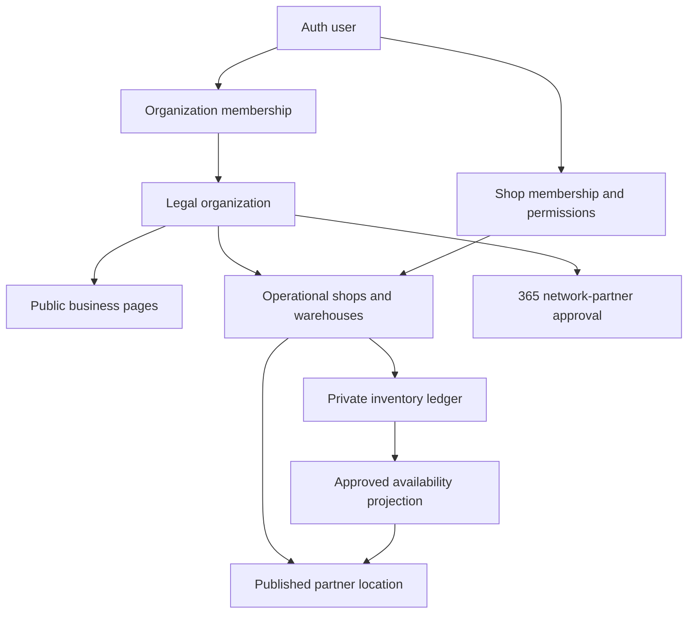

# 365 Parts Partner Network

**Repository:** `Hunting-Fishing/motorsales365`

**Customer surface:** 365 Parts marketplace (`/parts`)

**Partner operating surface:** 365 Shop Manager (`/workspace`)

**Platform:** TanStack Start, Supabase, Stripe subscription billing

**Status:** Global-core repository audit, target architecture, operating model, and implementation plan

**Version:** 2.2

**Updated:** 2026-08-06

**Launch market:** Philippines

**Expansion scope:** Asia-Pacific, Europe, and North America

## Document map and reading order

The [`365_PARTS_PROGRAM_INDEX.md`](./365_PARTS_PROGRAM_INDEX.md) is the program control point. This file remains the detailed product and implementation specification for the common customer marketplace, partner operating model, Shop Manager tenancy, catalog, inventory, orders, fulfilment, settlement, Supabase architecture, operations, and Philippine pilot.

Use the separated control documents to manage delivery. Use the detailed companion specifications for subjects that cannot safely be reduced to one Philippine configuration:

| Document | Purpose |
|---|---|
| [`365_PARTS_PROGRAM_INDEX.md`](./365_PARTS_PROGRAM_INDEX.md) | Scope, document authority, workstreams, program gates, governance, scorecard, and current state. |
| [`365_PARTS_EXECUTION_ROADMAP.md`](./365_PARTS_EXECUTION_ROADMAP.md) | Steps 1–50 from Philippine proof through national, international, global-network, and long-term intelligence/capital stages. |
| [`365_PARTS_DECISION_REGISTER.md`](./365_PARTS_DECISION_REGISTER.md) | Open, recommended, approved, conditional, deferred, superseded, and suspended business decisions. |
| [`365_PARTS_UNIT_ECONOMICS_CAPITAL_PLAN.md`](./365_PARTS_UNIT_ECONOMICS_CAPITAL_PLAN.md) | Order economics, working capital, reserves, financial ledger, scale gates, and capital approvals. |
| [`365_PARTS_QUALITY_TRACEABILITY_PLAN.md`](./365_PARTS_QUALITY_TRACEABILITY_PLAN.md) | Supplier/product quality, authenticity, fitment evidence, non-conformance, CAPA, recall, and Part Passport. |
| [`365_PARTS_REGULATORY_CHANGE_REGISTER.md`](./365_PARTS_REGULATORY_CHANGE_REGISTER.md) | Effective-dated regulatory monitoring, impact assessment, implementation, suspension, and evidence. |
| `365_PARTS_PARTNER_NETWORK_PLAN.md` | Detailed global platform core and Philippines-first operating specification. |
| [`365_PARTS_GLOBAL_EXPANSION_PLAN.md`](./365_PARTS_GLOBAL_EXPANSION_PLAN.md) | Asia-Pacific, Europe, and North America market architecture, localization, regional catalog standards, cross-border trade, compliance, data residency, and launch packs. |
| [`365_PARTS_GLOBAL_EXPORT_DISTRIBUTION_PLAN.md`](./365_PARTS_GLOBAL_EXPORT_DISTRIBUTION_PLAN.md) | Export-capable partner enrollment, country-of-origin packs, approved trade lanes, landed cost, customs, brokers/carriers/hubs, cross-border Shop Manager workflows, Supabase entities, integration clauses, contracts, returns, and rollout gates. |
| [`365_REPAIR_KNOWLEDGE_NETWORK_PLAN.md`](./365_REPAIR_KNOWLEDGE_NETWORK_PLAN.md) | Repair procedures, labour, diagnostics, technical data, provenance, and knowledge-provider integrations. |
| [`country-packs/PHILIPPINES.md`](./country-packs/PHILIPPINES.md) | Draft Philippine domestic-market activation evidence and configuration pack. |
| [`trade-lanes/PH_ORIGIN_PILOT.md`](./trade-lanes/PH_ORIGIN_PILOT.md) | Philippines-origin assisted B2B pilot scope and destination-selection gate. |

The plans deliberately separate three concepts:

1. **Global core:** identities, products, organizations, locations, memberships, permissions, inventory ledgers, offers, reservations, orders, audit, and provider adapters.
2. **Market pack:** country/region rules for vehicle identity, language, currency, address, tax, invoicing, payments, consumer rights, privacy, product safety, reporting, logistics, and seller verification.
3. **Vehicle-domain pack:** independent fitment and workflow rules for automotive, motorcycle, heavy truck/bus, equipment/agriculture, marine, and other power-sports/small-engine domains.

No market or vehicle domain should be activated by changing hard-coded Philippine or passenger-car assumptions. Activation requires a versioned market pack and domain pack that pass the launch gates in both documents.

## 1. Executive decision

365 should build one federated global parts network rather than choose between independent parts stores and warehouse distributors. The Philippines remains the first launch and proof market; Asia-Pacific, Europe, and North America should reuse the same global core through separate legal entities, market packs, catalog/provider adapters, and fulfilment networks.

1. **365 Parts Partner Network:** independent parts stores, repair shops, tire shops, motorcycle shops, truck-parts businesses, equipment suppliers, and specialty vendors in each approved country—starting in the Philippines—keep their ownership, staff, name, inventory, customers, and accounting while joining the 365 technology and purchasing network.
2. **Distributor fulfilment:** approved distributors and manufacturers provide catalog, wholesale price, availability, ordering, warranty, and shipping capabilities. Depending on the commercial agreement, an order may ship to the customer, repair shop, or partner store.
3. **365 Shop Manager:** each partner operates its private business through Shop Manager while selectively publishing approved products, stock availability, prices, pickup options, delivery promises, and warranty terms to the 365 marketplace.
4. **365 network orchestration:** 365 provides the shared catalog, fitment, seller offers, inventory availability, reservations, order routing, delivery coordination, settlement ledger, returns, warranties, partner standards, reporting, and buying-group functions.
5. **Regional market nodes:** a Philippine order, German order, Canadian order, and US order may use the same canonical product identity, but each must retain its own seller-of-record, legal entity, currency, tax, invoice, consumer terms, payment provider, product-safety evidence, data boundary, and fulfilment promises.

The correct positioning is:

> Keep your business. Keep your name. Keep your customers.
>
> Join 365 and gain the online reach, inventory network, purchasing power, and technology of a national parts chain.

The platform should eventually provide more local value than a pure online catalog because a customer can combine nationwide selection with verified fitment, nearby pickup, local delivery, installation, warranty support, and a repair record.

The current repository contains strong single-shop and public-marketplace foundations. It does **not** yet contain a production-ready multi-company parts network or the regional isolation required for international marketplace operations. The highest-priority work is not adding more product cards. It is correcting tenancy, consolidating inventory ownership, creating canonical products and domain-specific fitment, publishing controlled availability, reserving stock atomically, orchestrating multi-party orders, reconciling money and returns, and making every transaction market-aware.

The global strategy is **local commerce connected by shared product intelligence**, not one borderless seller pool. Domestic partner networks should launch first in each country. Cross-border offers should be enabled only when importer/exporter responsibility, landed cost, restricted goods, delivery duty model, returns, warranty, tax, and customer disclosure are proven for the exact trade lane.

The detailed export operating model is defined in [`365_PARTS_GLOBAL_EXPORT_DISTRIBUTION_PLAN.md`](./365_PARTS_GLOBAL_EXPORT_DISTRIBUTION_PLAN.md). Its approved-trade-lane, country-pack, product-eligibility, contract, and integration requirements are mandatory extensions of this master plan whenever an order crosses a customs border.

## 2. Non-negotiable conclusions from the repository audit

### 2.1 What already exists and should be reused

| Capability | Verified repository surface | Decision |
|---|---|---|
| Public parts marketplace | `src/routes/parts.*` with search, category, product, supplier, brand, department, partner, and store routes | Reuse as the public customer storefront. Do not build a competing second storefront. |
| Parts-partner landing and onboarding | `src/routes/partners.parts.tsx`, `partners.parts.onboarding.tsx` | Expand into a complete merchant application, KYB, contract, location, payout, feed, training, and activation workflow. |
| Parts administration | `src/routes/admin.parts.*` | Reuse for supplier outreach, applications, feeds, commissions, and analytics; add catalog quality, partner health, fulfilment exceptions, settlements, disputes, and compliance. |
| Public supplier pipeline | `parts_suppliers`, `parts_supplier_applications`, contacts, outreach, and tasks | Retain as supplier CRM. It is not the source of truth for sellers, contracts, offers, inventory, or orders. |
| Public product catalog | `public.parts_catalog` | Use only as a transition source. Replace broad make/model arrays and year ranges with canonical products and structured fitment assertions. |
| Public business inventory | `business_inventory_items` and movements | Useful for generic business workspaces, but it overlaps Shop Manager inventory and is not sufficient for network commerce. |
| Shop Manager inventory | `shop_manager.inventory_items`, transactions, alerts, forecasts, reorder settings, and inventory locations | Consolidate into the authoritative private stock ledger after tenancy and duplicate-table remediation. |
| Shop purchasing | `/workspace/purchase-orders*`, vendors, vendor bills, payments, and receiving-related tables | Reuse the UI concepts; add shop ownership, supplier acknowledgements, ASNs, backorders, shipments, receiving variance, inter-company mirroring, returns, and reconciliation. |
| Repair workflow | customers, vehicles, estimates, work orders, job lines, parts, inspections, invoices, payments, and warranty fields | Connect the network from diagnosis and quote through reservation, purchase, receiving, installation, invoicing, and warranty. |
| Wanted-parts workflow | `/wanted-parts*`, `/parts/my-requests`, `parts_wanted`, and matches | Retain as the exception path for uncatalogued, uncommon, discontinued, used, imported, or manually sourced parts. |
| Feed orchestration entrypoint | `/api/public/hooks/sync-parts-feeds` and feed admin routes | Reuse the entrypoint; add provider adapters, durable queues, validation, idempotency, provenance, freshness, quarantine, retries, and monitoring. |
| Affiliate items | `affiliate_parts` and Lazada refresh workflows | Keep strictly separated from 365-fulfilled offers. Affiliate click-outs are not marketplace inventory or 365 orders. |
| VIN/chassis decoding | `src/lib/vin-decode.functions.ts` | Reuse as an identity input; add engine, transmission, chassis, market, production-date, and ambiguity resolution. |
| Repair information architecture | `docs/365_REPAIR_KNOWLEDGE_NETWORK_PLAN.md` | Use its vehicle identity and provider-adapter model. The Parts Partner Network is the commerce and availability layer. |

### 2.2 Critical tenancy and Shop Manager findings

The repository currently has overlapping account and tenancy concepts:

- `public.organizations` and `organization_members` support organization-level collaboration.
- `public.businesses` and `business_staff` support a user owning or working for multiple businesses.
- `listMyWorkspaceBusinesses()` correctly finds more than one public business for a user.
- `shop_manager.shops` represents an operational shop, but no repository migration or application path was found that inserts a shop row during normal signup/provisioning.
- `shop_manager.profiles.shop_id` stores only one shop per user.
- `shop_manager.get_current_user_shop_id()` returns that one value and is used by many RLS policies.
- `shop_manager.ensure_profile_for()` selects the user's first `public.businesses.id` and writes it to `shop_manager.profiles.shop_id`, but it does not create a matching `shop_manager.shops` record.
- Native `/workspace` Shop Manager routes query `shop_manager.*` through `smSupabase` without an explicit selected `businessId` or `shopId`; they depend on the single profile value and RLS.
- The separate `/dashboard/business/$businessId/*` workspace uses public business IDs and `business_staff`, creating a second partially overlapping operational system.
- `shop_manager.purchase_orders` has no `shop_id`; its current RLS is primarily `created_by = auth.uid()`, which does not support a business-owned PO visible to authorized coworkers.
- Multiple operational tables have no direct tenant key or rely on parent joins that are incomplete or inconsistent.
- `shop_manager.inventory_items` has `shop_id`, but `inventory_locations`, vendors, suppliers, purchase orders, and several adjacent records are not consistently shop-scoped.
- The repository contains multiple inventory and purchasing table families: `inventory_items`, `business_inventory_items`, `inventory_purchase_orders`, `purchase_orders`, `inventory_suppliers`, `inventory_vendors`, and `suppliers`.
- The public signup trigger creates an organization for most non-staff profiles. A normal account organization must not automatically be treated as an approved parts seller.
- Shop Manager entitlement logic is per `public.businesses` row, while older access logic still contains user-subscription concepts. These must be consolidated before network access is sold.

This means the statement “every signup has its own Shop Manager user” is directionally useful but insufficient for the network. A user account is a person. A partner is a verified legal organization. A shop is an operating location. A business page is a public listing. These must not be represented by one interchangeable UUID.

### 2.3 Required correction before linked inventory

Do not build cross-company inventory sharing on `profiles.shop_id`.

The required model is:

| Concept | Meaning | Cardinality |
|---|---|---|
| `auth.users` | One human login identity | One person can belong to many organizations and shops. |
| `organizations` | Legal/accounting entity or business group | One organization can own many brands, businesses, and locations. |
| `organization_memberships` | A person's organization role | A user may have different roles in different organizations. |
| `businesses` | Public-facing brand/location listing and discovery page | Linked to an organization; not the private stock ledger. |
| `shop_manager.shops` | Operational branch, warehouse, service shop, or parts counter | Linked to the organization and, where applicable, a public business page. |
| `shop_memberships` | A person's location access and permissions | May cover one shop, selected shops, or all shops in the organization. |
| `network_partners` | Verified participation in the 365 Parts Partner Network | Separate lifecycle from ordinary signup and public business listing. |
| `partner_locations` | Network fulfilment capabilities for an operational location | Links to a shop and exposes only approved public facts. |

Every tenant-owned row must be attributable to an organization and/or shop. Authorization must use indexed membership checks such as `is_shop_member(auth.uid(), row.shop_id)` and permission checks. The selected shop in the user interface is a navigation convenience, never the source of authorization.

## 3. Scope and operating principles

### 3.1 In scope

- Cars, vans, SUVs, motorcycles, scooters, tricycles, heavy trucks, buses, agricultural equipment, construction equipment, marine applications, small engines, and specialty fleets.
- Genuine/OE, OEM-supplier, branded aftermarket, economy aftermarket, remanufactured, rebuilt, used, performance, universal, consumable, tool, fluid, tire, battery, and accessory products with clear condition and channel rules.
- Consumer sales, repair-shop procurement, inter-store sourcing, distributor direct fulfilment, ship-to-store, store pickup, local delivery, parcel shipment, and installed-part workflows.
- Independent stores, chains, distributors, importers, manufacturers, warehouses, repair shops, 3PLs, carriers, and installation partners.
- Group purchasing, replenishment, negotiated network pricing, rebates, private label in a later phase, and commercial fleet accounts.

### 3.2 Operating principles

1. **Inventory remains owned by the stocking company.** Network visibility never transfers ownership.
2. **Private data stays private.** Cost, negotiated terms, exact physical stock, customer lists, and internal margins are never exposed to another partner unless explicitly required for a transaction.
3. **Availability is published, not copied blindly.** The network consumes a controlled projection with quantity bands, availability, freshness, fulfilment, and price rules.
4. **One canonical product can have many offers.** Product identity and fitment are separate from the seller's SKU, price, stock, and warranty.
5. **Every material decision is traceable.** Fitment source, inventory source, routing decision, seller, price, warranty, payment, fulfilment, return, and settlement are retained.
6. **No silent substitution.** A substitution needs verified interchange evidence and customer/shop approval where the exact ordered identity changes.
7. **Local support is an advantage.** Pickup, installation, warranty assistance, and returns through a nearby partner should be first-class options.
8. **The assisted pilot comes before full automation.** Manual review is preferable to incorrect fitment, false stock, misrouted money, or counterfeit parts.
9. **Country is a transaction boundary.** Legal entity, seller of record, tax, invoice, payment, consumer terms, and product compliance are frozen by market and cannot be inferred later from a shipping address.
10. **Vehicle domains are first-class modules.** Passenger automotive assumptions must not be forced onto motorcycles, heavy trucks, equipment, or marine products.
11. **Cross-border is an explicit fulfilment mode.** It is never the automatic fallback for a domestic no-result search.
12. **Provider IDs remain external.** TecDoc, ACES/PIES, manufacturer, distributor, registration, and regional vehicle identifiers map to 365 canonical records without becoming the permanent primary key.

### 3.3 First-class vehicle and equipment domains

Each domain is separately licensable, measurable, and launchable. Shared accounts, checkout, supplier records, and inventory infrastructure are appropriate; vehicle identity, fitment, parts taxonomy, safety rules, provider coverage, and professional workflows are not automatically shared.

| Domain | Required identity beyond a generic make/model | Important product/workflow differences |
|---|---|---|
| Passenger automotive and light commercial | VIN or chassis/frame, market, production date, engine, transmission, drivetrain, body, steering side, trim/brake/emission packages | ACES/PIES in North America, TecDoc-led data in Europe, and chassis/model-code-heavy Asian coverage; EV/ADAS/security parts need additional restrictions. |
| Motorcycle, scooter, tricycle, and powersports | Frame/VIN, engine number/code, displacement, variant, market, model year/production period | Strong Asia demand, high accessory/universal-part mix, size/style qualifiers, helmet/safety-product compliance, and different distributors. |
| Heavy truck and bus | VIN/chassis, manufacturer model, engine, transmission, axle, brake system, wheelbase, GVW/GCW, cab and vocational configuration | Parts are configuration- and duty-cycle-sensitive; fleet downtime, unit-down priority, rebuildables, cores, roadside fulfilment, and commercial credit are first-class. |
| Construction, agricultural, and industrial equipment | PIN/serial, model, arrangement/build number, engine, attachment and hydraulic/electrical configuration | Serial-range fitment, dealer territories, machine-down urgency, reman/core programs, oversized freight, and jobsite delivery. |
| Marine: outboard, inboard, sterndrive, PWC, and boat systems | Engine/drive serial and model, horsepower, shaft length, year/production range, hull/application and system voltage | Exploded diagrams, corrosion/environment specifications, supersessions, seasonal service kits, hazardous liquids, and marina/remote delivery. |
| Tires, wheels, batteries, fluids, tools, and shop supplies | Category-specific specifications rather than one vehicle key | Fitment may use dimensions/load/speed/rim/terminal/chemistry/specification; installation, disposal, dangerous-goods, recycling, and calibration rules differ. |

The customer may use one garage, but the saved asset record needs a `domain` and domain-specific identity payload. Catalog quality, provider coverage, no-result rate, returns, and profitability must be reported independently for every domain.

## 4. Network participants and capabilities

Do not represent every participant as a generic supplier. A single organization may hold more than one capability.

| Participant type | Typical capabilities | Important distinctions |
|---|---|---|
| Local parts store | Counter sale, pickup, local delivery, network stock, inter-store supply | May use manual/barcode stock rather than an API. |
| Repair/service shop | Search, quote, procure, receive, install, warranty support | May sell stocked parts and act as ship-to-shop destination. |
| Tire/battery shop | Product sale, installation, fitment, disposal/core handling | Appointment capacity and service fees matter as much as stock. |
| Distributor/importer | Wholesale catalog, price tiers, warehouse stock, replenishment, direct ship | Commercial terms, territory, minimum order, credit, and data rights vary. |
| Manufacturer/authorized brand | Product master data, fitment, authorization, warranty, recalls | Does not automatically fulfil individual orders. |
| Used/salvage supplier | Condition-specific inventory and one-off availability | Needs photos, grading, donor vehicle, serial identity, and stricter return rules. |
| Warehouse/3PL | Storage, pick, pack, ship, return handling | Does not automatically supply product ownership or catalog rights. |
| Carrier/local courier | Parcel or same-day movement, tracking, POD | Needs service area, weight/size, dangerous-goods, COD, and claims capabilities. |
| Affiliate marketplace | External click-out and affiliate commission | Not eligible for 365 stock promises, checkout, warranties, or network fulfilment unless separately contracted. |
| 365 central inventory | Inventory owned or consigned to 365 in a later phase | Requires its own purchasing, warehouse, insurance, accounting, and product-liability controls. |

Capabilities must be stored as verified records with evidence, territory, commercial status, last verified date, and expiry. Never infer `supports_dropship`, `supports_api`, or `authorized_dealer` from marketing text alone.

## 5. Customer-side product requirements

### 5.1 Customer account and garage

Public browsing should not require an account. Ordering, saved vehicles, B2B pricing, warranty history, and return initiation should use a verified account.

Customer accounts need:

- email and Philippine/international phone verification;
- saved delivery and billing addresses with map pin, landmark, barangay, city, province, postal code, and delivery notes;
- saved vehicles in a “My Garage” record;
- preferred parts quality: genuine, premium aftermarket, standard, economy, used, or no preference;
- favorite stores and preferred installation shops;
- order, quote, return, warranty, vehicle, and installed-part history;
- notification preferences for email, SMS, in-app, and push/WhatsApp/Messenger only where consent and providers permit;
- personal or business buyer profile;
- privacy export, correction, consent, and deletion/request controls subject to legal retention requirements.

### 5.2 Vehicle identification

A customer must be able to identify a vehicle through more than one path:

1. VIN for standardized markets where decoding coverage is reliable.
2. Japanese/Asian chassis or frame number.
3. Year, make, model, series, body, engine, transmission, drivetrain, fuel, and market.
4. Motorcycle make/model/engine/frame.
5. Heavy-truck manufacturer, model, chassis, engine, axle, transmission, and gross weight configuration.
6. Equipment make/model/serial/product identification number and engine.
7. Marine hull/engine/outboard model and serial.
8. Manual entry with a photo of the registration, data plate, old part, or part number when automated identity is uncertain.

The UI must show what is confirmed and what remains uncertain. Do not present a green “fits” badge when engine, production month, chassis range, axle, or market is unresolved.

### 5.3 Search and discovery

Customers and shops need to search by:

- vehicle plus category;
- manufacturer part number;
- OEM/OE number;
- interchange or superseded number;
- barcode/GTIN where licensed and available;
- seller SKU;
- product name, brand, and category;
- old-part photo or label through assisted/manual review;
- DTC or repair operation only as a guided suggestion, never as proof that the part is required;
- nearby in-stock products;
- wanted-parts request when no safe match exists.

Search results need filters for compatibility confidence, genuine/aftermarket/used condition, brand, warranty, seller verification, distance, pickup time, delivery date, installed option, price, core charge, returnability, and stock status.

### 5.4 Product page

One product page should represent one canonical product and show seller-specific offers beneath it.

Required product information:

- canonical product name and category;
- brand/manufacturer and authorization claims;
- manufacturer part number, OE references, interchange, and supersession with provenance;
- verified vehicle fitment and all qualifiers/exclusions;
- condition: new, remanufactured, rebuilt, used grade, or universal;
- package quantity and unit of measure;
- specifications, dimensions, weight, side/position, color, material, connector/pin count, and other category-specific attributes;
- actual product images versus representative images;
- installation notes, required one-time hardware, fluids, seals, programming, relearn, special tools, and safety warnings where licensed/verified;
- core charge and core-return rules;
- warranty provider, duration, coverage, exclusions, and claim route;
- return window, opened/installed restrictions, electrical restrictions, hazardous/oversized limits, and restocking rules;
- recall or stop-sale status;
- alternative quality levels and verified interchanges;
- seller identity, location, partner status, service score, stock confidence, cutoff, ETA, pickup, delivery, and installation options;
- all-in price breakdown before checkout.

The customer must select or confirm the intended vehicle before relying on fitment.

### 5.5 Offers and price presentation

Offers must distinguish:

- merchandise price;
- VAT/tax treatment as determined by the seller and invoicing model;
- environmental/disposal fees;
- core deposit;
- delivery charge;
- installation labour;
- 365 service or marketplace fee if customer-facing;
- discount, voucher, commercial price, or loyalty credit;
- expected refund on accepted core return;
- total payable now and any amount payable later.

Display the actual seller of record and warranty provider. A “365 Partner” badge must not imply that 365 manufactured or guarantees the product unless a written program specifically does so.

### 5.6 Cart and checkout

The cart must preserve the selected vehicle and fitment assertion for each line. It must group items by seller/location and explain when the order will create multiple shipments, pickup locations, invoices, or return routes.

Checkout requirements:

- authenticated or verified-guest path based on fraud and support policy;
- customer and recipient identity;
- selected vehicle and fitment acknowledgement;
- delivery, pickup, ship-to-shop, or installation destination;
- address validation and serviceability;
- seller-specific fulfilment and cancellation cutoff;
- substitution preference: no substitution, request approval, or approved equivalents only;
- itemized pricing and fees;
- seller-of-record and official-invoice disclosure;
- warranty and return acknowledgement;
- payment authorization/capture state;
- fraud/risk screening and velocity limits;
- idempotency key so double-clicks or retries cannot duplicate the order or charge;
- final immutable snapshot of product, offer, fitment, price, tax, fee, warranty, return, and delivery promises.

Do not promise one checkout across several sellers until partial capture, partial cancellation, split shipping, seller invoicing, fee allocation, refunds, withholding, payout, and reconciliation all pass launch tests.

### 5.7 Payment options

The customer experience should be designed for:

- cards;
- GCash/Maya or other supported local wallet methods;
- bank transfer or QR-based payment where supported;
- approved B2B terms/credit account;
- cash on delivery only for eligible products, sellers, territories, and customers;
- payment at pickup where the seller explicitly accepts the reservation risk.

The current Stripe implementation is suitable evidence for subscription checkout, not proof that marketplace split payouts to Philippine partner stores are supported. A payment-provider feasibility and legal/accounting decision is required before marketplace money movement is implemented.

### 5.8 Order confirmation and tracking

Customers need one parent order timeline with seller-specific sub-order detail:

- payment authorized;
- waiting for seller confirmation;
- accepted or rejected;
- substitution approval requested;
- reserved/allocated;
- preparing;
- transferred to receiving shop;
- ready for pickup;
- shipped;
- out for delivery;
- delivered/picked up;
- installation booked/completed;
- cancelled/refunded;
- return or warranty case open.

Every order should provide:

- promised date/window and changes;
- seller and 365 support contact route;
- order-scoped messaging that does not expose unnecessary private contact information;
- shipment tracking and proof of fulfilment;
- pickup QR/OTP and nominated-recipient controls;
- digital invoice/receipt links;
- cancellation eligibility;
- return/warranty action.

### 5.9 Pickup, ship-to-shop, delivery, and installation

**Store pickup** needs a reservation expiry, pickup window, branch hours, directions, QR/OTP, recipient identity, counter confirmation, and no-show release rule.

**Ship-to-shop** needs acceptance by the receiving shop, handling/installation terms, appointment dependency, receiving inspection, customer notification, and responsibility if the part arrives damaged or incorrect.

**Local delivery** needs service area, cutoff, map pin, driver/courier assignment, proof of delivery, failed-attempt handling, COD rules, return-to-origin cost, and claims.

**Parcel delivery** needs packaging class, weight/dimensions, dangerous-goods eligibility, label/waybill, carrier events, proof, lost/damaged claim, and reverse logistics.

**Installation** needs a separate service quote or package, bay schedule, technician capability, labour warranty, consumables, additional-parts approval, and a rule that appointment confirmation depends on the part being received and inspected.

### 5.10 Returns, warranty, and cores for customers

Customers need a guided case flow:

1. Choose order line and reason.
2. State whether the package was opened or part installed.
3. Upload photos/video, label, packaging, vehicle identity, diagnostic evidence, invoice, and installer information as required.
4. Receive an RMA/case number and responsible party.
5. Select drop-off, pickup, carrier return, or partner-store return where allowed.
6. Track inspection, seller decision, replacement, repair, credit, refund, denial, or escalation.
7. Receive a clear financial resolution including reversed fees and core credit.

Warranty claims must preserve the installed part, serial/lot where applicable, seller, vehicle, mileage/hour meter, installation date, installer, failure date, diagnostic evidence, and any manufacturer authorization number.

Core returns need the return deadline, required completeness/condition, deposit amount, receiving result, denial evidence, and refund status.

### 5.11 No-result and assisted sourcing

When no defensible catalog match exists, the customer should be able to create a wanted-parts request containing:

- vehicle identity and unresolved fields;
- part name/number and old-part photos;
- new/used/reman preference;
- location, deadline, and budget range;
- installation requirement;
- consent to share only the necessary information with responding partners.

Accepted matches should be converted into a normal canonical/staged product, offer, and order snapshot so support, payment, warranty, and returns remain traceable.

### 5.12 Business and repair-shop buyers

B2B accounts need more than a consumer cart:

- verified business and authorized buyers;
- multiple users, buyer roles, approval limits, and purchase approvers;
- branch-specific delivery and billing addresses;
- customer purchase-order/reference number;
- negotiated price tier and eligible suppliers;
- credit limit, available credit, payment terms, aging, and account holds;
- tax/BIR documents and invoice preferences;
- quote request and price-expiry workflow;
- bulk upload, saved lists, repeat order, service kits, and replenishment;
- partial shipment/backorder rules;
- consolidated statement, invoices, credits, and payments;
- fleet/vehicle group and cost-center allocation;
- procurement analytics and lost-sales reporting.

## 6. Customer routes and screens required

Existing route names may be adapted, but the product needs these capabilities:

| Surface | Minimum screen |
|---|---|
| `/parts` | Vehicle-aware search, categories, nearby availability, promotions, and service/install entrypoints. |
| `/parts/search` | Search results with fitment, quality, seller, stock, ETA, and fulfilment filters. |
| `/parts/product/$slug` | Canonical product, fitment evidence, offers, warranty, returns, and installation. |
| `/parts/cart` | Seller/location grouping, selected vehicle, reservation countdown, and shipment split. |
| `/parts/checkout` | Address/pickup/shop selection, disclosures, payment, and final review. |
| `/parts/orders` | Customer order history. |
| `/parts/orders/$id` | Parent/sub-order tracking, messages, invoice, cancellation, return, and warranty. |
| `/parts/garage` | Saved vehicles and identity confidence. |
| `/parts/returns/$id` | Return/RMA lifecycle. |
| `/parts/warranty/$id` | Warranty evidence and resolution. |
| `/parts/business-account` | B2B profile, buyers, branches, terms, approvals, statements, and tax documents. |
| `/wanted-parts` | Assisted sourcing fallback. |

Mobile-first requirements include low-bandwidth pages, resumable image uploads, clear offline/retry states, large touch targets, accessible labels, English/Filipino-ready copy, and no critical action that depends only on color.

## 7. Partner onboarding and lifecycle

### 7.1 Partner states

An ordinary 365 signup or business page is not a network seller. Use an explicit lifecycle:

`lead → application_started → application_submitted → documents_pending → under_review → approved → contracted → integration_setup → training → test_mode → active → paused/suspended → offboarding → closed`

Every transition needs actor, timestamp, reason, evidence, and next action.

### 7.2 Required onboarding information

**Legal and tax**

- registered legal name, trade name, organization type, registration number, and registered address;
- DTI/SEC/CDA documentation as applicable;
- BIR Certificate of Registration and invoicing information;
- beneficial owner and authorized representative details as advised by counsel/provider;
- business permits for each relevant location;
- bank/payout account ownership evidence;
- Trustmark information or application status where applicable;
- tax declarations/certificates required for marketplace withholding treatment;
- data-processing and privacy contacts;
- insurance certificates where required by partner type.

**Commercial**

- participant capabilities and territories;
- wholesale/retail price rules and customer groups;
- marketplace, referral, inter-store, fulfilment, and subscription fees;
- payout schedule, reserve, deductions, and minimum payout;
- credit terms and minimum orders;
- service areas and cutoffs;
- return, warranty, core, counterfeit, and recall responsibilities;
- brands supplied and authorization evidence;
- delivery and claims responsibilities.

**Technical**

- current POS/inventory system;
- stock source and update method;
- catalog and fitment source/licence;
- API, webhook, EDI, SFTP, CSV, email, or manual capability;
- SKU, part-number, brand, warehouse, unit, pack, price, and quantity mapping;
- integration credentials stored only in server-side secret storage;
- sandbox/test data and support contact;
- expected volume, rate limits, maintenance windows, and SLA.

**Operational**

- location hours, holiday schedule, coordinates, contact route, loading/pickup instructions;
- staff roles and training completion;
- barcode/label capabilities;
- picking, packing, pickup, delivery, receiving, returns, and warranty process;
- inventory count and verification process;
- prohibited or restricted-product categories;
- escalation contacts and emergency stop-sale procedure.

### 7.3 Activation gates

A partner location becomes active only when:

- legal/KYB review is approved;
- contracts and privacy/data agreements are executed;
- seller-of-record and invoice responsibility are known;
- payout/tax setup is verified;
- at least one location is verified;
- staff complete required training;
- catalog/offers pass quality thresholds;
- inventory publishing and expiry behavior are tested;
- a test order, rejection, cancellation, fulfilment, and refund succeed;
- returns and support contacts are working;
- no unresolved critical compliance or counterfeit concern exists.

## 8. Partner Shop Manager requirements

### 8.1 Partner home dashboard

Each partner needs a selected organization and location context with:

- orders awaiting acceptance;
- pickup and shipment cutoffs;
- orders to pick/pack/transfer;
- substitutions awaiting response;
- receiving due and receiving variance;
- low stock and stale stock-feed alerts;
- failed catalog matches and unpublished SKUs;
- returns, warranties, cores, and disputes awaiting action;
- payouts, holds, adjustments, and reconciliation exceptions;
- service-level performance and tasks;
- training/compliance documents expiring;
- network announcements, recalls, and stop-sales.

### 8.2 Required modules

| Module | Partner function |
|---|---|
| Organization and locations | Legal entity, branches, warehouses, public pages, hours, capabilities, and staff access. |
| Catalog mapping | Map private SKUs to canonical products, review fitment, correct errors, and submit new products. |
| Inventory | On hand, bins, holds, reservations, damaged/quarantine, inbound, cycle counts, adjustments, transfers, and network publish settings. |
| Offers and pricing | Retail/wholesale tiers, channel prices, MAP where lawful, promos, quantity breaks, core, tax, warranty, and effective dates. |
| Network orders | Accept/reject, allocate, substitute, pick, pack, ship, ready-for-pickup, proof, cancel, and exception handling. |
| Purchasing | Vendor catalog, RFQ, PO, acknowledgement, backorder, ASN, receiving, landed cost, invoice, credit, and payment. |
| Inter-store sourcing | Search other partner stock and distributors, compare delivered cost/ETA, order to shop, and receive. |
| Customers/B2B | Commercial accounts, terms, limits, buyers, statements, and service/vehicle history subject to consent. |
| Repair integration | Add network parts to quote/work order, reserve/order, receive, install, invoice, and warranty. |
| Delivery/pickup | Service areas, courier/carrier, labels, tracking, pickup QR/OTP, POD, and failed delivery. |
| Returns/warranty/cores | RMA, inspection, disposition, supplier claim, customer resolution, credit, and audit. |
| Finance | Fees, taxes, withholding, payouts, refunds, disputes, reserves, supplier AP, and reconciliation. |
| Reports | Sales, fill rate, stock accuracy, lost sales, inventory turns, margin, returns, warranty, payouts, and network value. |
| Settings/integrations | POS/feed/API credentials references, mappings, schedules, webhooks, staff permissions, and audit logs. |

### 8.3 Partner role and permission model

The existing role sets are too broad and inconsistent. Use capabilities with organization and location scope.

| Role | Typical permissions |
|---|---|
| Organization owner | Contracts, billing, all locations, owner transfer, payouts, and top-level access. |
| Organization admin | Locations, staff, integrations, pricing rules, reporting, and operational settings. |
| Branch manager | Orders, staff, inventory, refunds within limits, and local reports for assigned locations. |
| Inventory manager | Catalog mapping, stock, counts, adjustments, transfers, and publishing. |
| Purchasing manager | Vendors, RFQs, POs, credits, receiving oversight, and replenishment. |
| Fulfilment staff | Accept where delegated, pick, pack, ready for pickup, ship, and proof. |
| Counter sales | Customer lookup, quotes, pickup handoff, and permitted local sales. |
| Accountant | Invoices, taxes, withholding, payouts, reconciliation, credits, and financial reports. |
| Service advisor | Vehicle/fitment search, quote, customer approval, procurement, and appointments. |
| Technician | Read assigned work, receive/install evidence, usage, and warranty documentation. |
| Read-only/auditor | Scoped reports and immutable records without mutation. |

High-risk actions require step-up authentication and/or dual approval:

- change payout account;
- change legal/tax identity;
- add/remove organization owner;
- export customer data;
- issue large refund or manual payout adjustment;
- override fitment or recall stop;
- publish a large stock/price change;
- modify integration credentials;
- approve a supplier or counterfeit appeal.

## 9. Multi-company and multi-location Supabase architecture

### 9.1 Target relationships

### 9.2 Required schema decisions

1. Keep `auth.users` as human identity only.
2. Select `public.organizations` as the organization authority, but add repository-owned baseline migrations if its original creation is not reproducible from the current migration history.
3. Link every `public.businesses` row to its organization and define whether it represents a brand, branch, or public page.
4. Add `shop_manager.shops.organization_id` as a real foreign key to `public.organizations`.
5. Add `shop_manager.shops.public_business_id` as a nullable unique/controlled link to `public.businesses`.
6. Add `shop_manager.shop_memberships` with `user_id`, `shop_id`, status, role/capability set, effective dates, invited_by, and audit fields.
7. Allow organization-wide membership to grant access to multiple shops only through explicit scope rules.
8. Deprecate `shop_manager.profiles.shop_id` as an authorization source after migration. It may temporarily retain `last_shop_id` for convenience, but not security.
9. Add a tenant key to every private operational record or guarantee a validated parent chain to one.
10. Consolidate user, organization, business, shop, network-partner, and subscription entitlements into one access service.

### 9.3 Provisioning flow

Use one server-only, idempotent transaction such as `provision_partner_workspace()`:

1. Verify authenticated user and business/organization authority.
2. Resolve or create the organization.
3. Resolve or create the public business page.
4. Create the operational shop/location with its own UUID.
5. Create organization and shop memberships for the owner.
6. Seed default roles, location, inventory settings, numbering sequences, and entitlements.
7. Link the subscription to the correct organization/business scope.
8. Create an audit event.
9. Return the organization and shop IDs.

The function must be safe to retry and must never create two shops after a payment webhook or page refresh.

### 9.4 Migration from the current model

1. Build an ID crosswalk of `auth.users`, `profiles`, `organizations`, `organization_members`, `businesses`, `business_staff`, `shop_manager.profiles`, and `shop_manager.shops`.
2. Identify `profiles.shop_id` values that point to a real shop, a public business, or nothing.
3. Create missing operational shops from verified public businesses; never silently create network sellers.
4. Add memberships for verified owners/staff and require review for ambiguous rows.
5. Add tenant keys to unscoped operational tables, beginning with purchase orders, vendors/suppliers, locations, settings, stock transfers, stock alerts, and financial records.
6. Backfill tenant keys through reliable parent records.
7. Quarantine orphaned/ambiguous data rather than assigning it to the first business.
8. Replace single-shop RLS helpers with membership and permission policies.
9. Update routes to carry an explicit selected shop in the URL or workspace context.
10. Remove compatibility fields/helpers only after RLS regression tests and production data reconciliation pass.

### 9.5 Route strategy

Choose one operational route family. Recommended:

`/workspace/$shopId/...`

All screens should resolve the shop server-side, verify membership, then query rows restricted by `shop_id`. The existing `/workspace/...` URLs can redirect to the last authorized shop. The `/dashboard/business/$businessId/...` modules should be merged into or clearly separated from Shop Manager rather than maintaining two inventory systems.

## 10. Canonical parts, fitment, and offer model

### 10.1 Core separation

| Layer | Example | Owner |
|---|---|---|
| Canonical product | “Denso oil filter X” | 365 catalog with licensed/provider provenance. |
| Part numbers | MPN, OE, alternate, barcode, supersession | Catalog assertions with source and confidence. |
| Fitment | Fits a specific market/chassis/engine/date range | Fitment assertion with source, qualifiers, and verification. |
| Seller item | JB Auto Parts internal SKU `FIL-00391` | Private to seller. |
| Offer | JB sells one unit at ₱X with warranty Y | Seller/channel/location-specific. |
| Inventory | JB's physical on-hand/reserved/bin/lot | Seller's private ledger. |
| Availability projection | “Verified in stock, pickup today” | Controlled network publication. |

### 10.2 Minimum catalog entities

| Entity | Purpose |
|---|---|
| `parts_brands` | Brand/manufacturer identity, aliases, ownership, authorization evidence, and status. |
| `parts_categories` | Hierarchy and category-specific attributes/rules. |
| `parts_products` | Canonical product independent of any seller. |
| `parts_product_attributes` | Typed specifications by category. |
| `parts_numbers` | MPN, OE, OEM, alternate, barcode, casting, supplier, interchange, and supersession numbers. |
| `parts_number_relationships` | Exact interchange, replaces, replaced-by, service replacement, kit component, and uncertain cross-reference. |
| `vehicle_configurations` | Canonical vehicle/engine/chassis/transmission/market identity. |
| `parts_fitment_assertions` | Product-to-vehicle applicability, position, quantity, date/VIN/chassis bounds, qualifiers, source, confidence, and state. |
| `parts_media` | Images, diagrams, documents, source, licence, locale, and representative/actual flag. |
| `parts_safety_rules` | Recall, stop-sale, dangerous goods, installation restrictions, and required warnings. |
| `catalog_sources` | Provider, contract/licence, territory, data version, allowed use, attribution, and expiry. |

### 10.3 Fitment rules

- Text similarity is never enough for fitment.
- Normalize brand and part numbers while preserving the original value.
- Store positive and negative fitment qualifiers.
- Store market/region; Philippine vehicles may differ from North American vehicles with the same model name.
- Support engine, transmission, drivetrain, body, brake package, axle, steering side, production date, VIN/chassis range, emission package, and position.
- A supersession does not automatically prove identical fitment in both directions.
- Universal products need measurable constraints and a customer acknowledgement.
- Used parts require donor vehicle and actual-item evidence.
- Conflicting providers create a review case, not an arbitrary winner.
- Removing or expiring licensed source data must be supported without destroying order-history snapshots.

### 10.4 Catalog ingestion pipeline

`raw file/API → immutable staging → schema validation → normalization → brand/number resolution → canonical match → fitment validation → duplicate/conflict checks → human review when needed → approved product → seller offer publication`

Every run records source, checksum, received time, row count, accepted/rejected/quarantined count, mapping version, errors, and previous/new values.

## 11. Linked inventory control

### 11.1 Private stock ledger

The authoritative Shop Manager ledger needs:

- organization and shop/location;
- seller item/SKU and canonical product mapping;
- unit of measure, package quantity, kit/bundle relationships, and conversion rules;
- warehouse, zone, shelf, bin, or mobile/service-vehicle location;
- on hand;
- reserved for carts/quotes/orders;
- allocated for accepted orders/work orders;
- picked/packed;
- damaged;
- quarantined/return inspection;
- consigned if applicable;
- inbound confirmed and inbound unconfirmed;
- available to promise;
- reorder point/min/max/safety stock;
- lot/batch/serial/expiry where applicable;
- weighted/FIFO/other costing decision, landed cost, last cost, and standard cost;
- cycle count, full stocktake, adjustment approval, and variance;
- source document for every movement.

Recommended quantity rule:

`available_to_promise = on_hand - reserved - allocated - damaged - quarantined - safety_buffer`

Never edit “quantity” without posting an immutable movement and audit reason. A cached balance may be maintained for speed but must reconcile to the ledger.

### 11.2 Network publication controls

Each partner controls:

- whether an item is published;
- which locations and channels can sell it;
- whether exact quantity, quantity band, or availability only is shown;
- network allocation cap;
- retail and B2B customer groups;
- minimum quantity and case-pack rules;
- cutoff and handling time;
- pickup, local delivery, parcel, direct-ship, and ship-to-shop capability;
- service area;
- price/warranty/return terms;
- stock safety buffer;
- blackout, holiday, and temporary pause.

Other companies must never receive direct write access to a partner's stock ledger.

### 11.3 Buyer-facing stock states

| State | Minimum rule |
|---|---|
| Verified in stock | Connected stock within approved freshness window and enough available-to-promise quantity. |
| Low stock | Verified but below threshold; reservation required immediately. |
| Confirmation required | Manual or stale inventory; seller must confirm by a displayed deadline. |
| Distributor stock | Distributor-confirmed availability with cutoff, lead time, and terms. |
| Incoming | Confirmed inbound with realistic date but not available for immediate fulfilment. |
| Special order | Source can attempt procurement, but stock/date is not reserved. |
| Backordered | Accepted demand awaiting supply with customer-approved date/rules. |
| Unavailable | No eligible/fresh offer. |

### 11.4 Stock synchronization modes

| Mode | Expected treatment |
|---|---|
| Real-time API/webhook | Highest confidence when health checks, sequence/idempotency, and reconciliation are good. |
| Scheduled POS/API pull | Confidence based on interval and last successful complete sync. |
| SFTP/CSV feed | Batch confidence; full versus delta semantics must be explicit. |
| Shop Manager barcode workflow | High confidence if all receiving, sales, returns, and counts use it. |
| Manual merchant update | Confirmation-required unless recent count and low-risk threshold permit otherwise. |
| Distributor inquiry at checkout | Short-lived quote/availability token with expiry. |

A failed feed must not leave old stock appearing indefinitely. Expire or downgrade availability automatically.

### 11.5 Reservations

Reservations need:

- shop, item, offer, quantity, purpose, customer/quote/cart/order/work-order reference;
- created and expiry time;
- status: tentative, confirmed, committed, released, expired, consumed;
- atomic database function that locks/checks available quantity;
- idempotency key;
- extension policy;
- release/compensation on payment failure, seller rejection, cancellation, or timeout;
- monitoring for stuck reservations.

The last unit cannot be reserved by two customers, even under simultaneous checkout requests.

### 11.6 Inter-company inventory ownership

When Store A orders from Store B:

1. B's stock is reserved and later decremented through B's sales/fulfilment ledger.
2. A receives a mirrored purchase order and expected inbound record.
3. Shipment/transfer custody is tracked between them.
4. A does not gain on-hand stock when the order is placed.
5. A receives and inspects quantity/condition.
6. Only accepted receiving posts stock into A's ledger at landed cost.
7. Shortage, damage, wrong item, or rejected quantity creates a variance/claim.
8. Financial AP for A, AR/payout for B, and the 365 fee ledger reconcile to the same network order.

This is a trade transaction, not a shared editable quantity.

## 12. Order orchestration

### 12.1 Required records

| Record | Purpose |
|---|---|
| `marketplace_orders` | Customer-facing parent order, buyer, selected vehicle, totals, payment, and lifecycle. |
| `marketplace_suborders` | Seller/location allocation with acceptance, fulfilment, invoice, and return responsibility. |
| `order_items` | Immutable product, offer, fitment, price, fee, tax, warranty, and return snapshot. |
| `order_status_events` | Append-only transition history with actor/source/reason. |
| `inventory_reservations` | Stock holds and consumption. |
| `seller_sales_orders` | Supplying partner's operational sale. |
| `buyer_purchase_orders` | Procuring partner's operational PO for B2B/inter-store orders. |
| `fulfilments` | Pickup, delivery, parcel, direct ship, transfer, or ship-to-shop plan. |
| `shipments` and `shipment_events` | Packages, labels, carrier references, tracking, and proof. |
| `receipts` and `receiving_variances` | Destination receiving result. |
| `payment_attempts` and `refunds` | Provider-independent money state. |
| `settlement_entries` | Immutable allocation and payout ledger. |
| `returns`, `warranties`, `core_returns`, `disputes` | After-sales cases. |

### 12.2 Parent and sub-order states

Parent states should summarize, not overwrite, sub-order truth:

`draft → pending_payment → payment_authorized → sourcing/confirmation → confirmed/partially_confirmed → fulfilling/partially_fulfilled → completed`

Exception terminals include `cancelled`, `partially_cancelled`, `refunded`, `partially_refunded`, and `disputed`.

Sub-order states:

`pending_acceptance → accepted → reserved/allocated → picking → packed → ready_for_pickup/shipped/transferred → delivered/picked_up/received → completed`

Exception branches include `rejected`, `substitution_requested`, `backordered`, `cancel_requested`, `cancelled`, `delivery_failed`, `return_requested`, `returned`, and `warranty_case`.

Transitions must be validated server-side. No client may write an arbitrary status string.

### 12.3 Routing engine

The routing service should produce explainable options:

1. Remove blocked sellers, recalled products, unverified fitment, expired offers, stale stock, unsupported destinations, and incompatible dangerous-goods combinations.
2. Check the selected/preferred local partner.
3. Compare nearby verified stock, distributor stock, and approved special-order options.
4. Score delivered price, ETA, stock confidence, seller performance, warranty, customer preference, pickup/install value, and number of splits.
5. Prefer fewer reliable fulfilments when small price differences would create delay/risk.
6. Offer ship-to-shop when the receiving shop is accepted and adds installation/support value.
7. Use wanted-parts for unresolved catalog or availability.
8. Never substitute solely on text similarity.

Store the considered offers, exclusions, score version/inputs, winner, and manual override.

### 12.4 Distributed transaction pattern

Checkout, seller acceptance, supplier APIs, payments, and carriers cannot be one database transaction. Use a saga/outbox pattern:

- the local database commits the order/reservation and an outbox event together;
- a durable worker sends external requests;
- provider responses are idempotently stored in an inbox/event record;
- retries use the same idempotency key;
- failures trigger compensation such as release reservation, void authorization, cancel sub-order, or request manual review;
- dead-letter/failed jobs create an operations alert;
- support can replay safe steps without duplicating charges, orders, stock, or payouts.

## 13. Repair Shop Manager integration

### 13.1 Quote-to-install flow

1. Customer and exact vehicle are selected.
2. Inspection/diagnosis creates an approved repair need; the system must not sell a part as certain from a DTC alone.
3. Service advisor searches canonical parts linked to the vehicle/operation.
4. Shop Manager shows local stock, network stock, distributor stock, delivered cost, ETA, quality, warranty, and customer price.
5. Advisor selects offer and markup/price policy.
6. Quote stores offer/fitment/price expiry and whether stock is reserved or confirmation required.
7. Customer approves the repair and parts.
8. Local stock reservation or network order is created.
9. Network order creates the shop PO/inbound record.
10. Receiving verifies quantity, damage, part identity, lot/serial, and cost.
11. Received item is allocated to the work order.
12. Technician records installation, mileage/hours, serial/lot, and returned core.
13. Invoice preserves installed-part and seller/warranty identity.
14. Warranty/comeback opens against the correct supplier/manufacturer and original repair.

### 13.2 Privacy boundaries in Shop Manager

The buying shop may see the supplying partner's public/network price, available status, warranty, fulfilment promise, and transaction contact. It must not see the supplier's acquisition cost, other customers, exact bins, total stock beyond the publication rule, employee data, or unrelated orders.

The supplying shop sees only the buyer/customer information needed to fulfil and support the order. For direct ship, define whether the distributor sees the final customer and how data may be used.

## 14. Purchasing, group buying, and network buying power

### 14.1 Normal replenishment

Shop Manager should generate suggestions from:

- on hand, reserved, inbound, and sales velocity;
- reorder point, safety stock, min/max, and supplier pack quantity;
- lead time, seasonality, service bookings, and open work orders;
- lost sales and wanted-parts demand;
- supplier price breaks, freight threshold, and minimum order;
- substitute/interchange availability;
- branch transfer opportunity before external purchase.

Suggested orders require human approval until accuracy is proven.

### 14.2 Aggregated buying events

For group purchasing:

1. 365 publishes a confidential buying opportunity and price-break tiers.
2. Partners commit quantities before a deadline.
3. Credit/deposit and cancellation terms are confirmed.
4. 365 aggregates demand without exposing one partner's full business data to others.
5. Supplier confirms price, freight, allocation, and date.
6. Commitments become partner POs and one master negotiation/order structure.
7. Allocation, hub/direct shipment, landed cost, shortages, and credits are reconciled.
8. Volume rebate is allocated using a disclosed rule.

Buying power analytics should aggregate demand while protecting individual store costs, margins, and customer lists.

### 14.3 Private label

Defer 365 private-label filters, fluids, brakes, or consumables until the company has supplier qualification, product testing, specifications, batch traceability, insurance, quality audits, warranty reserves, recall process, trademark/packaging review, and product-liability counsel.

## 15. Pricing, fees, payments, and settlement

### 15.1 Commercial model

Pilot assumptions, not promises:

| Revenue source | Possible starting model |
|---|---:|
| Partner software | ₱1,500–₱4,500 per location/month after pilot |
| Marketplace transaction fee | 6%–10% of merchandise value |
| Inter-store network fee | 2%–4% |
| Delivery coordination | Disclosed customer charge plus modest margin |
| Distributor rebate | Negotiated from aggregate volume |
| Featured placement | Optional, relevant, and clearly labelled |
| Data/integration premium | Higher-volume API/feed/service tier |
| National fleet/commercial account | Contracted margin or service fee |
| Private-label margin | Later phase after liability/quality controls |

Use “transaction revenue allocation,” “fulfilment commission,” “referral commission,” or “purchasing rebate,” not casual “profit sharing.”

### 15.2 Financial model decisions required

Before coding payout flows, decide with counsel/accounting/payment providers:

- seller of record for each channel;
- whether 365 collects as marketplace/agent, sells as principal, or only facilitates direct B2B payment;
- who issues the official invoice;
- when customer payment is authorized and captured;
- when seller earnings become payable;
- marketplace fee and refund behavior;
- withholding, VAT/tax, credit-note, and certificate responsibilities;
- reserve/hold policy for returns, fraud, disputes, and new sellers;
- negative-balance recovery;
- COD collection and remittance;
- abandoned pickup and return-to-origin charges;
- cross-border/import duties for later channels.

### 15.3 Settlement ledger

Never calculate payout only from the current order total. Create immutable entries for:

- merchandise principal;
- seller discount;
- 365 commission;
- referral commission;
- payment processing;
- delivery/fulfilment;
- tax and marketplace withholding;
- core deposit and core refund;
- seller payout;
- refund and fee reversal;
- chargeback/dispute;
- reserve hold/release;
- manual adjustment with approval;
- supplier rebate;
- inter-company AP/AR posting.

Every provider payout and bank deposit needs reconciliation to these entries.

### 15.4 Philippine tax/compliance note

The BIR's RR No. 5-2025 states a one-half percent creditable withholding rate on gross remittances by e-marketplace operators and digital financial service providers to sellers/merchants. Implementation must still account for current exemptions, declarations, certificates, registration, filing, and later issuances as confirmed by Philippine tax counsel/accounting. Do not hard-code historical rules into order logic; use versioned tax policies and effective dates.

## 16. Fulfilment and logistics

### 16.1 Fulfilment capability matrix

Each seller/location/offer must declare:

- pickup, local delivery, parcel, direct ship, ship-to-shop, transfer, and installation;
- service territory and exclusions;
- daily cutoff, handling days, operating calendar, and holiday blackout;
- min/max weight/dimensions and package count;
- tires, batteries, fluids, refrigerants, aerosols, airbags, and other restricted-goods ability;
- COD, insurance, signature, photo POD, and recipient-ID support;
- return label/pickup and claims process;
- carrier/provider and service code;
- SLA and cost calculation method.

### 16.2 Warehouse and store operations

Required scan events:

`allocated → pick started → item/quantity verified → packed → label/manifest → handed to carrier/customer/transfer driver → delivered/received`

High-risk or serialized parts should require barcode/serial/photo verification. Packing rules should support fragile, liquid, heavy, sharp, electrical, tire, battery, and oversized products.

### 16.3 Delivery exceptions

Support address problem, customer unavailable, seller delay, partial pick, wrong part, damaged before shipment, carrier loss/damage, weather disruption, remote-area surcharge, failed COD, refused delivery, return to origin, and proof dispute.

Each exception has owner, SLA, customer communication, financial consequence, and escalation.

## 17. Returns, warranties, counterfeit control, and recalls

### 17.1 Return disposition

Returned inventory must not automatically become sellable. Receiving chooses:

- unopened/restock;
- opened but sellable under disclosed condition;
- supplier return;
- warranty quarantine;
- core inventory;
- damaged claim;
- counterfeit investigation;
- scrap/disposal;
- legal/recall hold.

### 17.2 Counterfeit and authenticity program

- seller identity and source invoices;
- authorized-distributor/brand evidence with expiry;
- product images, labels, batch/serial, packaging, and security codes;
- customer/partner reporting;
- temporary listing and payout hold;
- evidence and appeal workflow;
- brand/manufacturer escalation;
- repeat-offender and related-account detection;
- affected-order identification and customer notification;
- recall/return/refund action;
- no unverified “genuine” badge.

### 17.3 Recall and stop-sale

365 needs an emergency control that can stop publication/reservation/fulfilment by brand, product, part number, supplier, seller, batch/lot/serial, vehicle fitment, or date range. It must identify affected stock, open orders, delivered orders, installed work-order parts, customers, and partner locations.

## 18. Distributor, POS, catalog, and logistics integrations

### 18.1 Provider-adapter contract

Every adapter should expose only supported capabilities:

- catalog search/get;
- vehicle/fitment lookup;
- price/availability inquiry;
- quote token and expiry;
- place/confirm/cancel order;
- acknowledgement/backorder/substitution;
- shipment/tracking/ASN;
- invoice/credit;
- return/warranty/core claim;
- stock or catalog feed;
- webhook/event verification;
- health check.

Cross-border adapters may additionally expose address/customs-ID validation, export/import eligibility, tariff and landed-cost quotes, restricted-party screening, broker booking, trade-document generation, declaration submission/status, customs events, returns, duty-refund support, and carrier/broker invoice reconciliation. The full capability and failure contract is defined in [`365_PARTS_GLOBAL_EXPORT_DISTRIBUTION_PLAN.md`](./365_PARTS_GLOBAL_EXPORT_DISTRIBUTION_PLAN.md). An adapter must never imply that 365 is the legal declarant, exporter, importer, or broker unless the exact legal entity, authority, country pack, and trade lane are approved.

Unsupported functions return an explicit capability error. Provider-specific identifiers remain external mappings, not the sole 365 identity.

### 18.2 Integration reliability fields

- provider connection and location/account;
- mode and version;
- credential secret reference;
- capability and territory;
- rate limit and retry policy;
- data licence and permitted uses;
- last successful/failed sync;
- freshness SLA;
- circuit-breaker/paused status;
- contact and escalation;
- mapping version;
- webhook signing secret reference;
- test/live environment.

### 18.3 Initial outreach targets

Philippine/Asian business development can continue with candidates such as Rapide Auto Parts, ACDelco Philippines, BSB Junrose, Winterpine, AllMakes Philippines, TruckGear Philippines, Yohingco, Schaeffler Philippines, RS8, TecAlliance/TecDoc/TecCom, and Parts Square. Logistics candidates can include LOCAD, aCommerce, Ninja Van, and enterprise automotive providers.

These are research/outreach candidates, not confirmed integrations. Each needs verified product ownership, wholesale terms, territory, catalog rights, API/feed, direct/blind shipping, minimum volume, credit, warranty, return, and support capabilities.

## 19. Supabase implementation blueprint

### 19.1 Schema boundaries

**`public`**

- customer profiles and saved vehicles;
- organizations, memberships, public businesses, and public partner/location projections;
- public catalog/search projections that are safe for browser reads;
- customer-visible orders/returns through tightly scoped views or RPCs.

**`shop_manager`**

- private shop inventory, movements, costs, bins, purchasing, receiving, customers, work orders, invoices, staff, and accounting;
- shop-scoped RLS for every row or reliable parent chain.

**`parts_network` or another non-public application schema**

- canonical catalog and fitment source records;
- offers, inventory projections, reservations, routing, parent/sub-orders, fulfilments, returns, settlements, provider connections, feed jobs, and audits;
- expose only reviewed views/RPCs through the API.

**Private/secrets**

- provider credentials, signing secrets, bank/payout tokens, and service keys must never be readable from the browser. Use environment secrets and/or carefully permissioned Supabase Vault references.

### 19.2 RLS pattern

Policies should be based on the row being accessed:

- customer: `buyer_user_id = auth.uid()`;
- organization: indexed active membership;
- shop: indexed active membership and capability;
- supplying seller: sub-order/offer belongs to an authorized shop;
- 365 staff: explicit internal role and case/action scope;
- public: only active, approved projection fields.

Avoid generic policies such as “current user has any shop” on tables without a tenant key. Avoid trusting a `shop_id` in client state without RLS membership validation.

Test every policy using two organizations, two shops, staff with partial location access, a customer, suspended users, and internal staff. Include negative tests proving cross-tenant reads/writes fail.

### 19.3 Atomic database functions

Server/RPC functions should own high-risk invariants:

- provision organization/shop/memberships;
- reserve/release/commit inventory;
- create order from a priced cart snapshot;
- accept/reject/substitute sub-order;
- post immutable inventory movement and cached balance;
- post receiving and variance;
- transition state with expected previous version;
- create refund/settlement entries;
- approve role/payout/security changes;
- publish/expire availability;
- stop-sale/recall products.

Use row locks or optimistic versioning as appropriate, constraints, and idempotency keys.

### 19.4 Background jobs and events

Supabase Queues/`pgmq` can provide durable work messages, and Supabase Cron/`pg_cron` can schedule feed pulls, reservation expiry, reconciliation, reminders, and stale-stock expiry. Workers/Edge Functions handle external API calls. Keep queue operations server-side for sensitive jobs.

Suggested queues:

- `catalog_ingest`;
- `inventory_sync`;
- `order_dispatch`;
- `provider_webhook`;
- `shipment_tracking`;
- `payment_reconcile`;
- `payout_reconcile`;
- `notification_send`;
- `return_warranty`;
- `dead_letter_review`.

Use an outbox table to guarantee that committed business events are eventually queued. Do not call an external distributor or carrier from a database trigger that must complete the customer's transaction.

### 19.5 Realtime

Supabase Realtime can update order queues and customer timelines, but authorization remains RLS-based. Realtime is a convenience; every screen must recover correct state after reconnect or missed events.

### 19.6 Files and evidence

Supabase Storage buckets need private paths and policies for:

- KYB/legal documents;
- supplier authorization/catalog licences;
- product images and data sheets;
- receiving/packing/POD evidence;
- return/warranty/counterfeit evidence;
- invoices, credits, and settlement reports;
- recall notices.

Use signed URLs, retention rules, malware/file validation, content-type/size limits, and audit access.

### 19.7 Performance and scale

- Index every tenant/membership, canonical part number, normalized identifier, product-offer, location-stock, order-state, and event lookup.
- Use PostgreSQL full-text/trigram search for the pilot; assess a dedicated search engine when catalog volume, facets, typo tolerance, or ranking demand it.
- Partition or archive high-volume inventory snapshots, provider events, audit events, and tracking histories when growth requires it.
- Keep a current availability projection rather than searching raw historical snapshots.
- Cache public catalog/offer pages without caching private or stale stock incorrectly.
- Define rate limits and bulk endpoints for feeds.

### 19.8 Backup, recovery, and continuity

- point-in-time recovery appropriate to order/financial risk;
- tested restore procedure;
- documented recovery point and recovery time objectives;
- reconciliation process after restore so external payments, orders, and shipments are not duplicated;
- provider credential and Vault key migration procedure;
- offline/manual fulfilment procedure during outage;
- incident communications and status page.

## 20. Security and privacy requirements

- MFA/step-up authentication for owners, admins, finance, catalog approval, and 365 internal staff;
- least privilege and location-scoped roles;
- immutable audit trail for roles, prices, stock, orders, refunds, payouts, fitment overrides, recalls, and credential changes;
- service-role key only in trusted server runtime;
- signed and replay-protected webhooks;
- idempotency for every external mutation;
- rate limiting, bot/fraud controls, and abuse monitoring;
- encryption in transit and at rest through platform/provider controls;
- secret rotation and credential expiry;
- privacy impact assessment, data inventory, retention schedule, data-processing agreements, and vendor register;
- customer and partner data subject request workflow;
- breach response plan, evidence preservation, contacts, and notification decision process;
- no customer-list reuse by distributors or partners outside fulfilment/support without lawful basis and disclosure;
- separation of catalog training/AI use from licensed or personal data permissions.

The National Privacy Commission states that qualifying personal-data breaches may require notification through its system within 72 hours, and that the controller retains responsibility even when processing is outsourced. The operating plan therefore needs a named privacy lead/DPO decision, incident runbook, vendor obligations, and annual/security reporting process as advised by counsel.

## 21. Legal, tax, and contract workstreams

This plan is not legal or tax advice. Obtain Philippine counsel and accounting review before accepting marketplace orders.

### 21.1 Required decisions and registrations

- 365 Philippine operating entity and contracting entity;
- electronic marketplace/platform classification;
- seller of record and invoicing model;
- Internet Transactions Act and IRR duties;
- DTI Trustmark application/status and display requirements;
- BIR marketplace withholding, seller registration documents, certificates, remittance, and reporting;
- VAT/percentage tax and official invoice treatment;
- Data Privacy Act roles, registrations if applicable, DPO, processor agreements, retention, and breach response;
- consumer complaint/redress and dispute escalation;
- product liability, counterfeit, recall, hazardous goods, batteries/fluids/airbags/refrigerants, and regulated products;
- employment/franchise/agency/competition implications of brand standards, benefits, pricing, and purchasing arrangements;
- insurance: cyber, commercial general/product liability, cargo, warehouse, errors/omissions, and employee fidelity as appropriate.

The current DTI Trustmark FAQ contains inconsistent wording: one section says covered online businesses “must” register while another says application is voluntary. Treat current applicability as a legal/compliance confirmation item, not a software assumption. Regardless, the system should be able to store and display verified Trustmark status/QR and its expiry.

### 21.2 Contract package

- Parts Partner network agreement;
- marketplace seller/fulfilment addendum;
- Shop Manager software subscription and acceptable-use terms;
- trademark/brand badge licence and signage standards;
- inventory/catalog feed and data licence;
- data-processing/data-sharing agreement;
- fee, payout, withholding, reserve, refund, and reconciliation schedule;
- fulfilment/service-level schedule;
- warranty, return, core, counterfeit, and recall schedule;
- distributor purchasing/direct-ship agreement;
- Parts Partner export fulfilment addendum;
- country-pack and approved-trade-lane schedules;
- customs broker/declaring-agent authorization and service schedule;
- cross-border consolidation/cross-dock agreement;
- landed-cost, duty/tax, FX, adjustment, and international-return schedule;
- 3PL/carrier agreement;
- installation/service partner agreement;
- B2B credit terms and guarantee/security documents if used;
- group-purchasing commitment and rebate terms;
- termination/offboarding, data export, open-order completion, return, payout, and badge-removal obligations.

Start as a licensed independent-partner network, not an employment relationship. Store employees remain employees of their independent business. Any group “benefit” should be an opt-in partner/group purchasing program and must not be described as a 365 employee benefit unless 365 is the employer.

## 22. 365 internal operating requirements

### 22.1 Minimum internal functions

| Function | Responsibilities |
|---|---|
| Partner acquisition | Recruit stores/distributors, explain offer, capture attribution, and manage pipeline. |
| Partner onboarding/KYB | Verify documents, contracts, locations, payout/tax, and activation gates. |
| Partner success/training | Inventory setup, workflow training, performance improvement, and retention. |
| Catalog operations | Product/brand/number/fitment mapping, conflicts, licensing, and quality. |
| Network order operations | Confirmation, routing, backorder, substitution, delivery, and exception desk. |
| Customer support | Order, pickup, delivery, return, warranty, and complaint handling. |
| Trust and safety | Counterfeit, fraud, prohibited products, seller behavior, recall, and appeals. |
| Finance | Fees, invoices, withholding, payouts, refunds, reserves, reconciliation, and close. |
| Purchasing/category management | Distributor terms, group buys, rebates, assortment, and private-label readiness. |
| Integration operations | Feeds, APIs, credentials, monitoring, incidents, and provider relations. |
| Security/privacy | Access, incidents, vendor risk, privacy requests, retention, and audit. |
| Legal/compliance | Agreements, consumer rules, tax/regulatory coordination, and claims. |
| Data/analytics | KPI definitions, network demand, unit economics, forecast, and experiments. |

The pilot can combine roles, but ownership and escalation must be named. Finance approvals, trust/safety decisions, and catalog overrides should not depend on one person without backup/audit.

### 22.2 Admin control center

365 needs dashboards for:

- partner application and expiring documents;
- active/suspended locations and capabilities;
- feed freshness, failures, row errors, and catalog conflicts;
- stock accuracy and confirmation performance;
- orders by state, age, exception, seller, route, and payment risk;
- fulfilment SLA, tracking gaps, lost/damaged claims, and pickup no-shows;
- returns, warranty, core aging, counterfeit cases, and recalls;
- payment, payout, withholding, refund, dispute, and unreconciled balances;
- customer complaints and redress SLA;
- partner scorecards and corrective-action plans;
- audit logs, role changes, risky actions, and incidents.

### 22.3 Partner score and enforcement

Score verified-stock accuracy, acceptance speed, fill rate, on-time fulfilment, cancellation, substitution, packaging, return response, warranty resolution, complaint rate, counterfeit/safety events, and reconciliation accuracy.

Enforcement ladder:

`education → warning → corrective action → availability downgrade → order cap → payout reserve/hold where contractually lawful → temporary suspension → termination`

Critical safety/counterfeit/fraud events may bypass earlier steps.

## 23. Branding and physical network experience

Use the supplied transparent 365 Motor Sales master logo as the basis for an official **“365 Parts Partner”** badge. Use the full category flyer for general marketplace awareness, not as the small verification mark.

Partner brand assets should include:

- storefront/window decal;
- counter sign and QR code;
- employee shirt/armband/ID use guidelines;
- delivery/packing sticker;
- website/app verified badge;
- partner certificate with location and expiry;
- unique verification QR linking to the live 365 partner page;
- brand usage, size, color, prohibited alteration, and removal-on-termination rules.

The badge should communicate network membership, not store ownership by 365. Full rebranding or franchise conversion is a later optional program requiring separate legal/commercial work.

## 24. Rollout roadmap

### Phase 0 — architecture, legal, and data correction (4–8 weeks)

- Approve organization/business/shop/membership vocabulary and IDs.
- Audit live Supabase against repository migrations and create a reproducible baseline for missing foundational tables.
- Build the current-ID crosswalk and orphan report.
- Add shop memberships and explicit tenant keys.
- Replace first-business/single-profile tenancy in new code.
- Choose authoritative inventory, vendor, supplier, PO, and movement tables.
- Define seller-of-record, payment, invoice, withholding, payout, return, warranty, and dispute model.
- Draft partner contracts, KYB checklist, SLA, and operating procedures.
- Define canonical catalog/fitment schema and licence rules.
- Conduct marketplace payment/payout provider feasibility.
- Select pilot partners and product categories.

**Exit gate:** no uncertainty about who owns a row, stock, order, invoice, customer relationship, or peso.

### Phase 1 — single-location assisted pilot foundation (6–10 weeks)

- Provision organizations, shops, memberships, and network-partner applications correctly.
- Consolidate one private inventory ledger and movement function.
- Add canonical products, seller items, offers, locations, and controlled availability.
- Support validated CSV/manual/barcode onboarding.
- Add catalog match-review queue.
- Add vehicle garage and fitment-aware product search.
- Add confirmation-required and verified-stock states.
- Add atomic reservations.
- Launch single-seller request/checkout, pickup, manual local delivery, and order history.
- Connect Shop Manager quote → reservation/order → receiving → work-order part → invoice.
- Keep payouts/manual settlement under finance control until automated reconciliation is proven.
- Use wanted-parts for unresolved catalog needs.

Pilot target:

- 5–10 parts stores;
- 10–20 repair shops;
- two distributors;
- one motorcycle supplier;
- one truck/equipment specialist;
- one delivery provider;
- Laoag/Northern Luzon focus.

Start categories:

- filters;
- brake pads/shoes and common hardware;
- spark/glow plugs;
- belts and wipers;
- bearings and seals where fitment quality is reliable;
- batteries;
- cooling-system parts;
- common suspension/steering parts;
- lubricants/fluids with shipping rules;
- common motorcycle maintenance parts.

Defer programmed electronics, airbags, body panels, complex engine internals, unknown used parts, and other high-return/high-safety categories.

**Exit gate:** traceable order and inventory history, no platform-caused oversell, successful receiving/installation, supportable returns, and daily financial reconciliation.

### Phase 2 — inter-store network (8–14 weeks)

- Add network stock search inside Shop Manager.
- Add seller sales order + buyer PO mirroring.
- Add transfers/ship-to-shop, receiving variance, AP/AR references, and inter-store returns.
- Add partner price tiers and commercial accounts.
- Add feed/API adapters and automatic freshness expiry.
- Add seller scorecards and operational SLA alerts.
- Add courier/carrier labels, tracking, POD, and failed-delivery cases.
- Automate settlements only after parallel/manual reconciliation proves accuracy.
- Expand in Ilocos and adjacent regions.

**Exit gate:** two different companies can trade a part end to end without seeing/editing private data and all inventory/financial entries reconcile.

### Phase 3 — distributor direct fulfilment and multi-seller commerce (10–18 weeks)

- Add distributor quote/stock/order adapters.
- Add direct-to-customer and distributor-to-shop flows.
- Add multi-seller parent/sub-orders.
- Add partial capture/cancellation/refund and split invoicing/settlement.
- Add automated returns, warranty, and cores.
- Add fraud/reserve/chargeback controls.
- Expand through Central Luzon and Metro Manila.

**Exit gate:** multi-party payment, order, fulfilment, refund, withholding, and payout reconcile to the centavo under failure/retry scenarios.

### Phase 4 — national buying group

- Negotiate master distributor terms and volume rebates.
- Add aggregated buying events and commitments.
- Evaluate Manila, Cebu, and Davao hubs based on actual order density.
- Add national fleet/commercial accounts.
- Expand motorcycle, heavy truck, equipment, marine, and specialty catalogs with separate fitment/provider rules.
- Add replenishment routes and demand planning.

### Phase 5 — 365 inventory and private label

- Add 365-owned/consigned inventory only with warehouse, accounting, tax, insurance, QC, and liability readiness.
- Pilot low-risk private-label consumables after supplier testing and recall controls.
- Consider full-branded/franchise locations only after the independent network model is proven.

## 25. Testing and launch gates

| Gate | Required proof |
|---|---|
| Tenancy | A user can access multiple assigned shops; cannot read/write any unauthorized shop, cost, customer, order, or payout. |
| Provisioning | Signup/payment retries create one organization/shop/membership/subscription set, not duplicates. |
| Catalog | Duplicate numbers, aliases, supersessions, conflicting fitments, licence expiry, and provider removal are deterministic and auditable. |
| Fitment | Market/engine/chassis/date qualifiers and uncertain states display correctly; unsafe substitutions fail. |
| Inventory | Concurrent last-item requests cannot oversell; every balance reconciles to movements; stale feed loses verified status. |
| Publication | Private cost/exact stock/bin/customer data never leaks through public views, APIs, logs, or realtime. |
| Inter-store | Seller reservation/decrement, buyer PO/inbound/receiving, transfer, variance, AP/AR, and fees agree. |
| Routing | Pickup, ship-to-shop, direct ship, split, backorder, rejection, and manual override are explainable. |
| Order | Invalid state transitions fail; retries do not duplicate orders; partial outcomes summarize correctly. |
| Money | Authorization, capture, void, refund, fee reversal, withholding, payout, reserve, dispute, and adjustment reconcile to centavo. |
| Fulfilment | Acceptance, picking, shipment, tracking, pickup OTP, POD, failed delivery, and return are idempotent. |
| Returns | RMA, inspection, disposition, replacement/refund, seller debit/credit, and restock/quarantine are traceable. |
| Warranty/core | Installed identity and evidence survive from original order through claim/core credit. |
| Security | RLS negative tests, role escalation tests, webhook signature/replay tests, secret scan, and audit trail pass. |
| Recovery | Queue/provider/carrier/payment timeouts safely retry; backup restore plus provider reconciliation does not duplicate external actions. |
| Mobile/accessibility | Core customer and partner flows work on low-bandwidth mobile and meet agreed accessibility checks. |

## 26. Pilot scorecard and unit economics

### Customer and demand

- visitors, vehicle identification completion, search-to-product rate, no-result rate;
- fitment-confirmed rate and manual-review rate;
- add-to-cart, quote, approval, and purchase conversion;
- repeat buyer, repeat vehicle, and repeat B2B shop rate;
- customer acquisition cost and referral contribution;
- customer satisfaction, complaint, and support contact rate.

### Catalog and inventory

- catalog match rate, conflicting-fitment rate, error correction time;
- published SKU count and active offer count;
- feed age, feed success, stock-confirmation rate, and stock accuracy;
- reservation expiry, oversell, inventory adjustment, and lost-sales rate;
- inventory turns and dead stock for opt-in partner analytics.

### Orders and fulfilment

- gross merchandise value, average order value, items/order, and split rate;
- acceptance time, seller rejection, fill rate, backorder, substitution, and cancellation;
- pick/pack time, on-time pickup, on-time delivery, cost/shipment, failed delivery, and damage/loss;
- ship-to-shop and installed-order conversion.

### After-sales and trust

- return, warranty, core aging, counterfeit, recall, chargeback, and dispute rates;
- time to first response and resolution;
- seller corrective actions and suspensions.

### Financial

- 365 gross revenue by source;
- payment cost, fulfilment subsidy, refund loss, support cost, fraud loss, and contribution margin;
- partner payout timing and unreconciled value;
- withholding/tax exceptions;
- partner sales/margin improvement and retention;
- distributor rebate and group-buy savings.

Do not scale based on GMV alone. Scale when contribution margin, stock accuracy, support load, returns, and partner economics are healthy.

## 27. Risk register

| Risk | Early control |
|---|---|
| Wrong fitment | Structured fitment, confidence/qualifiers, manual review, no silent substitution, order snapshot. |
| False stock/oversell | Freshness states, safety buffer, atomic reservations, confirmation-required, scorecard. |
| Cross-tenant leak | Membership-based RLS, tenant keys, private projections, negative tests. |
| Duplicate inventory/accounting | Select authoritative ledgers, migrate/compatibility views, freeze new use of duplicates. |
| Counterfeit parts | KYB/source evidence, authorization expiry, reporting/holds, investigation and recall. |
| Payout/tax error | Versioned immutable ledger, manual parallel reconciliation, counsel/accounting review. |
| Partner bypass/off-platform trade | Earn retention through software, warranty, terms, support, purchasing power, and easier reconciliation. |
| Low partner technical ability | CSV/barcode/manual modes, onboarding help, mobile workflow, confirmation state. |
| Distributor API unavailable | Capability adapters and assisted CSV/email/manual fallback; no false automation claim. |
| Returns destroy margin | Category rules, fitment quality, evidence, restocking/disposition, supplier agreements, reserve. |
| Delivery cost across islands | Delivered-price routing, regional hubs only after density, ship-to-store, category restrictions. |
| Brand/franchise/employment exposure | Independent-partner contracts, accurate badge language, counsel review, separate optional programs. |
| System outage/provider timeout | Durable queue, idempotency, circuit breaker, manual operations, restore/reconciliation plan. |
| Privacy breach | Data minimization, RLS, MFA, vendor controls, incident runbook, retention, training. |
| Too much scope | Assisted Laoag pilot, narrow categories, launch gates, defer multi-seller/private label. |

## 28. Prioritized implementation backlog

### P0 — must be completed before network order coding

1. Reconcile organization/business/shop IDs and create reproducible baseline migrations.
2. Add `shop_memberships` and membership-based RLS.
3. Add tenant keys to purchase orders, vendors/suppliers, inventory locations, settings, and adjacent private records.
4. Select authoritative inventory/PO/vendor tables and stop expanding duplicates.
5. Make `/workspace/$shopId` or equivalent explicit tenant context.
6. Build idempotent workspace provisioning.
7. Decide seller-of-record, payment/payout, invoice, withholding, refund, and return model.
8. Define canonical product/number/fitment/offer schema and data licence rules.

### P1 — assisted pilot

1. Partner application/KYB/activation states.
2. Catalog staging, mapping, manual review, and CSV import.
3. Private inventory ledger and movements.
4. Controlled availability projection and freshness.
5. Customer garage and fitment-aware search.
6. Seller offers and single-seller cart/order snapshot.
7. Atomic reservation and request-to-confirm.
8. Partner acceptance/pickup/manual delivery.
9. Shop quote/order/receiving/work-order integration.
10. Support, cancellation, refund, and basic return case.
11. Admin operations and daily reconciliation.

### P2 — linked companies

1. Network inventory search in Shop Manager.
2. Seller sales order and buyer PO mirror.
3. Inter-store shipment/transfer and receiving variance.
4. Partner B2B pricing/credit/approvals.
5. Settlement/AP/AR links.
6. Inter-store returns, warranty, and core handling.

### P3 — automated scale

1. Distributor/POS/carrier adapters.
2. Durable queues, outbox/inbox, retries, and dead-letter operations.
3. Multi-seller checkout and partial money flows.
4. Automated payout/withholding/reconciliation.
5. Full return/warranty/counterfeit/recall operations.
6. Regional expansion and group buying.

## 29. Required owner decisions

| Decision | Recommended starting point |
|---|---|
| Network vs franchise | Independent licensed partner network; optional branded/franchise program later. |
| Inventory visibility | Publish availability/quantity band by default, not exact stock or cost. |
| Pilot checkout | Single seller/location first. |
| Payment capture | Authorize where possible, capture after seller acceptance; provider feasibility required. |
| Customer login | Browsing open; verified account/phone for orders, returns, and warranties. |
| Pilot fulfilment | Pickup, manual local delivery, and ship-to-shop before complex national parcel automation. |
| Fitment guarantee | Do not promise until coverage, exclusions, evidence, and financial reserve are defined. |
| Partner pricing | Seller controls offer within contract/law; 365 controls disclosed network fees. |
| Exact quantity exposure | Partner option; default to availability or bands. |
| Network benefits | Group purchasing/training/software program, not 365 employment benefits. |
| Private label | Defer until quality, insurance, recall, and liability readiness. |

## 30. Definition of done

The 365 Parts Partner Network is not complete because parts appear on a website. The first production network release is complete only when:

- a verified legal partner can onboard its organization, locations, staff, contracts, payout/tax, and integrations;
- one user can safely work in multiple authorized companies/locations without cross-tenant leakage;
- each company retains private ownership of its inventory, costs, customers, orders, and accounting;
- a shop can selectively publish safe availability and offers;
- a customer or shop can identify a vehicle and a defensible compatible part;
- the platform can reserve and route a real order without overselling;
- seller, fitment, price, tax, fee, warranty, return, and fulfilment terms are frozen before payment;
- the seller can accept, reject, substitute with approval, pick, fulfil, and support the order;
- inter-store purchasing creates a seller sale, buyer PO/inbound, custody, receiving, and financial trace without shared editable stock;
- Shop Manager preserves quote → order → receiving → install → invoice → warranty history;
- 365 reconciles payment, commission, withholding, payout, refund, reserve, dispute, and adjustment;
- returns, cores, warranties, counterfeits, recalls, and dangerous goods have operational owners and systems;
- support/admin staff can audit every material decision and replay safe failed jobs;
- automated tests prove tenancy, inventory, fitment, order, fulfilment, money, and recovery invariants;
- legal, tax, privacy, consumer, product-liability, and payment-provider launch approvals are documented.

Until those conditions are met, describe the offering accurately as a **parts directory**, **quote and sourcing network**, or **assisted pilot**—not a fully integrated national parts marketplace.

## 31. Current reference links

These sources are implementation inputs, not substitutes for counsel or signed provider agreements.

- [DTI Internet Transactions Act implementing rules](https://www.dti.gov.ph/sdm_downloads/implementing-rules-regulations-of-the-internet-transactions-act-of-2023)
- [DTI E-Commerce Philippine Trustmark FAQ](https://trustmark.dti.gov.ph/faqs)
- [BIR RR No. 5-2025](https://bir-cdn.bir.gov.ph/BIR/pdf/RR%20No.%205-2025.pdf)
- [National Privacy Commission breach reporting](https://privacy.gov.ph/pips-and-pics/breach-reporting/)
- [Supabase Row Level Security](https://supabase.com/docs/guides/database/postgres/row-level-security)
- [Supabase Queues](https://supabase.com/docs/guides/queues)
- [Supabase Cron](https://supabase.com/docs/guides/cron)
- [Supabase Vault](https://supabase.com/docs/guides/database/vault)
- [Stripe Connect overview](https://docs.stripe.com/connect/how-connect-works)
