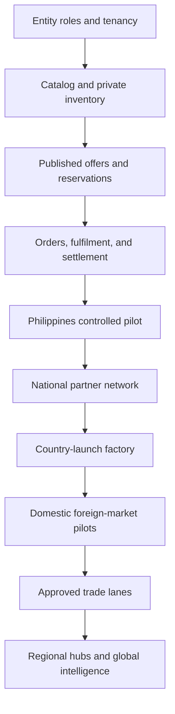

# 365 Parts Program Index

**Repository:** `Hunting-Fishing/motorsales365`

**Program:** 365 Parts Network

**First market:** Philippines

**Expansion:** Asia-Pacific, Europe, and North America

**Status:** Program control document

**Version:** 1.0

**Updated:** 2026-08-06

> This index is the control point for the Parts program. It does not replace the detailed product, architecture, export, legal, tax, quality, or country reviews referenced below.

## 1. Program outcome

365 will build an asset-light parts network that connects customers, repair shops, parts stores, distributors, manufacturers, logistics providers, and installers through one trusted product-intelligence and order-orchestration platform.

The program starts with a controlled Philippine domestic pilot. It then expands into domestic networks in selected countries and connects proven networks through individually approved cross-border trade lanes.

The long-term moat is the evidence chain:

> vehicle or equipment identity → diagnosis or need → selected part → fitment evidence → source → order → delivery → installation → operating result → return, failure, or warranty outcome

## 2. Non-negotiable program rules

1. A user account is a person, not a company, legal entity, shop, or network approval.
2. Shop Manager authorization must use organization and location memberships, never one mutable `profiles.shop_id` value.
3. Inventory is federated. Every stock balance remains privately owned and controlled by its stocking legal entity and location.
4. Network publication exposes only approved availability, commercial terms, and customer-facing facts.
5. A canonical product is separate from a seller item, offer, stock balance, reservation, order line, and installed part.
6. AI may suggest classification, mapping, translation, or fitment; only approved evidence may establish fitment or regulatory eligibility.
7. Every order freezes the seller of record, legal entity, currency, tax treatment, policy versions, responsible parties, and settlement rules.
8. Domestic commerce is the default. Cross-border purchase eligibility requires an approved and versioned trade lane.
9. 365 does not become exporter, importer, merchant of record, product guarantor, lender, or insurer by implication.
10. Growth is approved from contribution margin, cash conversion, service quality, and risk results—not gross merchandise value alone.

## 3. Document hierarchy and authority

| Level | Document | Controls |
|---|---|---|
| 1 | `365_PARTS_PROGRAM_INDEX.md` | Scope, document authority, governance, workstreams, gates, and current program status. |
| 2 | [`365_PARTS_EXECUTION_ROADMAP.md`](./365_PARTS_EXECUTION_ROADMAP.md) | Numbered delivery sequence, dependencies, outcomes, and phase exit criteria. |
| 2 | [`365_PARTS_DECISION_REGISTER.md`](./365_PARTS_DECISION_REGISTER.md) | Decisions, assumptions, owners, deadlines, evidence, and supersession history. |
| 2 | [`365_PARTS_UNIT_ECONOMICS_CAPITAL_PLAN.md`](./365_PARTS_UNIT_ECONOMICS_CAPITAL_PLAN.md) | Revenue, costs, reserves, settlement timing, working capital, and scale approval. |
| 2 | [`365_PARTS_QUALITY_TRACEABILITY_PLAN.md`](./365_PARTS_QUALITY_TRACEABILITY_PLAN.md) | Supplier quality, authenticity, traceability, non-conformance, CAPA, recall, and Part Passport. |
| 2 | [`365_PARTS_REGULATORY_CHANGE_REGISTER.md`](./365_PARTS_REGULATORY_CHANGE_REGISTER.md) | Effective-dated legal and regulatory monitoring and launch-impact workflow. |
| 3 | [`365_PARTS_PARTNER_NETWORK_PLAN.md`](./365_PARTS_PARTNER_NETWORK_PLAN.md) | Customer product, partner operations, Shop Manager, tenancy, catalog, linked inventory, orders, settlement, and Philippine pilot architecture. |
| 3 | [`365_PARTS_GLOBAL_EXPANSION_PLAN.md`](./365_PARTS_GLOBAL_EXPANSION_PLAN.md) | Global core, market packs, localization, regional catalogs, payments, tax, privacy, and country-launch factory. |
| 3 | [`365_PARTS_GLOBAL_EXPORT_DISTRIBUTION_PLAN.md`](./365_PARTS_GLOBAL_EXPORT_DISTRIBUTION_PLAN.md) | Export enrollment, trade lanes, customs, landed cost, carriers, brokers, hubs, contracts, and cross-border operations. |
| 3 | [`365_REPAIR_KNOWLEDGE_NETWORK_PLAN.md`](./365_REPAIR_KNOWLEDGE_NETWORK_PLAN.md) | Repair data, diagnostics, labour, procedures, tools, relearns, provenance, and provider licensing. |
| 4 | [`country-packs/PHILIPPINES.md`](./country-packs/PHILIPPINES.md) | Versioned Philippine market activation configuration and evidence checklist. |
| 4 | [`trade-lanes/PH_ORIGIN_PILOT.md`](./trade-lanes/PH_ORIGIN_PILOT.md) | Controlled Philippines-origin export pilot and destination-selection gate. |

### 3.1 Authority rules

- Detailed specifications define **what the system must support**.
- The roadmap defines **when it may be built or activated**.
- The decision register records **which optional business choices have been approved**.
- Country packs define **where domestic operation is approved**.
- Trade-lane packs define **where a cross-border product/order combination is approved**.
- The regulatory register may suspend a country, product class, payment route, or trade lane even when older documents describe it as planned.
- Signed agreements, approved policies, and current law override planning assumptions.
- If documents conflict, the stricter safety/compliance restriction applies until the program owner records a resolution.

### 3.2 Status vocabulary

| Status | Meaning |
|---|---|
| `idea` | Worth retaining; no delivery or reliance approved. |
| `research` | Evidence and options are being collected. |
| `proposed` | A defined choice awaits owner approval. |
| `approved-for-build` | Scope and dependencies are accepted for implementation. |
| `pilot` | Limited users, geography, volume, or product classes under enhanced review. |
| `approved-for-scale` | Exit criteria and financial/risk gates passed. |
| `restricted` | Operation permitted only under stated limits. |
| `suspended` | New transactions blocked while existing obligations are handled. |
| `retired` | No new use; records retained for audit and support. |

## 4. Program scope

### 4.1 Included

- Consumer, repair-shop, fleet, reseller, and distributor parts demand.
- Automotive, motorcycle, truck/bus, equipment/agriculture, marine, power-sports, and small-engine domains through separate domain packs.
- New, remanufactured, rebuilt, used, universal, performance, tool, fluid, battery, tire, and accessory categories through risk-specific policies.
- Domestic pickup, local delivery, ship-to-shop, distributor direct fulfilment, parcel shipping, consolidation, cross-dock, regional stocking, and approved export.
- Shop Manager inventory, purchasing, quote-to-install, order receiving, warranty, and network sourcing.
- Catalog, fitment, interchange, supersession, authenticity, traceability, recall, and installed-outcome intelligence.

### 4.2 Explicitly deferred until approved

- 365-owned warehouses or broad inventory positions.
- Consumer lending or trade credit funded from 365 operating cash.
- Private-label safety-critical products.
- Automated consumer cross-border checkout across unproven lanes.
- Batteries, aerosols, fuel-system chemicals, airbags, pressurized goods, and other dangerous or highly regulated export classes.
- Claims that 365 guarantees fitment, authenticity, stock, delivery, or warranty without defined evidence standards, exclusions, insurance, and reserves.
- Shared access to another partner's private cost, customer, bin, employee, or accounting information.

## 5. Workstreams

| ID | Workstream | Primary deliverable | Launch dependency |
|---|---|---|---|
| WS-01 | Program governance | Index, roadmap, decision register, ownership, gates | All work |
| WS-02 | Corporate/legal model | Entity roles, seller/exporter/importer/merchant responsibilities | Orders and payouts |
| WS-03 | Partner network | KYB, contracts, locations, roles, service standards | Published offers |
| WS-04 | Shop Manager tenancy | Organization, legal entity, shop, membership, RLS | Linked inventory |
| WS-05 | Catalog and fitment | Canonical products, identifiers, domain fitment, provenance | Search and purchase |
| WS-06 | Inventory federation | Private ledger, publication, freshness, reservations | Stock promises |
| WS-07 | Orders and fulfilment | Parent/sub-orders, routing, receiving, delivery, exceptions | Transactions |
| WS-08 | Payments and finance | Collection, tax, fees, settlement, refunds, reconciliation | Paid orders |
| WS-09 | Quality and trust | Supplier qualification, authenticity, traceability, recall | Partner/product activation |
| WS-10 | Customer product | Garage, search, offer comparison, checkout, tracking, support | Market launch |
| WS-11 | Repair integration | Estimate, procurement, receiving, installation, warranty record | Shop value proposition |
| WS-12 | Integrations | Distributor, POS, EDI/API/CSV, carrier, broker, 3PL adapters | Scale |
| WS-13 | Data/security/privacy | Regional architecture, RLS, audit, retention, incident handling | Production |
| WS-14 | Country activation | Versioned market packs and domestic networks | Each new country |
| WS-15 | Export/distribution | Approved lanes, documents, landed cost, customs, returns | Cross-border orders |
| WS-16 | Analytics/intelligence | Demand, no-result, fitment, quality, unit economics, outcomes | Scaling decisions |

## 6. Dependency map

Cross-cutting quality, security, regulatory, finance, and audit gates apply to every node.

## 7. Program gates

| Gate | Required evidence | Authority |
|---|---|---|
| G0 — concept | Program charter, scope, initial commercial hypothesis | Program sponsor |
| G1 — architecture | Tenancy, ledger, catalog, order, policy-version, and RLS design approved | Product + engineering + security |
| G2 — legal/financial | Entity roles, contracts, tax/payment/payout model, reserves, insurance path | Executive + finance + counsel |
| G3 — partner/data | Founding partners, licensed data, product/category rules, training | Partner + catalog + quality leads |
| G4 — internal sandbox | End-to-end tests, reconciliation, audit evidence, recovery tests | Engineering + operations |
| G5 — assisted pilot | Limited live orders, manual oversight, daily reconciliation | Pilot steering group |
| G6 — domestic scale | Service, quality, contribution margin, support, and continuity thresholds | Executive review |
| G7 — country activation | Approved country pack and local operating capability | Country launch committee |
| G8 — trade-lane activation | Exact origin/destination/product/service pack approved | Trade compliance committee |
| G9 — strategic capital | Proven density and return on invested capital | Board/investment authority |

Failure of a gate blocks the dependent activation; it does not erase learning or completed work.

## 8. Program governance

### 8.1 Required accountable roles

One person may hold several roles during the pilot, but each responsibility must have one named accountable owner.

| Role | Accountability |
|---|---|
| Program sponsor | Strategy, funding envelope, final go/no-go decisions |
| Program manager | Roadmap, dependencies, risks, decisions, reporting |
| Product owner | Customer, partner, Shop Manager, and admin scope |
| Technical lead | Architecture, delivery quality, provider integrations |
| Security/privacy lead | RLS, threat model, privacy, incident and access controls |
| Finance lead | Unit economics, payout, tax, reconciliation, reserves, capital |
| Partner operations lead | Recruitment, onboarding, training, performance, enforcement |
| Catalog/fitment lead | Data rights, provenance, mapping, correction, coverage |
| Quality/compliance lead | Supplier qualification, product safety, CAPA, recall, regulatory register |
| Customer operations lead | Support, disputes, returns, communication, service recovery |
| Trade compliance lead | Export/import approvals, screening, brokers, customs, lane suspensions |
| Country manager | Country-pack evidence and domestic performance |

### 8.2 RACI rule

- Every roadmap step has one accountable owner before `approved-for-build`.
- Legal, tax, customs, insurance, or regulatory specialists advise and validate; business owners still record the operational decision.
- No developer is expected to infer seller-of-record, tax, refund, importer, warranty, or data-retention rules from UI copy.

## 9. Program scorecard

### 9.1 Demand and growth

- qualified searches and wanted-part requests;
- no-result and ambiguous-fitment rate;
- quote-to-order conversion;
- active customers, shops, partner locations, and suppliers;
- repeat purchase and repair-shop retention;
- domestic and cross-border order density by route.

### 9.2 Catalog and inventory

- fitment evidence coverage and confidence;
- duplicate/conflict rate;
- stock freshness and confirmation accuracy;
- reservation success and oversell rate;
- correct-item-shipped rate;
- product safety and recall coverage.

### 9.3 Service and trust

- on-time promise performance;
- cancellation and exception rate;
- return, warranty, counterfeit, damage, and dispute rate;
- time to first response and resolution;
- partner service score and corrective-action closure;
- installed-part outcome capture.

### 9.4 Financial and capital

- gross transaction value and net revenue;
- contribution margin per order, partner, category, lane, and market;
- payment/settlement reconciliation exceptions;
- refund, chargeback, fraud, warranty, duty, FX, and bad-debt loss;
- cash conversion cycle and reserve coverage;
- return on inventory, hub, integration, and country-launch capital.

## 10. Change control

Any change affecting legal responsibility, customer price, fitment, product eligibility, tax, payout, refunds, data access, trade lanes, quality gates, or safety requires:

1. a decision-register entry;
2. identified affected records, interfaces, agreements, and country/lane packs;
3. effective date and migration/transition rule;
4. approval by the accountable owner;
5. tests and rollback/suspension path;
6. audit evidence and customer/partner communication when applicable.

Rules must be effective-dated. Historical orders keep the policy and calculation snapshots used when the order was accepted.

## 11. Meeting and reporting cadence

| Cadence | Purpose |
|---|---|
| Daily during pilot | Orders, money, stock, exceptions, safety, support, partner issues |
| Weekly | Roadmap, blockers, decisions, risk changes, data quality, partner launch readiness |
| Monthly | Unit economics, cash, reserves, quality trends, compliance register, country/lane scorecards |
| Quarterly | Strategy, capital allocation, market sequence, provider concentration, insurance, continuity exercises |
| Event-driven | Recall, breach, regulatory change, sanctions match, serious incident, material provider failure |

## 12. Current program state

| Area | Current state | Next controlled action |
|---|---|---|
| Detailed strategy | Documented | Merge and baseline the approved specifications |
| Shop Manager | Strong single-shop foundation; multi-company correction not implemented | Complete tenancy design and migration plan |
| Partner network | Routes and supplier CRM foundations exist | Define KYB, agreements, activation, and founding cohort |
| Catalog | Transitional catalog and feed routes exist | Establish canonical model, provenance, licensing, and pilot scope |
| Linked inventory | Target design documented | Build private ledger/publication boundary after tenancy |
| Orders/settlement | Existing shop and commerce fragments | Freeze seller/tax/payout model before orchestration build |
| Philippine market pack | Draft created | Assign owners and replace open items with evidence |
| Export | Detailed target design documented | Select one destination and complete exact lane pack |
| Quality/traceability | Control plan created | Appoint owner and implement supplier/product gates |
| Economics | Model structure created | Populate from signed terms and measured pilot data |

## 13. Immediate executive actions

1. Approve this document hierarchy.
2. Assign accountable owners for WS-01 through WS-16.
3. Resolve the P0 decisions in the Decision Register.
4. Repair and merge the documentation PR, then tag the approved baseline.
5. Begin Roadmap Steps 1–10 only; keep later work as design and research until gates are passed.
6. Do not activate a foreign market or export destination from a generic feature flag.

## 14. Definition of program completion

The program is never “complete” merely because a marketplace page exists. A mature state requires:

- profitable domestic networks in multiple approved countries;
- reliable partner-held and distributor-held inventory publication;
- verifiable catalog, fitment, authenticity, installation, and outcome evidence;
- reconciled order, tax, settlement, return, and warranty ledgers;
- repeatable country and trade-lane activation packs;
- resilient provider and logistics operations;
- proven demand-driven capital allocation;
- a proprietary parts-intelligence network that improves with every transaction.
