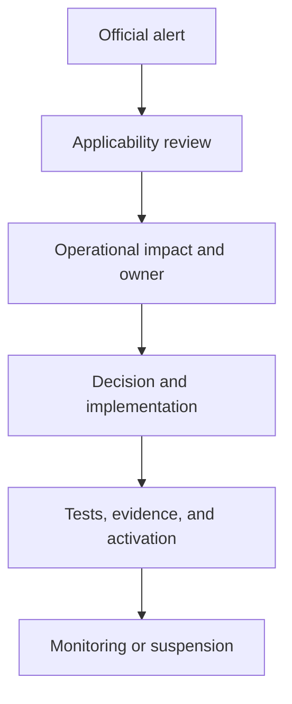

# 365 Parts Regulatory Change Register

**Control document:** [`365_PARTS_PROGRAM_INDEX.md`](./365_PARTS_PROGRAM_INDEX.md)

**Status:** Regulatory monitoring and impact-control specification

**Version:** 1.0

**Updated:** 2026-08-06

> This is an operating register, not legal, tax, customs, privacy, product-safety, or sanctions advice. Entries must be validated by qualified professionals before they authorize or change operations.

## 1. Purpose

The Parts Network will operate across changing marketplaces, tax systems, product rules, privacy regimes, payment markets, and customs lanes. Requirements must be effective-dated and operationally connected to product, seller, order, country, and trade-lane controls.

The register prevents:

- outdated thresholds or rates being hard-coded;
- a rule for one country being reused in another;
- launch before required registration, reporting, labeling, return, or responsible-party capability exists;
- historical orders being recalculated under current rules;
- regulatory updates remaining in email or legal memos without product/operations action.

## 2. Register ownership

| Role | Responsibility |
|---|---|
| Regulatory/change owner | Maintains register, sources, dates, and review cycle |
| Local counsel/tax/customs adviser | Interprets applicability and required action |
| Country manager | Collects market evidence and confirms operational readiness |
| Trade compliance lead | Applies import/export, sanctions, classification, and lane controls |
| Product/engineering | Converts approved requirements into effective-dated configuration and tests |
| Finance | Tax, withholding, invoices, reporting, payouts, reserves |
| Quality | Product safety, labeling, restricted goods, recall, environmental obligations |
| Privacy/security | Data, consent, rights, transfers, retention, incidents |
| Program sponsor | Accepts residual risk or suspends scope |

## 3. Source hierarchy

Prefer, in order:

1. enacted law, official gazette, regulation, court/authority decision;
2. official regulator, customs, tax, privacy, consumer, product-safety, or sanctions guidance;
3. written ruling, permit, registration, or adviser opinion for the exact entity/activity;
4. provider/carrier/broker contract and operational rule;
5. reputable professional summary used only to identify primary sources;
6. news, blogs, search results, and AI used only as alerts—not authority.

Every record stores the direct source URL or document, publication date, effective date, retrieved date, jurisdiction, language, and reviewer.

## 4. Regulatory record schema

| Field | Requirement |
|---|---|
| `change_id` | Stable identifier such as `PH-TAX-2026-001` |
| jurisdiction | Region, country, state/province, local authority, customs territory |
| authority | Issuing body |
| subject | Marketplace, tax, customs, privacy, consumer, product, payments, etc. |
| instrument | Law, regulation, circular, decision, guidance, provider rule |
| source | Official URL/document and archived evidence |
| publication/effective dates | Separate dates; include transition periods |
| applicability | Entity, activity, customer, product, market, lane, threshold |
| interpretation status | Alert, under review, adviser-confirmed, approved, disputed |
| operational impact | Product, process, data, contract, finance, training, reporting |
| affected configuration | Market pack, lane pack, rule IDs, provider IDs, product classes |
| owner/deadline | One accountable owner and required completion date |
| required evidence | Registration, filing, test, contract, screen, training, approval |
| deployment | Code/config version and release date |
| historical treatment | Whether existing orders/records retain prior rule |
| suspension/rollback | What is blocked if work is late or invalid |
| review | Completion, effectiveness, and next monitoring date |

## 5. Impact categories

- corporate registration and foreign ownership;
- online marketplace/merchant registration;
- seller verification and platform disclosures;
- consumer rights, returns, warranties, complaints, and online dispute resolution;
- advertising, pricing, rankings, sponsored placements, reviews, and dark patterns;
- income, VAT/GST/sales tax, withholding, invoicing, e-invoicing, seller reporting;
- payments, e-money, payout, stored value, escrow, lending, and AML/KYC;
- privacy, cookies, marketing, profiling, minors, biometrics, data rights, transfers, residency, and breach;
- product safety, recalls, responsible person/economic operator, labeling, language, technical files;
- batteries, tires, oils, chemicals, packaging, waste, extended producer responsibility;
- emissions, theft-prevention, immobilizer, software, telematics, cybersecurity, and repair data;
- customs classification, origin, valuation, duty, de minimis, trade remedies, permits, export controls, sanctions;
- dangerous goods, carrier acceptance, packaging, documentation, and storage;
- competition, buying groups, exclusivity, resale pricing, rebates, and data sharing;
- employment/contractor, insurance, warehouse, health/safety, and local permits.

## 6. Change workflow

### 6.1 Alert

Create the record even when applicability is uncertain. Do not wait for full interpretation when an effective date may be near.

### 6.2 Triage

Classify urgency:

| Priority | Meaning |
|---|---|
| R0 | Immediate safety, illegality, sanctions, privacy, payment, or customer-funds risk; suspend affected scope |
| R1 | Mandatory action before a near effective date or launch |
| R2 | Material design/contract/reporting change with manageable lead time |
| R3 | Monitor, clarify, or include in next scheduled review |

### 6.3 Impact assessment

Identify affected:

- legal entities and registrations;
- partners, sellers, buyers, providers, and staff;
- product/category/domain;
- market and exact trade lane;
- customer terms, price, returns, warranty, and disclosures;
- onboarding, KYB/KYC, payments, payout, tax, invoice, and reporting;
- data fields, retention, consent, access, and localization;
- APIs, carrier/broker rules, jobs, screens, reports, and training;
- historical versus future transactions.

### 6.4 Decision and implementation

Create a Decision Register entry when options exist. Convert the approved interpretation into effective-dated configuration. Avoid code releases for rates/thresholds where governed configuration is safer.

### 6.5 Validation

Require legal/adviser confirmation as applicable, automated tests, operational simulation, reconciliation, updated agreements/policies, training, and evidence upload.

### 6.6 Closure

Close only when the rule is active, affected operations comply, monitoring exists, and late/non-compliant transactions are resolved.

## 7. Monitoring cadence

| Scope | Minimum cadence |
|---|---|
| Live market: tax, marketplace, privacy, consumer, payments | Monthly and alert-driven |
| Live trade lane: customs, sanctions, export controls, dangerous goods | Before quote/shipment plus alert-driven rule updates |
| Product safety and recalls | Continuous provider/regulator intake |
| Country in launch preparation | Monthly; weekly within 90 days of activation |
| Future country | Quarterly high-level watch |
| Provider/carrier operational rules | Contract change and scheduled quarterly review |
| Full country/lane reapproval | At least annually and after material change |

## 8. Philippines initial watch register

These entries identify mandatory workstreams; counsel/advisers must validate exact applicability and current implementation.

| Change ID | Topic/source | Current operational implication | Status/owner |
|---|---|---|---|
| PH-MKT-001 | DTI Internet Transactions Act / E-Commerce Philippine Trustmark | Verify platform, marketplace, merchant, seller-verification, disclosure, complaint, and Trustmark obligations before domestic launch. | `under review` / legal + country manager |
| PH-TAX-001 | BIR marketplace withholding issuances, including amendments and clarifications | Do not freeze historic RR 16-2023 assumptions; confirm current withholding base, exceptions, certificates, filing, transition, and seller onboarding. | `under review` / tax lead |
| PH-PRIV-001 | Data Privacy Act, IRR, and NPC issuances | Establish controller/processor roles, lawful bases, privacy management, rights, security, breach, sharing, transfers, and retention. | `under review` / privacy lead |
| PH-CUS-001 | Bureau of Customs export/import guidance and customs orders | Exact exporter/importer registration, declaration, document, permit, classification, origin, value, and port process belongs in each lane pack. | `under review` / trade lead |
| PH-CONS-001 | Consumer Act, ITA, DTI complaints/ODR | Build clear seller identity, terms, price, delivery, redress, returns/warranty, records, and complaint escalation. | `under review` / customer ops + legal |
| PH-PROD-001 | DTI/other agency prohibited and regulated product lists | Product eligibility must be authority/product/category specific; no generic automotive exemption. | `under review` / quality |
| PH-PAY-001 | BSP/payment-provider rules and provider availability | Confirm collection, payout, stored-value/escrow boundaries, KYC, limits, disputes, and safeguarding with licensed providers. | `under review` / finance |

## 9. Global watch matrix

Each country pack must create current entries for:

| Area | Asia-Pacific examples | Europe examples | North America examples |
|---|---|---|---|
| Marketplace | seller verification, platform registration, consumer redress | DSA/trader traceability, GPSR/economic operator, national consumer rules | marketplace facilitator, state/provincial consumer and seller rules |
| Tax/invoice | VAT/GST, withholding, e-invoicing | VAT, OSS/IOSS where applicable, platform reporting, e-invoicing | sales tax/GST/HST/PST/VAT and marketplace facilitator rules |
| Privacy | national privacy laws and cross-border transfers | GDPR/UK GDPR and national overlays | federal/state/provincial privacy regimes |
| Product | national standards, permits, labeling, recalls | GPSR, batteries/EPR, national market surveillance | federal/state/provincial product, recall, emissions, environmental rules |
| Customs | origin, agreements, ASEAN/other procedures | EORI, tariff, origin, import controls | importer numbers, tariff/classification, low-value and trade remedies |
| Payments | local acquiring/payout availability | PSD/payment provider and payout conditions | provider availability, money transmission/credit boundaries |

This table is a routing guide, not a statement that every named regime applies to every 365 activity.

## 10. Product safety and recall feed register

For every live market/domain, record:

- official recall and safety authorities;
- supplier/manufacturer notice feeds;
- ingestion method and frequency;
- identifier-matching rules;
- human review owner;
- stop-sale threshold;
- customer/partner/regulator notification workflow;
- evidence retention and effectiveness review.

## 11. Customs and trade rule register

Each exact lane pack links to effective-dated records for:

- HS/Schedule B/tariff classification source and ruling;
- manufacturing and preferential origin;
- customs valuation method and assists/royalties/related-party effects;
- duty, tax, brokerage, disbursement, and trade-remedy treatment;
- low-value processing and data requirements;
- importer/exporter/declarant registration;
- permits, licenses, sanctions/export-control screening;
- dangerous-goods carrier rules;
- evidence, declaration, correction, drawback/duty recovery, and record retention.

## 12. Product and code controls

The platform needs:

- `regulatory_rules` with jurisdiction, scope, dates, version, and status;
- `regulatory_rule_impacts` linked to product, partner, market, lane, provider, policy, and feature;
- `market_activations` and `trade_lane_versions` that reference approved rule sets;
- scheduled pre-effective-date warnings;
- activation refusal when required evidence is incomplete/expired;
- emergency suspension with reason, owner, customer/partner handling, and audit;
- order-level snapshots of applied rules;
- reports for affected historical orders after a change or recall.

## 13. Source list — Philippines starting points

- [DTI E-Commerce Philippine Trustmark](https://trustmark.dti.gov.ph/)
- [DTI Trustmark FAQs](https://trustmark.dti.gov.ph/faqs)
- [DTI Consumer Care/online dispute resolution](https://consumercare.dti.gov.ph/)
- [BIR Revenue Memorandum Circulars](https://www.bir.gov.ph/2024-Revenue-Memorandum-Circulars)
- [Bureau of Customs export guidance](https://customs.gov.ph/guidelines-on-exportation/)
- [Bureau of Customs import guidance](https://customs.gov.ph/guidelines-on-importation/)
- [National Privacy Commission Data Privacy Act](https://privacy.gov.ph/data-privacy-act/)
- [Data Privacy Act implementing rules](https://privacy.gov.ph/implementing-rules-regulations-data-privacy-act-2012/)

Official source links must be rechecked at each review; saved evidence should include retrieval date and document version.

## 14. Definition of regulatory readiness

A market, product class, provider route, or trade lane is ready only when:

- applicable authorities and rules have named owners;
- exact responsibilities and registrations are documented;
- effective dates and transition rules are configured;
- customer/partner contracts and disclosures match operations;
- product, tax, payment, privacy, customs, and reporting tests pass;
- evidence is stored and expiry is monitored;
- suspension and historical-order handling are rehearsed;
- qualified advisers have reviewed the scope where required.
