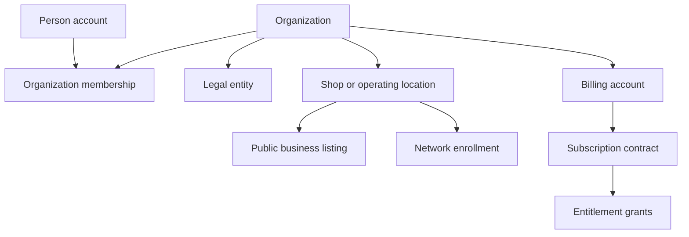
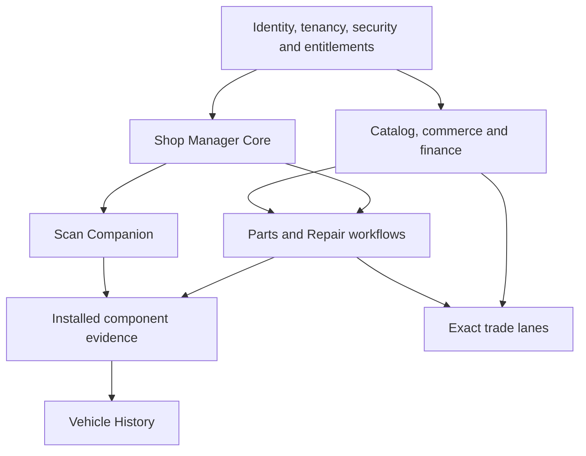

# 365 Platform Program Index

**Repository:** `Hunting-Fishing/motorsales365`  
**Primary market:** Philippines  
**Expansion direction:** Asia-Pacific first; selected European and North American markets after country, provider, privacy and economic gates  
**Document role:** Platform-wide control index and dependency register  
**Status:** Initial control baseline; not production or launch authorization  
**Version:** 1.0  
**Updated:** 2026-08-06

## 1. Purpose

This document governs 365 Motor Sales as one connected platform. It prevents Marketplace, Shop Manager, Parts, Repair Knowledge, Diagnostics, Vehicle History, Partner/Franchise operations and Export from creating incompatible identities, permissions, financial records or evidence models.

This is intentionally an index, not another detailed plan. It must remain short enough to operate. Specialist plans retain their detailed requirements; this document controls:

- program boundaries and authority;
- shared platform architecture;
- cross-program dependencies;
- status, owners and decision gates;
- conflicts between plans, code, policies and marketing;
- the Philippines-first delivery sequence; and
- the conditions for national and international expansion.

No plan, feature label, open pull request or marketing page authorizes production launch by itself.

## 2. Platform outcome

365 should operate as a trusted mobility-commerce and service network with one shared backbone:

> person or organization → service asset → need or diagnosis → quote/work order → part or service → payment/settlement → installation or completion → evidence → lifecycle history

The platform should create value before any government or enterprise-data agreement is signed. LTO, insurers, OEMs, catalog providers, repair-data vendors and logistics partners add authoritative or commercial layers later; they must not own 365's core identities, evidence, workflow or customer relationship.

## 3. Authority and document precedence

### 3.1 Precedence

When two sources conflict, apply this order:

1. Applicable law, regulator direction, signed contract, licence restriction, court order or active incident suspension.
2. An approved platform decision recorded under this index.
3. This Platform Program Index for shared boundaries, dependencies and gates.
4. The relevant specialist control plan for domain detail.
5. An activated country pack or exact trade-lane pack for one jurisdiction.
6. Approved implementation specifications, migrations, API contracts and tests.
7. Repository feature catalogues, terms pages, sales copy and other descriptive material.
8. Unmerged branches, draft pull requests, meeting notes and ideas.

Code and database schemas are evidence of current behavior; they do not prove that the behavior is secure, legally approved or ready to scale. If a conflict cannot be resolved immediately, the stricter safety, privacy, licensing and consumer-protection restriction applies and the dependent capability is blocked.

### 3.2 Authoritative document register

| Document or source | Current role | Authority/status | Required action |
|---|---|---|---|
| `365_PLATFORM_PROGRAM_INDEX.md` | Shared scope, architecture, dependencies, gates and cross-program status | Platform control baseline | Assign owners and record sponsor approval |
| [`365_REPAIR_KNOWLEDGE_NETWORK_PLAN.md`](./365_REPAIR_KNOWLEDGE_NETWORK_PLAN.md) | Repair information, provider access, four repair domains and diagnostic architecture | Specialist plan on `main` | Implement only after platform gates |
| [`vendor-outreach/README.md`](./vendor-outreach/README.md) | Repair/catalog/diagnostic provider procurement | Outreach working pack on `main` | Complete company and pilot fields before sending |
| [`365_VEHICLE_HISTORY_NETWORK_PLAN.md`](./365_VEHICLE_HISTORY_NETWORK_PLAN.md) | Vehicle lifecycle, evidence, installed parts, reports and government-partner strategy | Specialist plan on `main` | Build 365-owned MVP before relying on government data |
| [`vehicle-history-outreach/README.md`](./vehicle-history-outreach/README.md) | LTO, HPG, insurer and partner outreach controls | Outreach working pack on `main` | Clear all blocker fields before outreach |
| [`SHOP_MANAGER_MIGRATION_STATUS.md`](./SHOP_MANAGER_MIGRATION_STATUS.md) | Historical migration record dated 2026-07-13 | Reference only; no longer current program status | Replace later with a current architecture and migration register |
| `src/data/features-catalog.ts` | Product/marketing feature inventory | Descriptive; not launch authority | Reconcile labels with tested production status |
| `src/routes/terms.tsx` and related policies | Current public contractual statements | Binding only as deployed and legally applicable; not an architecture plan | Split or add product-specific terms before new services launch |
| [Parts Program draft PR #2](https://github.com/Hunting-Fishing/motorsales365/pull/2) | Parts index, roadmap, decisions, economics, quality, country and export packs | Draft/unmerged; not platform authority | Reconcile with current `main`, this index and Vehicle History before merge |

After Parts PR #2 is reconciled and merged, its Parts Program Index controls Parts-only execution beneath this platform index. Its `G0–G10` gates remain Parts gates; this document's `PG0–PG10` are platform gates.

### 3.3 Status vocabulary

| Delivery status | Meaning |
|---|---|
| `research` | Problem, market, law, provider or architecture is still being investigated. |
| `proposed` | A defined approach awaits accountable approval. |
| `approved-for-build` | Scope, owner, dependencies, risks and acceptance tests are approved. |
| `in-build` | Code, operating procedures or contracts are actively being prepared. |
| `internal-test` | Limited to controlled non-customer or synthetic data. |
| `pilot` | Limited users, geography, volume and products with enhanced oversight. |
| `production` | Approved for the named market, users, volume and version only. |
| `suspended` | New use is blocked while existing obligations are safely handled. |
| `retired` | New use has ended; retention and support duties remain. |

Evidence labels are separate from delivery status:

- `documented-only` — described in a plan but not verified in code;
- `repository-evidenced` — relevant routes, tables or code were found;
- `operationally-verified` — tested in the deployed environment with recorded results;
- `externally-authorized` — required licence, contract or authority is active.

Never convert `repository-evidenced` or a feature-catalogue `live` label into `production` without operational verification and the applicable gate decision.

## 4. Program portfolio and boundaries

| Program | Product responsibility | Current evidence | Current control state | Platform dependency |
|---|---|---|---|---|
| Marketplace and Business Directory | Vehicle/equipment listings, seller/business discovery, messaging and listing trust | Repository-evidenced; production claims need verification | `in-build` | Identity, trust, policy and payments |
| Shop Manager Core | Customers, staff, work orders, inspections, quotes, parts, time, invoices, payments and reminders | Strong native `/workspace` surfaces documented; multi-company correction incomplete | `in-build` | Tenancy, RLS, billing and continuity |
| Parts Partner Network | Catalog, partner offers, stock, RFQ, ordering, fulfilment, returns, warranty and installed-part traceability | Detailed plans in draft PR #2; some existing inquiry/inventory surfaces | `proposed` | Shop Manager, catalog, tenancy, finance and quality |
| Repair Knowledge Network | Licensed/free/original repair information, labour, recall, procedure and provider routing | Complete plan; shared network not implemented | `proposed` | Asset identity, domain entitlements, licences and Shop Manager |
| 365 Scan Companion | Device registration, read-only scans, VIN comparison, DTC/readiness/freeze-frame/live observations and RO attachment | Architecture researched; no production companion verified | `research` | Shop Manager, device trust, domain rules and evidence service |
| Vehicle History Network | Verified lifecycle events, installed parts, reports, owner sharing, correction/dispute and partner status checks | Plan and outreach package complete; product and external feeds not verified | `proposed` | Shared asset/event/evidence model, Shop Manager, Parts and Scan |
| Partner/Franchise Network | Shop enrollment, verification, benefits, brand permissions and network participation | Repository and terms evidence; entity/entitlement boundaries need correction | `in-build` | Organization hierarchy, contracts, training and quality |
| Payments and Settlement | Subscriptions, invoices, marketplace collection, seller payout, refund, reserves and reconciliation | Subscription/payment surfaces exist; marketplace settlement is not proven | `research` for network commerce | Legal roles, ledger, provider support and finance controls |
| Export and Trade Lanes | Assisted export, customs/logistics roles, landed cost, eligibility, returns and warranty | Draft Parts plans only; no exact active lane approved | `research` | Proven domestic Parts network, quality, finance and exact lane pack |
| Education and Certification | 365 Learn, partner training and future technician certification | Existing product surfaces; certificates are not trade licences | `in-build` | Identity, content rights and clear claims |

Each program is a bounded product. Shared infrastructure does not merge its legal role, data visibility, provider licence, price, entitlement or customer promise with another program.

## 5. Shared identity, tenancy and partner model

### 5.1 Required hierarchy

One record must not silently substitute for another:

- A person account authenticates a human.
- An organization represents the operating group or account boundary.
- A legal entity identifies the party that contracts, invoices, pays, receives funds or carries liability.
- A shop/location is an operational site.
- A public business listing controls discovery content, not private data access.
- A network enrollment represents Parts, Franchise, Repair, History or another partner relationship and its state.
- A billing account and subscription contract record who purchased access.
- Entitlement grants control which people, organization and locations may use which capabilities.

### 5.2 Resolution of the `user_id` / `business_id` / `business_partner_id` conflict

The platform must not solve partner subscriptions by adding `business_partner_id` as another interchangeable owner column.

Binding architecture direction:

1. Keep `user_id` for personal entitlements and audit identity.
2. Treat the current public `business_id` as a listing/reference until its exact schema role is audited; it must not be the universal tenancy key.
3. Create or normalize an `organization_id` as the durable company account boundary.
4. Link one or more `legal_entity_id` and `shop_location_id` records to the organization.
5. Use a `network_enrollment` or equivalent record for Partner/Franchise/Parts participation. A future `business_partner_id` may identify this enrollment, but not the organization itself.
6. Attach subscription contracts to the purchaser/billing account and issue explicit entitlement grants to the organization, selected sites and, when needed, named users.
7. Server functions and RLS enforce grants. UI state, a public listing, a coupon, a partner badge or a paid invoice is never sufficient authorization.
8. Suspension of a network enrollment removes network capabilities without deleting the business listing, Shop Manager data or unrelated subscriptions.

This supports standalone car washes and other ordinary businesses, direct 365 partners, multi-location companies, franchises and individual technicians without forcing them into one identity type.

## 6. Shared platform objects and ownership

| Object | Authoritative owner | Shared use | Prohibited shortcut |
|---|---|---|---|
| Person and authentication | Platform Identity | Memberships, technician actions, buyer/seller actions | Using email/phone as durable foreign key |
| Organization/legal entity/location | Platform Tenancy | All business products | Treating public listing ID as legal or tenancy identity |
| Service asset | Platform Asset Registry | Marketplace, Shop Manager, Repair, Scan, History, Parts | Separate incompatible vehicle rows per product without mapping |
| Domain profile | Automotive, Motorcycle, Heavy Truck or Marine module | Exact identity/applicability | Falling back to Automotive fields or data |
| Customer relationship | Shop Manager/private CRM | Work orders and owner-authorized sharing | Network-wide CRM access without purpose and consent |
| Work order and inspection | Shop Manager | Repair, Parts, Scan and History references | Copying private notes into public history |
| Canonical product | Parts Catalog | Offers, fitment, purchasing, installation | Treating a seller listing as canonical truth |
| Seller item and offer | Parts Network | Search, quote and order | Pooling ownership or letting one seller edit another's stock |
| Inventory position/reservation | Owning company/location | Publication and fulfilment | Shared editable network quantity |
| Order/line/settlement | Commerce and Finance | Parts, services, fees, refunds | Deriving money from mutable invoice display fields |
| Part or component instance | Installed Component Registry | Work order, warranty and History | Treating purchase as proof of installation |
| Diagnostic scan/report | Scan domain | Work order and History evidence | Treating a cleared code as proof of repair |
| Evidence object and assertion | Trust/Evidence Service | History, quality, disputes and audits | Destructive overwrite of disputed facts |
| Published history event/report | Vehicle History | Owner/buyer/shop authorized views | Exposing customer, owner or shop-private data by default |
| Provider content/cache | Owning domain adapter | Entitled display and search | Reuse outside contract, territory or retention rights |

## 7. Repair and diagnostic module boundaries

The four first-class repair modules remain independently purchasable:

| Module key | Domain | Identity rule | Diagnostic rule |
|---|---|---|---|
| `repair_automotive` | Cars, SUVs, pickups, vans and explicitly classified light commercial vehicles | VIN/chassis plus regional variant | OBD/light-vehicle stack |
| `repair_motorcycle` | Motorcycles, scooters, underbones, tricycles and ATV/UTV | Frame/model/engine; no forced 17-character VIN | Motorcycle hardware/protocol pack |
| `repair_heavy_truck` | Medium/heavy trucks, buses, trailers and fleet components | Chassis plus engine/transmission/axle/aftertreatment/trailer components | RP1210/J1939/commercial stack |
| `repair_marine` | Vessels, outboards, inboards, sterndrives and personal watercraft | HIN/vessel plus installed propulsion/system identity | NMEA/Signal K telemetry plus licensed OEM diagnostics |

Rules:

- Shop Manager Core may be purchased with any one domain.
- Automotive never unlocks Motorcycle, Heavy Truck or Marine data.
- Personal watercraft belong to Marine.
- Ambiguous light-commercial assets require an explicit classification record.
- Provider packs, device packs, territory rights, usage cost and audit logs stay domain-specific.
- Cross-domain search is a federated entitled view; it cannot create a cross-domain fitment or repair-data fallback.
- The Scan MVP is read-only. Clearing, actuator tests, resets, coding and programming require later safety, authorization, voltage, provider and audit gates.

## 8. Entitlement, billing and pricing contract

Every sellable capability requires:

- stable `module_key` and optional `addon_key`;
- purchaser/billing account and legal seller/provider snapshot;
- granted organization, location and/or user;
- territory, repair domain and provider-pack limitations;
- start, renewal, expiry, cancellation, suspension and grace state;
- quantity/seat/site/device limits;
- provider usage and cost-of-goods metering;
- immutable price, tax, discount and policy version snapshots; and
- server-side and RLS enforcement tests.

Bundles may discount multiple products, but they create separate entitlement grants. A Parts partner enrollment may qualify an organization for a price or benefit; it does not itself grant Shop Manager, repair data, diagnostic or History access.

## 9. Evidence, privacy and lifecycle rules

1. Operational records remain private to the permitted organization and users by default.
2. Public or buyer-visible History uses a separately approved assertion with source, event time, observation time, confidence, evidence, visibility and policy version.
3. Corrections append, supersede or annotate; they do not erase the audit trail unless law requires a controlled deletion.
4. Purchase, delivery, installation, verification, removal, failure, return and warranty are separate events.
5. A part instance may record manufacturer, part number, supplier, condition, serial/lot/GTIN, position, installer, date, mileage/hours, warranty, removal and failure evidence.
6. Previous-owner identity and private shop/customer details do not follow the asset to a new owner.
7. AI may extract, translate, map or suggest. It may not invent fitment, mark an event verified, approve a repair procedure or override a conflict.
8. Every external field carries source, licence, territory, allowed use, cache/retention rule and refresh date.
9. No scraping of personal profiles, private databases, subscription portals or unofficial vehicle records is permitted.
10. LTO and other government access is a later controlled verification layer, not a dependency for the 365-owned MVP.

## 10. Cross-program dependency map

Vehicle History may ingest approved events from all programs, but it must never become the transactional system of record for work orders, stock, payments or subscriptions.

## 11. Platform gates

| Gate | Required evidence | Blocks |
|---|---|---|
| `PG0 — authority` | Sponsor, program owner, decision method, document register and budget boundary approved | All new cross-program builds |
| `PG1 — architecture` | Identity, organization, tenancy, service asset, catalog, event/evidence, ledger and entitlement designs approved | Migrations and integrations |
| `PG2 — security and continuity` | RLS/adversarial tests, secret rotation, MFA, privileged access, backups/restore, incident and dependency controls pass | Live partner/customer data |
| `PG3 — legal and commercial model` | Operating entity, contracting roles, seller/payment/invoice/refund roles, terms, privacy, tax and insurance decisions recorded | Network commerce and outreach commitments |
| `PG4 — build authorization` | Bounded scope, owner, budget, acceptance tests, rollback and data migration approved | Feature implementation |
| `PG5 — internal readiness` | Synthetic/internal tests, monitoring, support, reconciliation and suspension paths pass | External pilot |
| `PG6 — Philippine pilot` | Named cohort, geography, limits, consent, contracts, support and daily review approved | Public scale |
| `PG7 — external partner` | Due diligence, licence/data rights, security, pilot contract and integration acceptance pass | Provider/government data use |
| `PG8 — Philippine scale` | Unit economics, quality, uptime, security, consumer outcomes and cash/reserve thresholds pass | National growth |
| `PG9 — foreign domestic market` | Activated country pack, local entity/roles, privacy, tax, payments, support, providers and returns pass | Foreign launch |
| `PG10 — trade lane` | Exact origin/destination, product class, parties, carrier, customs, landed cost, payment, return and warranty route approved | Cross-border transaction |

Gate approval is version-, market-, module-, product- and volume-specific. Passing one gate never authorizes every future market or use.

## 12. Current cross-program status and blocker register

| ID | Area | Current state | Blocking issue | Depends on | Owner |
|---|---|---|---|---|---|
| `PS-001` | Platform authority | This initial index prepared | Sponsor approval and named program owner open | — | Open |
| `PS-002` | Parts documents | Draft PR #2 is open and currently separate from `main` | Reconcile shared identity, evidence and current History work before merge | PS-001 | Program owner |
| `PS-003` | Shop Manager | Strong single-shop native foundation reported | Current architecture inventory, duplicate-table plan and multi-company RLS tests incomplete | PG1/PG2 | Technical lead |
| `PS-004` | Identity/tenancy | Several user/business/shop concepts exist | Organization, legal entity, location, listing and enrollment boundaries not yet enforced consistently | PG1 | Product + technical |
| `PS-005` | Subscriptions | User/business-scoped flows exist | Organization/site grants and separate module/provider entitlements incomplete | PS-004 | Product + finance |
| `PS-006` | Security/continuity | Policies and RLS exist in areas | Production-wide RLS, secrets, restore, incident and privileged-access evidence incomplete | PG2 | Security/privacy |
| `PS-007` | Parts commerce | Plans and partial inventory/inquiry features exist | Canonical catalog, private inventory boundary, seller roles, settlement and quality gates incomplete | PS-003–006 | Parts owner |
| `PS-008` | Repair Knowledge | Global/provider plan complete | Shared schema, content rights, coverage registry and domain entitlements not implemented | PS-003–006 | Repair owner |
| `PS-009` | Scan Companion | Hardware/open-source route researched | Companion app, device registry, signing and exact scan-to-RO implementation missing | PS-003/004/006 | Diagnostic owner |
| `PS-010` | Vehicle History | Plan and outreach package complete | 365-owned product schema, report, owner transfer, correction and evidence services missing | PS-003/004/006/007/009 | History owner |
| `PS-011` | Government/provider access | Outreach drafts ready | Company, DPO, security, pilot volumes, legal and technical owners not finalized | PG2/PG3/PG7 | Partnerships lead |
| `PS-012` | Marketplace settlement | Subscription payments do not prove marketplace payout capability | Seller-of-record, collector, payout, withholding, refund and reserve model open | PG3 | Finance/legal |
| `PS-013` | Export | Generic strategy exists | No exact approved destination lane or responsible parties | PG8/PG10 | Trade owner |
| `PS-014` | Product status claims | Feature catalogue marks many items `live` | Deployed functional, security and operational verification is not centralized | PG5 | QA/product ops |

## 13. Cross-program conflict register

| Conflict | Risk | Platform resolution | Gate |
|---|---|---|---|
| `user_id`, `business_id` and proposed `business_partner_id` all used as access owners | Data leakage, billing errors and unusable multi-location accounts | Organization-based tenancy plus explicit site/user grants; partner ID is enrollment only | PG1 |
| Public business listing treated as company or shop identity | Wrong contracts, permissions and history attribution | Separate organization, legal entity, location and listing | PG1 |
| Old migration status versus newer native `/workspace` implementation | Teams follow obsolete work | Historical label; create current architecture/migration register | PG0 |
| Parts PR #2 versus newer History/outreach changes on `main` | Duplicate schemas and overwritten decisions | Reconcile before merge; platform index wins shared boundaries | PG0/PG1 |
| Shop Manager, Marketplace and History each create vehicle identities | Split or merged histories | One service-asset registry plus domain profiles and identity observations | PG1 |
| Purchased part treated as installed part | False service and warranty history | Separate purchase, delivery, install, verify, remove, fail and return events | PG1 |
| Repair and History each create evidence/source models | Inconsistent trust and licensing | Shared evidence/source primitives; domain-owned event types and visibility | PG1 |
| Feature catalogue says `live` without operational evidence | False customer or investor claims | Separate marketing label from delivery/evidence status | PG5 |
| Generic OBD data confused with enhanced OEM diagnostics | Unsupported claims and unsafe actions | Read-only standard MVP; licensed enhanced packs later | PG4/PG7 |
| Automotive data used for Motorcycle, Heavy Truck or Marine | Wrong fitment/repair guidance | Explicit domain keys; no technical fallback | PG1 |
| Global catalog visibility implies sale/export eligibility | Regulatory, duty, warranty and return failure | Country eligibility plus exact approved trade lanes | PG9/PG10 |
| One general Terms page covers every new service | Unclear role and liability | Product-specific schedules/addenda and role snapshots | PG3 |

## 14. Platform roadmap

The identifiers below are platform steps (`PLAT-xx`). Parts roadmap Steps 1–50 remain Parts-only and do not replace these.

### 14.1 Near future — `PLAT-01` to `PLAT-10`

| Step | Outcome | Exit control |
|---|---|---|
| `PLAT-01` | Publish this index and freeze document authority | PG0 review opened |
| `PLAT-02` | Reconcile Parts PR #2 with current `main`; merge only after shared-boundary review | No conflicting identity, evidence, entitlement or roadmap authority |
| `PLAT-03` | Freeze Philippine legal and operating roles | Entity, tax, DPO, seller/payment/invoice/refund, insurance and terms decisions recorded |
| `PLAT-04` | Approve shared identity, tenancy, service-asset, event/evidence and ledger architecture | PG1 passed |
| `PLAT-05` | Remediate security and continuity foundation | PG2 passed with recorded tests and restore exercise |
| `PLAT-06` | Implement organization/site/user entitlements and independent repair modules | Server/RLS tests prove no cross-tenant or cross-domain access |
| `PLAT-07` | Recruit a measured Philippine pilot cohort and prepare provider outreach facts | Named shops, parts sellers, technicians, assets and volume ranges |
| `PLAT-08` | Build canonical Parts and Shop Manager capture path | Quote/RO → purchased part → received → installed → tested → warrantied evidence |
| `PLAT-09` | Build read-only Automotive Scan Companion and 365-owned History MVP | Scan-to-RO, identity mismatch, report snapshot, owner share/correction pass |
| `PLAT-10` | Run a controlled Philippines pilot | PG6 continue/correct/stop decision with measured economics, security and trust outcomes |

LTO access is not required for `PLAT-01` through `PLAT-10`.

### 14.2 Mid future — `PLAT-11` to `PLAT-20`

| Step | Outcome |
|---|---|
| `PLAT-11` | Add Shop Manager network search and wanted-part/RFQ workflows. |
| `PLAT-12` | Add inter-company reservation, purchase, transfer, receipt and ownership reconciliation. |
| `PLAT-13` | Add replaceable catalog, distributor, logistics, repair-data and diagnostic adapters. |
| `PLAT-14` | Implement marketplace collection, payout, refund, withholding, reserve and centavo-level reconciliation. |
| `PLAT-15` | Establish national returns, warranty, counterfeit, quality, recall and dispute operations. |
| `PLAT-16` | Pilot Automotive, Motorcycle, Heavy Truck and Marine as separately entitled products. |
| `PLAT-17` | Launch History buyer, seller, owner-transfer, correction, dispute and report-access workflows. |
| `PLAT-18` | Begin controlled LTO, HPG, insurer, inspection and provider pilots only after PG7. |
| `PLAT-19` | Activate one exact Philippines-origin assisted B2B trade lane after PG10. |
| `PLAT-20` | Decide Philippine scale and select the first foreign domestic market using evidence. |

### 14.3 International repeatability — `PLAT-21` to `PLAT-30`

| Step | Outcome |
|---|---|
| `PLAT-21` | Create a versioned country-launch template and approval workflow. |
| `PLAT-22` | Remove hard-coded country, language, currency, address, units, tax, phone and vehicle assumptions. |
| `PLAT-23` | Add country-specific privacy, consumer, tax, payment, invoice, identity and retention packs. |
| `PLAT-24` | Add regional catalog, repair, diagnostic and government-data adapters with field-level rights. |
| `PLAT-25` | Launch one limited foreign domestic APAC pilot using local sellers, fulfilment, support and returns. |
| `PLAT-26` | Prove local tenancy, finance, quality, security and complaint operations. |
| `PLAT-27` | Launch a second APAC country only after the first passes its scale gate. |
| `PLAT-28` | Launch one controlled North American or European domestic pilot selected by provider coverage and economics. |
| `PLAT-29` | Implement cross-border asset/history portability without transferring owner identity. |
| `PLAT-30` | Certify the country-launch process before wider rollout. |

### 14.4 Connected network — `PLAT-31` to `PLAT-40`

| Step | Outcome |
|---|---|
| `PLAT-31` | Connect proven domestic markets only through approved trade lanes. |
| `PLAT-32` | Add long-tail global B2B RFQ without promising universal fulfilment. |
| `PLAT-33` | Add qualified consolidation, cross-dock and regional return nodes. |
| `PLAT-34` | Launch the `365 Part Passport` with GTIN, serial, lot, provenance, install and outcome records. |
| `PLAT-35` | Add supplier quality, failure, counterfeit and recall intelligence. |
| `PLAT-36` | Add branded diagnostic-device partnerships by repair domain. |
| `PLAT-37` | Add controlled remanufacturing, core exchange and documented used parts. |
| `PLAT-38` | Add fleet, dealer, insurer, auction and OEM integrations. |
| `PLAT-39` | Offer partner APIs and white-label services with tenant, licence and usage isolation. |
| `PLAT-40` | Add licensed finance, commercial-credit and warranty partners; 365 does not self-lend without separate approval. |

### 14.5 Strategic moat — `PLAT-41` to `PLAT-50`

| Step | Outcome |
|---|---|
| `PLAT-41` | Build privacy-safe installed-outcome and predictive-maintenance models. |
| `PLAT-42` | Build global product-quality and fitment intelligence from approved evidence. |
| `PLAT-43` | Add EV battery identity, state-of-health, warranty, recycling and passport capability. |
| `PLAT-44` | Pilot low-risk private-label products after testing, insurance and recall readiness. |
| `PLAT-45` | Add selective consigned or 365-owned stock only where return on capital is proven. |
| `PLAT-46` | Develop Philippine manufacturing and regional nearshoring with alternate supply. |
| `PLAT-47` | Establish a technician, partner and quality certification academy with truthful claims. |
| `PLAT-48` | Evaluate acquisitions, franchises and country operators under defined criteria. |
| `PLAT-49` | License privacy-safe B2B parts, demand and quality intelligence. |
| `PLAT-50` | Operate a federated global Parts, Repair, Diagnostic and Vehicle History network. |

## 15. Governance and accountable roles

One person may hold several roles during an early pilot, but each responsibility requires one named accountable owner.

| Role | Accountable scope | Must be named by |
|---|---|---|
| Program sponsor | Capital boundary, strategic direction and stop/scale decisions | PG0 |
| Platform program owner | Cross-program roadmap, dependencies, decisions and reporting | PG0 |
| Product/architecture owner | Identity, tenancy, asset, entitlement, event and API boundaries | PG1 |
| Security/privacy lead and DPO | RLS, threat model, access, PIA, incidents, retention and data-subject operations | PG2/PG3 |
| Legal/tax/insurance owner | Entity and contractual roles, tax, consumer, competition, insurance and country advice | PG3 |
| Finance/settlement owner | Pricing, ledger, payout, reconciliation, reserve, cash and unit economics | PG3 |
| Shop Manager owner | Private shop operations and migration | PG4 |
| Parts/catalog/quality owner | Catalog, fitment, suppliers, inventory, quality, returns and recalls | PG4 |
| Repair/diagnostic owner | Provider rights, coverage, procedures, device and scan safety | PG4 |
| Vehicle History/trust owner | Evidence, reports, corrections, owner/buyer safety and partner data | PG4 |
| Partnerships/government lead | Approved outreach, due diligence, meetings and records | PG7 |
| Trade/compliance owner | Country packs, classification, customs, carriers and exact lanes | PG9/PG10 |
| Customer operations owner | Support, complaints, disputes, safety events and open-obligation handling | PG6 |

## 16. Decision and change control

### 16.1 Platform decision record

Every material cross-program decision needs:

- `PD-xxx` identifier, owner, status and deadline;
- exact question and options, including doing nothing;
- affected programs, jurisdictions, users and data;
- legal, privacy, security, financial, customer, partner and operational effects;
- source evidence and adviser/provider input;
- approved decision, conditions, effective date and version;
- required code, migration, contract, policy, communication and training;
- acceptance tests, metrics, review date and reversal/suspension trigger; and
- superseded decision or document references.

Only an applicable `approved` or `conditional` decision authorizes build or launch. Describing an option in a plan is not approval.

### 16.2 Changes that require this index to be updated

- a program, product or repair-domain boundary changes;
- an identity, tenancy, asset, entitlement, evidence or ledger owner changes;
- a legal/entity/payment/seller/marketplace role changes;
- a program enters pilot, production, suspension or retirement;
- a dependency, blocker, gate or accountable owner changes;
- a new country, provider, device class, product class or trade lane is activated;
- public/private visibility or data reuse rights change; or
- a specialist plan becomes authoritative, is superseded or is split.

### 16.3 Implementation issue minimum fields

Every Step `PLAT-01` through `PLAT-20` implementation issue must include:

- program and step ID;
- accountable owner and contributors;
- current status and evidence label;
- prerequisites and gate;
- exact in-scope and out-of-scope behavior;
- data model and migration effect;
- tenancy, RLS and entitlement tests;
- privacy/licence/source rules;
- financial and reconciliation effect where applicable;
- UX acceptance tests and failure states;
- monitoring, support, rollback and suspension path; and
- links to the controlling plan and decision IDs.

## 17. Operating cadence

| Cadence | Required review |
|---|---|
| Weekly before Philippine pilot | P0 decisions, security, architecture, document conflicts, owners and blockers |
| Weekly during build | Step status, dependencies, migrations, tests, provider rights, cost and scope changes |
| Daily during pilot | Customer safety, security, money, orders, stock, scans, history disputes, partner failures and support |
| Monthly | Unit economics, quality, uptime, growth, privacy, vendor cost and regulatory change |
| Quarterly | Portfolio priority, capital, country expansion, provider concentration and suspend/retire decisions |
| Immediate | Breach, tenant-data exposure, unsafe diagnostic behavior, recall, counterfeit event, regulatory order or material financial loss |

## 18. Platform scorecard

Do not scale on sign-ups, listings or gross merchandise value alone.

| Dimension | Minimum measures |
|---|---|
| Trust and safety | Identity conflicts, fraud, disputed events, correction time, unsafe guidance, counterfeit/recall events |
| Security/privacy | RLS failures, privileged access, incidents, restore result, vulnerability age, consent and data-subject SLA |
| Product | Task completion, exact asset match, fitment confidence, scan attachment, report usefulness and unsupported-case honesty |
| Operations | Stock freshness, fill rate, on-time fulfilment, support SLA, return/warranty resolution and partner quality |
| Financial | Contribution margin, provider/device cost, payment loss, reserve adequacy, reconciliation variance and cash cycle |
| Coverage | Country/domain/vehicle/category/provider capability coverage and explicit gap rate |
| Growth | Activated shops, active technicians, repeat buyers, verified installations and trusted history events |
| Expansion | Country-pack completeness, local partner readiness, exact lane success and concentration risk |

## 19. Immediate P0 decision queue

| Decision | Required outcome | Owner |
|---|---|---|
| `PD-001` | Approve this index as the shared control document | Program sponsor |
| `PD-002` | Approve organization/legal entity/location/listing/enrollment hierarchy | Product/architecture |
| `PD-003` | Approve entitlement and billing subject model; reject interchangeable ID ownership | Product/finance/security |
| `PD-004` | Decide Philippine operator, contracting, seller, payment, invoice, refund and tax roles per product | Legal/finance |
| `PD-005` | Approve service-asset and domain-profile kernel | Product/architecture |
| `PD-006` | Approve shared evidence/source/assertion primitives and visibility classes | History/security/privacy |
| `PD-007` | Approve Shop Manager multi-company migration and duplicate-table strategy | Technical lead |
| `PD-008` | Approve production security remediation and evidence required for PG2 | Security/privacy |
| `PD-009` | Approve independent repair/diagnostic module keys and initial pricing design | Product/finance |
| `PD-010` | Approve read-only Automotive Scan MVP device and safety boundary | Diagnostic owner |
| `PD-011` | Approve Philippine pilot geography, cohort, categories, limits and budget | Program sponsor |
| `PD-012` | Approve Parts seller/collector/payout/return/warranty roles | Legal/finance/quality |
| `PD-013` | Approve History report claims, correction, ownership-transfer and access-expiry rules | History/legal/privacy |
| `PD-014` | Approve outreach sender entity, DPO, technical/legal owners and volume ranges | Partnerships lead |
| `PD-015` | Select whether Parts PR #2 is merged, revised further or split after reconciliation | Program owner |

## 20. Mandatory pause and stop conditions

Pause the dependent build, pilot or market when any of these occurs:

- unexplained cross-tenant or cross-domain access;
- unknown seller, payment, invoice, tax, warranty or data-controller role;
- provider or government data used outside active rights;
- inability to restore critical data or reconcile money/stock;
- unsafe diagnostic action, false fitment or false verified-history claim;
- material counterfeit, recall, fraud, privacy or security incident without controlled response;
- no accountable owner available for open customer or regulatory obligations;
- negative contribution economics without an approved, time-limited learning budget; or
- expansion requested before the current country/module/lane gate is passed.

Suspension blocks new activity while preserving support, correction, refund, warranty, incident, regulatory and retention obligations.

## 21. Definition of platform readiness

The platform is ready to scale beyond the controlled Philippine pilot only when:

- document authority and owners are current;
- shared identities and module boundaries are enforced;
- RLS, entitlements, backups, incidents and privileged access pass recorded tests;
- legal, payment, tax, insurance and consumer roles are versioned;
- Parts, Repair, Scan and History use the same asset and evidence backbone;
- private shop/customer data is separate from published lifecycle assertions;
- provider/source rights are enforced per field, territory and use;
- money, stock, orders, devices and reports reconcile;
- customer correction, dispute, refund, warranty and support paths work;
- pilot economics, quality, security and trust thresholds pass; and
- the accountable gate authority records a continue, correct, suspend or stop decision.

## 22. Next controlled actions

1. Record `PD-001` and name the Program Sponsor and Platform Program Owner.
2. Reconcile Parts PR #2 against this index and the current Vehicle History work; do not merge on technical mergeability alone.
3. Replace the historical Shop Manager migration status with a current architecture, tenancy and migration inventory.
4. Turn `PD-002` through `PD-010` into decision records with owners and deadlines.
5. Convert `PLAT-03` through `PLAT-10` into implementation issues only after their prerequisite decisions and gates are identified.

Until these actions are complete, specialist plans remain valuable planning assets but do not authorize production integrations, partner promises, government data access, marketplace settlement or international trade.
